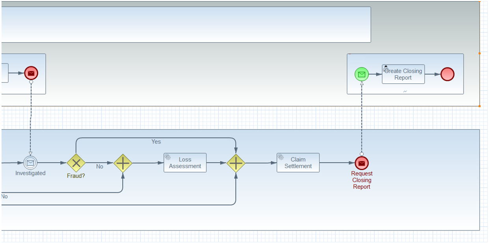
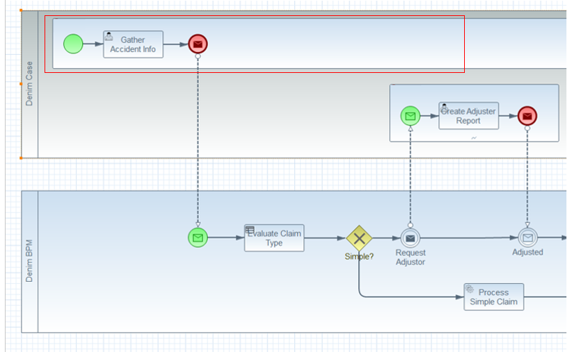
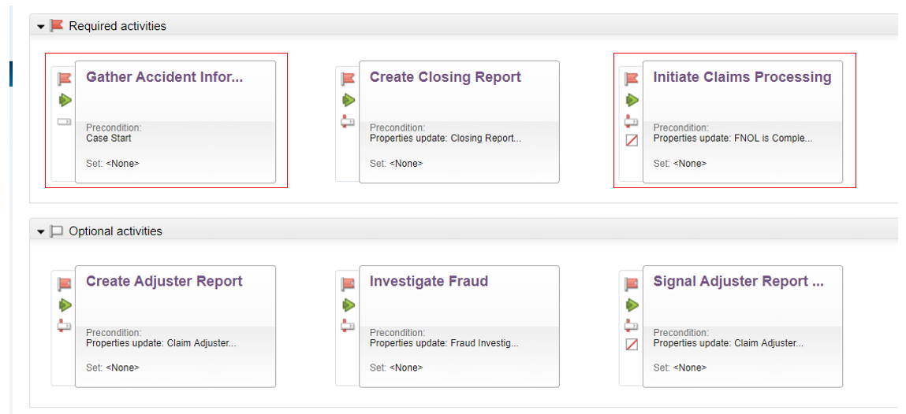
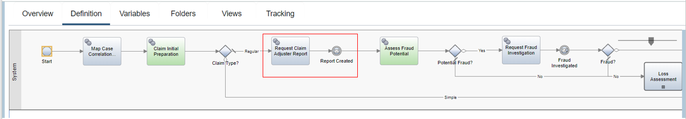
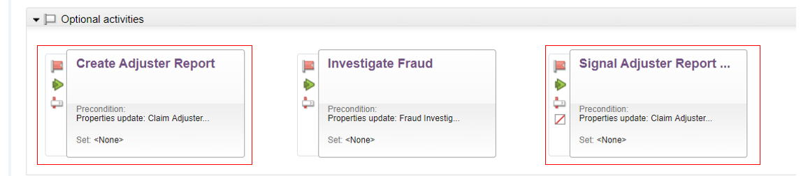
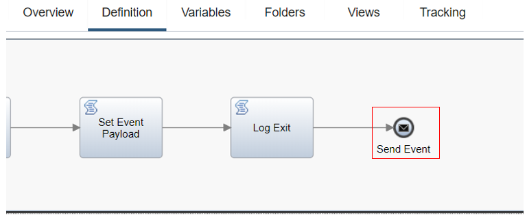

# Workflow design  

This section covers the design of the Denim Compute workflow using the Business Automation Workflow (BAW) platform. It is recommended to be familiar with [Scenario walkthrough](../usecase/resources/denim-compute-scenario-walkthrough.pdf) in conjunction with this section.

## Case and Process collaboration  
Denim Compute uses the combined capabilities of Case Management and Process flow from Business Automation Workflow in the solution scenario. Case-oriented workflows are typically modeled in [CMMN](<https://www.omg.org/spec/CMMN/About-CMMN/>) notation while Process-oriented ones use [BPMN](<http://www.bpmn.org/>) notation.

In order to show the collaboration between the Case and Process aspects we show a BPMN collaboration diagram as a close approximation of how the separation of focus is achieved.

The following two figures show the high level workflow as a BPMN Collaboration with Case ad-hoc activities in one pool and Process directed acyclic graph in the other pool and message exchanges between both as control passes back and forth.

Within the Case activities there is one special one (highlighted in the image below) that has scope for the duration of the Process it invokes. This is because the manner in which other Case activities are invoked is via property updates that in turn trigger pre-conditions on the activities. In order to update a Case property the Process must be able to reference its parent Case activity which remains in scope.

If we look at the Case Builder part of Business Automation Workflow, the highlighted activities match the earlier depiction whereby *Gather Accident Information* is a P8 Process implementation that updates a case property that then triggers the *Initiate Claims Processing* activity which is a BPM Process implementation.

The *Initiate Claims Processing* Process shown below is then responsible for co-ordinating both Process steps and communication back to Case to request further ad-hoc activities. Highlighted shows an example of the earlier model's message exchange. In the outbound message it is achieved by using the Javascript API to update a Case property which then triggers the pre-condition of a Case activity. The intermediate receiving message event then represents the return inbound message signaling the ad-hoc activity has finished.

Here in Case Builder again are the relevant activities with the first one (*Create Adjuster Report*) implemented as a P8 Process which then triggers the *Signal Adjuster Report Created* implemented as a BPM Process which will then send the message event to the main awaiting process.

Note this was a design decision to use the message pair capabilities in BPM, an alternative would be to implement a step in *Create Adjuster Report* P8 that would need to make a REST call to send the message event.

This is the BPM Process implementation of *Signal Adjuster Report Created* with the message send event highlighted.

