# Workflow for emulated BAI

## Introduction and rationale

The integration with Business Automation Insights (BAI) is best illustrated in the special scenario [BAI scenario walkthrough](../usecase/bai-scenario-walkthrough.md). While the main scenario BAW workflow as seen in [Main scenario walkthrough](../usecase/resources/denim-compute-scenario-walkthrough.pdf) is also integrated with BAI, the amount of human interaction in that workflow makes it hard in a short space of elapsed time to demonstrate a realistic BAI business situation where there would be 100s, 1000s or more claim instances processed. Therefore an additional workflow was designed and implemented in order to provide an emulated close approximation of the main workflow while also allowing for batch loading of large amounts of instances so that the resulting BAI Dashboards would have interesting and more true-to-life aggregated data to gain insights from.

## Emulated auto claims workflow
The BAI emulation workflow is accessed from the Process Apps section of BAW Workflow Center as shown below.

The `Emulate Auto Claim Processing` process is shown below. It matches the main steps with tracking enabled in the main scenario workflow (in terms of the activity names and the flow of control). All the steps are system steps with no human interaction so that the emulation can run without any need for intervention. The color-coding shows that there are Straight Through Processing (STP) activities (in green) and emulated long-running activities (in orange).

The data passed around in variables is a `EmulatedAutoClaim Business Object (BO)` which contains `controlData` of type `ClaimControl` and `processData` of type `ClaimData`. The `ClaimControl BO` shown expanded here contains settings that are used to determine what kind of an Auto Claim instance this will be and what emulated wait times to implement for each of the long-running activities in scope.
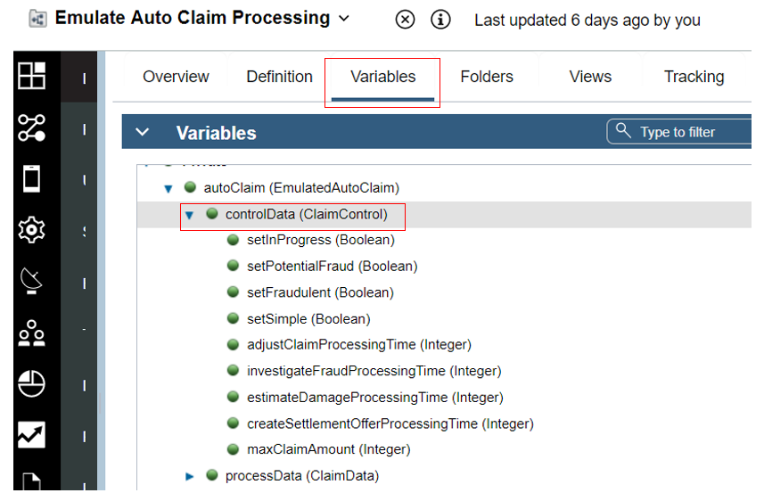

The `ClaimData BO` contains attributes that map one-to-one to the tracked fields that are defined in the `Tracking Groups` used to send business event data over the `Dynamic Event Framework (DEF)` to BAI.
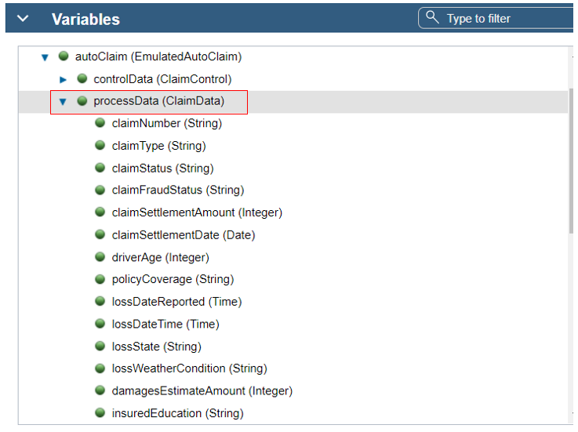

Looking a little further at the process activities, here we see an example of an STP activity `Claim Initial Preparation` which is implemented as a `Service Flow` named `Activity Controller` (this is a generic service that implements all the activity logic).
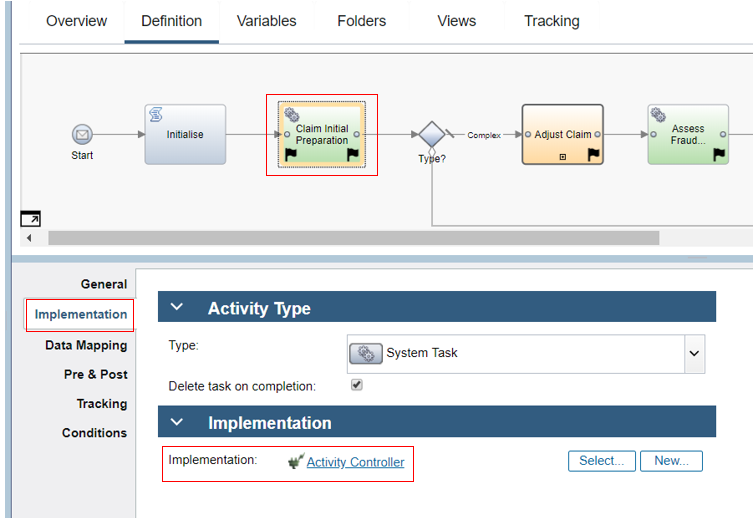

In the data mapping for the activity the `autoClaim.processData` and `autoClaim.controlData` are passed in and out of the service along with the `activityName`. The initial instantiation and population of these BOs is done in the emulation batch generator discussed in  [Emulation batch generator](#emulation-batch-generator) later.
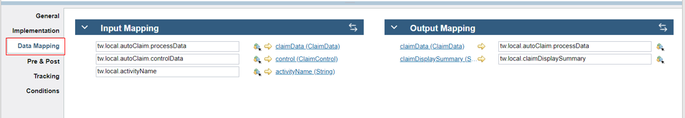

In the `Activity Controller Service Flow` the script step contains various helper functions and in the main logic it has a switch statement to provide specific processing according to he passed in `activityName`. It updates the business data in `claimData` using values of other business data and control settings in `control` (which is the `ClaimControl` BO).

Back in `Emulate Auto Claim Processing` the activity `Estimate Damage` is an example of a long-running activity (in the main scenario it would have one or more human interactions). It is implemented by a linked process named `Emulate Long Running Activity`.
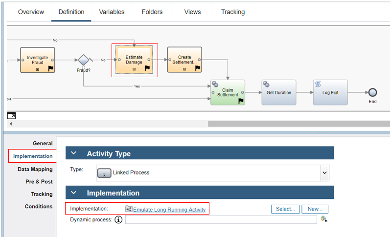

The `Emulate Long Running Activity` process also calls the `Activity Controller Service Flow`, however it does it after a timer delay where the amount of time is controlled by `activityWaitTime` which has been passed in to this process from the calling process `Emulate Auto Claim Processing`.
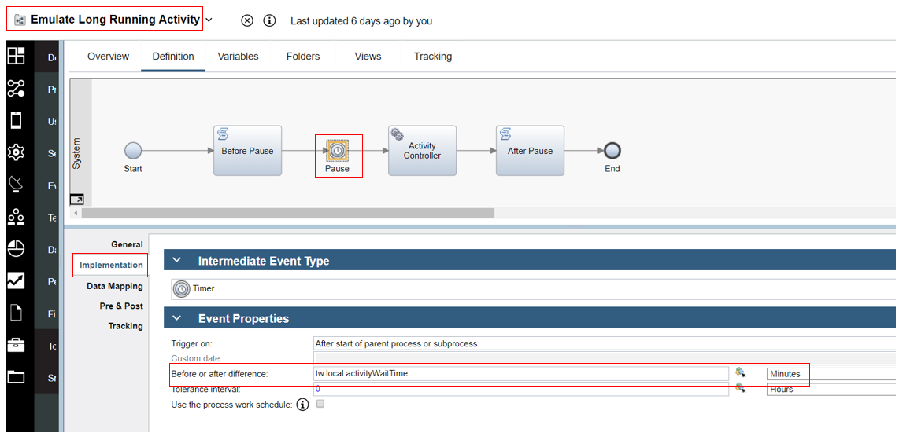

Here again in `Activity Controller` you can see the relevant part of the script where the processing for the `Estimate Damage` activity takes place. The estimates are derived by calling a function `getVehicleDamage`.
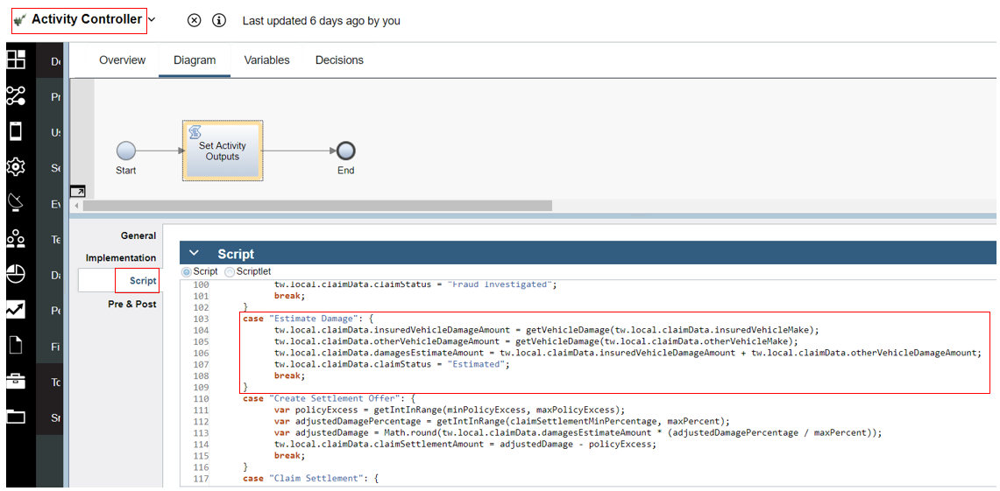

The called function within the script is shown here, it uses various random assignments of values according to the relative perceived values of the various vehicle makes (for example repairs to a Mercedes are likely to be most expensive relative to the configured maximum claim amount).

## Emulation batch generator
The emulation batch generator is a process that allows the user to set control values that control a batch run of between 100 and 10000 instances of an emulated auto claim. The process definition `Denim Compute Auto Claims - Emulation Generator` is shown below.

The user interaction to allow setting the emulation control parameters is an activity `Set Emulation Controls` which is implemented as a `Client-Side Human Service` with the same name. The data collected is then passed as output into the process (to the `tw.local.control` variable).
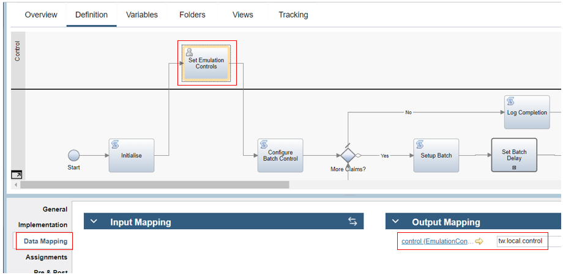

The variable is an instance of `EmulationControl BO` shown below which stores the user settings to be later used in setting up the batch of instances and configuring the control data on each instance in the batch.

The next activity in the process (`Configure Batch Control`) uses this data to then set up how the batches are to be controlled.
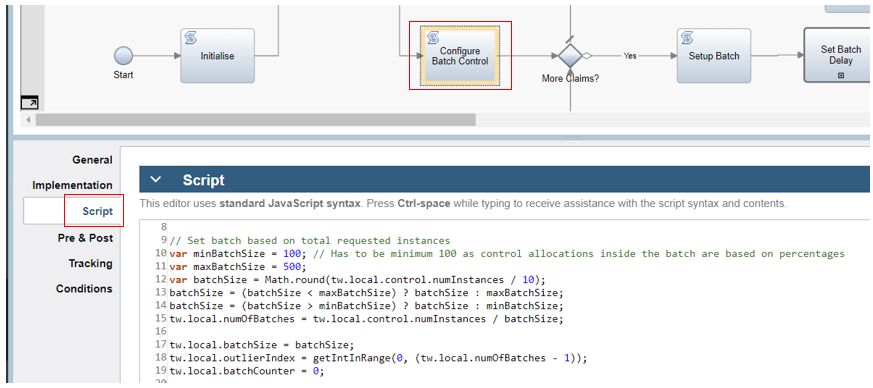

The rest of the `Denim Compute Auto Claims - Emulation Generator` process involves looping for the entire requested set of instances and within that setting up a batch (with a time delay between them in `Set Batch Delay`) and looping within that batch to configure (`Configure Emulation Instances`) and start (`Start Auto Claim Instance`) emulated claim instances.
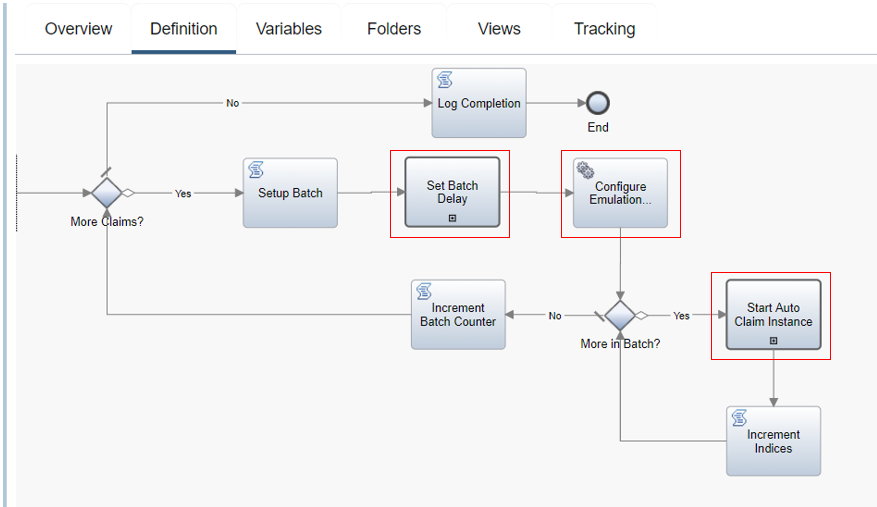

The activity `Set Batch Delay` is implemented by a `Linked Process` named `Emulate - Set Batch Delay` which uses a `Timer` to delay a few minutes between each batch submission.
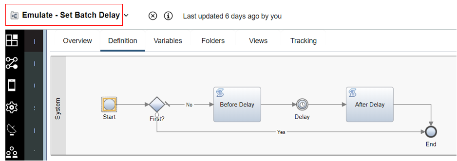

The `Configure Emulation Instances Service Flow` implements the activity `Configure Emulation Instances` and is shown below. This service uses the over control data for the emulation and the batch parameters to create a list of `EmulatedAutoClaim BOs` where each will be sent as the start data for creating and instance of `Emulate Auto Claim Processing` (see [Emulated Auto Claims workflow](#emulated-auto-claims-workflow) above).
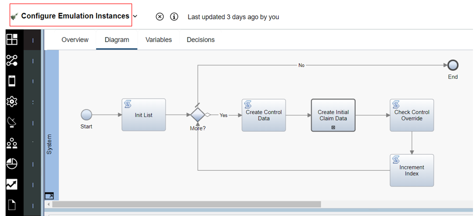

The `Create Control Data` step sets up the control data for a specific instance, for example as shown in the code it checks what the scenario type is and sets things like the timing delays based on that (and it in turn uses helper functions to get random numbers within ranges to calculate the timings and ensure a spread of differentiated data).
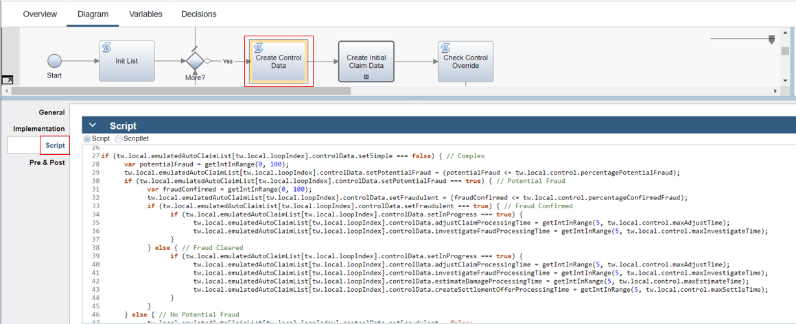

`Create Control Data` calls a further service flow named `Create Initial Claim Data` which sets the values of static data such as policy and loss data pertaining to the claim. The example below shows some of the potential options values for the data in `Create Policy Related Data`.

The script also includes some helper functions referenced in the main logic to get random data and it also chooses from the options lists based on a roll-of-the-dice additional random choice.
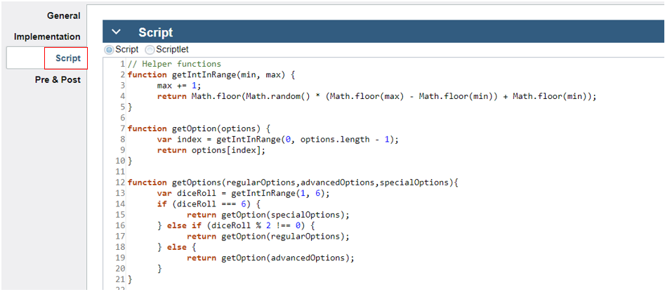

Each emulation run includes a single outlier case which is designed to skew the normal data trends and be identifiable in the `BAI Dashboards`. When the instance within the batch within the emulation has been designated to contain that `outlier` is encountered, the logic in `Set Outlier Overrides` is used to set special values as shown here (hint: use your favorite search engine if you don't know what the `otherVehicleMake / model` is referring to).
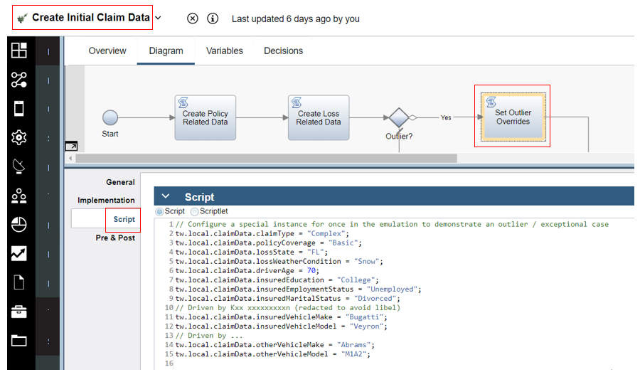

Finally to complete the story, the process activity `Start Auto Claim Instance` is implemented by a call to the `Linked Process` named `Emulate - Start Auto Claim Instance`. This then uses the passed in instance of `EmulatedAutoClaim BO` that has been configured in previous steps to invoke and start a process instance via a `send message event` as shown here.
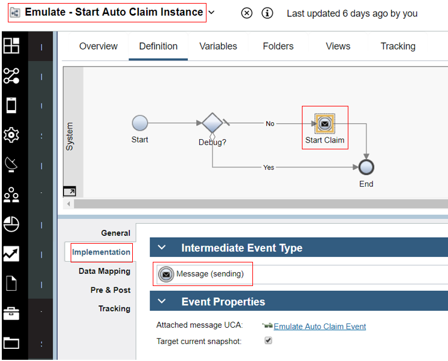