# Capture development

Business Automation Content Analyzer (BACA) is a *no code* environment. So, although we include this topic under the Development section, it is really rather configuration that is done for a BACA solution.

It is used in the solution when BAW needs to automatically process an uploaded vehicle repair estimate. For further details please see the design section [Mediated BACA integration](/design/workflow/#mediated-baca-integration).

## BACA ontology

In the BACA front-end, the Ontology Management Tool is used to define document classes such as our `Auto Repair Estimate` and within that, we define a set of keys which is data we want to train BACA to recognize in uploaded documents and to parse the results out (in our case we want the JSON representation).

In the image below we show the set of keys and have highlighted one example `repairer code`. We also then define a set of key aliases for a key to represent the different terms we might expect in a document that really mean the field is a `repairer code`.

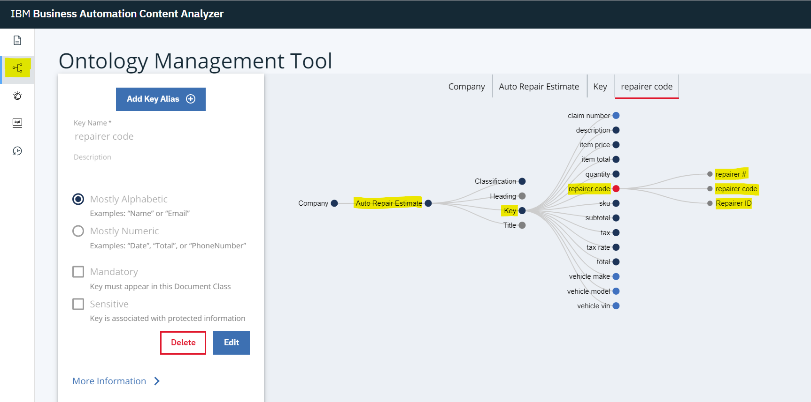

Just to illustrate the different keys, below we see the focus on `tax rate` and it expanded to show the various key aliases defined for it.

Note that the [Showtime](/showtime/run-solution/) section  documents that in BAW, there are a number of environment variables related to BACA that need to be specified when configuring the deployed solution. The API section of the BACA front-end is where you find the `API Key` and the host information for the endpoint (the `Request URL` section).

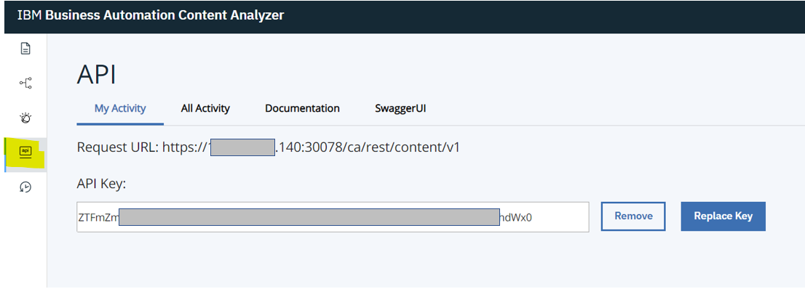

## BACA-related micro-services

A BACA Mediator micro-service has been developed that is used by BAW (as described in [BACA integration](/development/process-services/#baca-integration)) to interact with BACA (for details see [Content Analyser](/development/content-analyzer/)). The micro-service is implemented in Node.js and deployed on the Red Hat OpenShift Container Platform (OCP).

### Analyze a document
For this single micro-service, and because we are not showing a full CI/CD DevOps cycle, we are using a simple code editor to display the code.
If you are interested in Cloud Native development using the latest tooling, then have a look at [Kabanero](https://kabanero.io/).

The [application](https://github.com/ibm-cloud-architecture/denim-compute/tree/master/solution/baca/mediator) is shown here with the core Node.js code (`server.js`) to declare dependencies and use `Express` to start a HTTP Server listening for inbound REST requests.

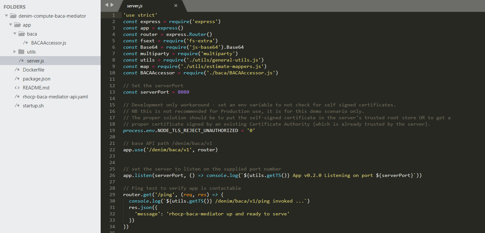

Node.js is a modular runtime, you declare dependencies on other packages and then specify them (along with the metadata about the application itself) in the `package.json` file shown here.

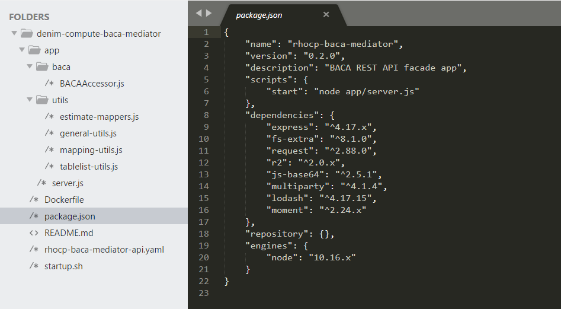

Returning to `server.js`, we expose a `HTTP POST` method to allow consumers (in our case this is BAW) to send a document to be analyzed by BACA. The code is commented with the major steps involved in processing the file and then delegating to the `BACAAccessor` class to perform the analysis.

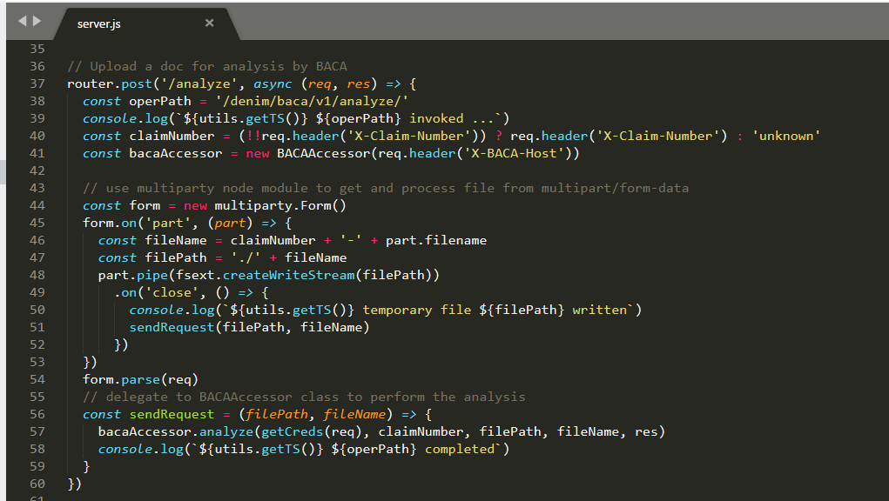

We expose the various services using OpenAPI 2.0 and here we see the provided YAML document describing the interface. This is where the operations that BAW invokes are referenced and how they map to the REST paths.

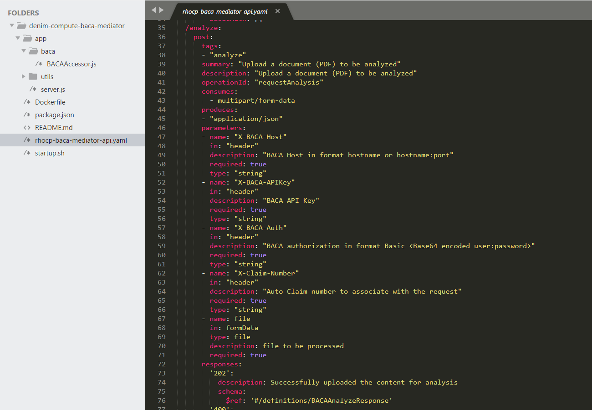

The `BACAAccessor` class is shown below. It exposes methods to implement the core logic for each of the REST methods exposed in `server.js`. Here you can see the `analyze` method of the class.

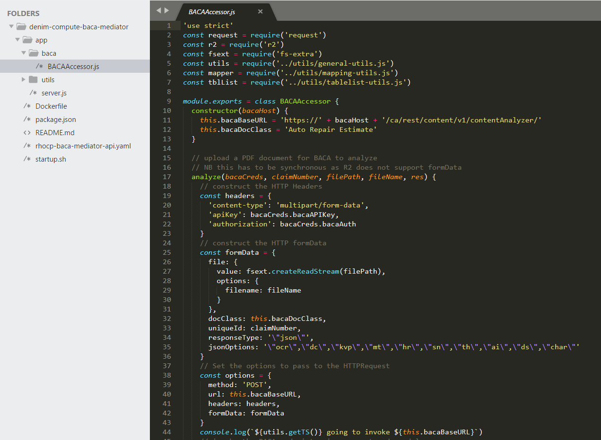

The remainder of the method implementation uses the `request` Node.js module to make the outbound HTTP REST API call to BACA and process the results (using in turn some helper mapper functions).

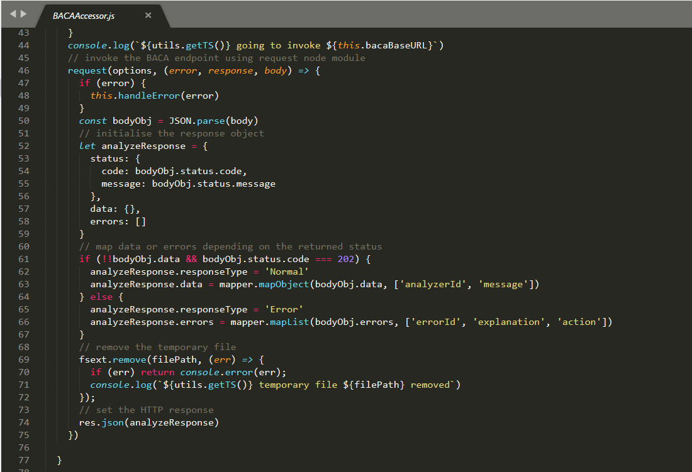

The mapping helpers are provided in `utils/mapping-utils.js` and they in turn make use of a common Node.js utility module called `lodash`.

### Retrieve analysis status

The other exposed REST methods follow a similar pattern. After uploading a document to BACA for analysis you check the status to verify it was parsed successfully. The `/status/:analyzerId` REST method is shown below.

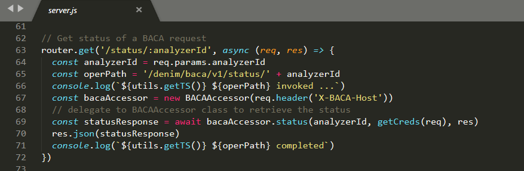

The delegated implementation is the `status` method in `BACAAccessor` as shown below.

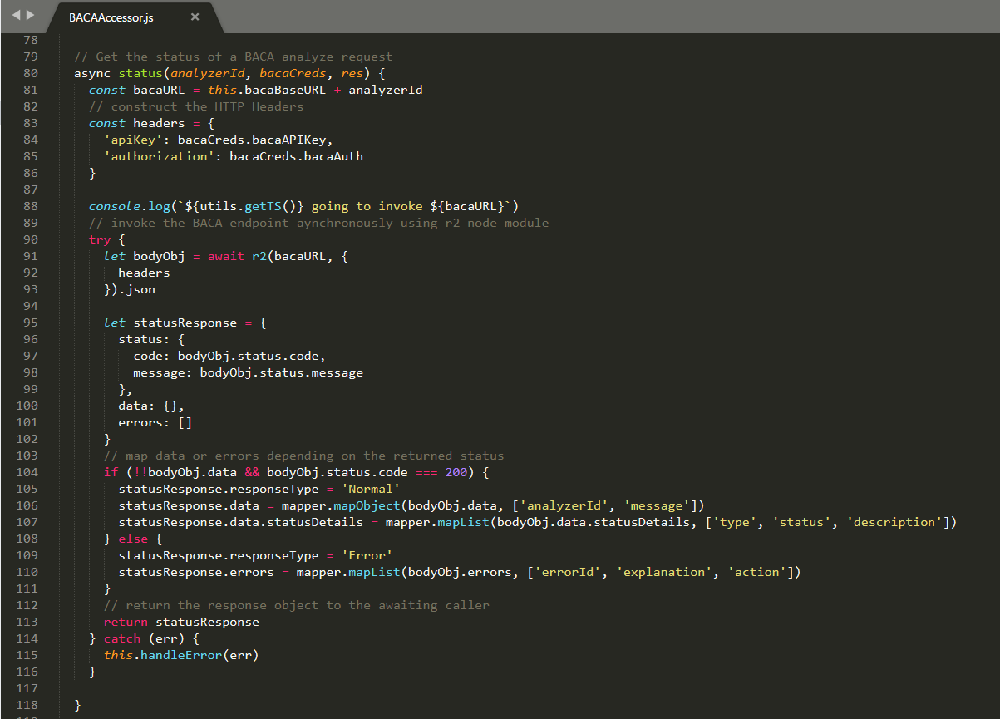

### Retrieve JSON result

Once an uploaded analysis has completed and the status reports it has been parsed successfully, you then need to call BACA to retrieve the results. This is where the micro-service has the most post-processing to do because the JSON payload from BACA is quite complex and we need to expose a more business interface to BAW plus we have to manipulate the BACA returned JSON in order to construct the nested array structure of `Vehicle Parts` inside the estimate.

As with the other methods, the point of entry is in `server.js` which then delegates to `BACAAccessor` to do the heavy lifting. It also passes in a callback function (`processBACARetrieve`) that will process the response.

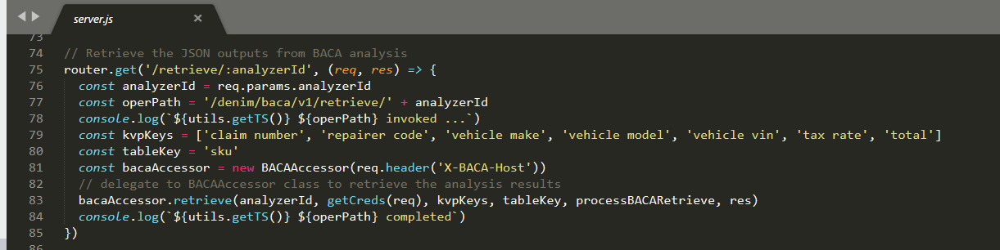

In `BACAAccessor` the `retrieve` method invokes BACA and then processes the response. It uses helper methods and functions to process the response which we will see next.

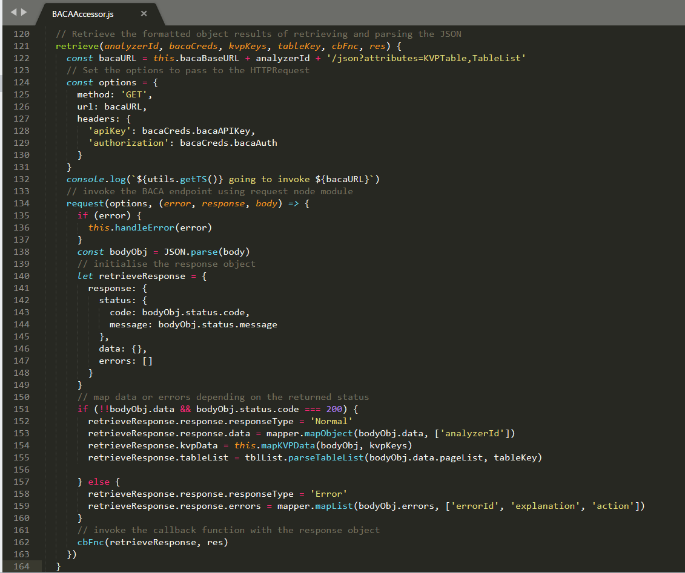

BACA returns identified data as a set of key-value pairs (KVP). The `mapKVPData` method shown below is used to extract those KVP entries that match the ones that we are interested in (as represented in the passed in parameter `kvpKeys`).

The next helper function that is invoked `parseTableList` is provided in the `utils\tablelist-utils.js` file. BACA when it encounters a table construct in a document returns the data in a complex nested structure within the JSON referred to as the `TableList`.

This has to be processed in order to identify the table and data within it that maps to our desire list of vehicle part objects. This is done by calling the function `getTableForClass` (shown here) to get the specific table and then `createItemsList` to process the items from it.

The `createItemsList` function has to walk a tree of complex nested structures returned from BACA in order to identify (based on `BACA ontology keys`) object structures that are intended by the presence of repeated data in a table under column headings.

Back in `server.js` the callback function that was passed to the `BACAAccessor` method is invoked with the response. It first sets up some mappings in order to translate the BACA objects to ones that are expected by BAW and are defined in the OpenAPI interface of our micro-service. 

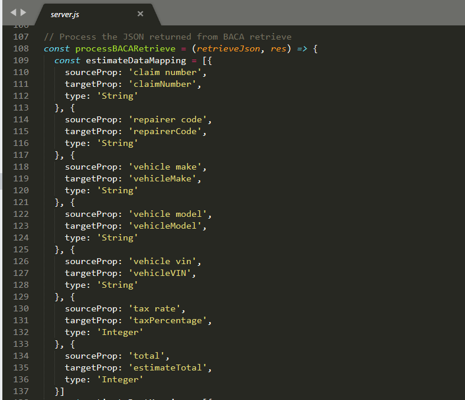

The function then invokes a helper function `mapEstimateData` to create the final response data and then sets it on the HTTP Response.

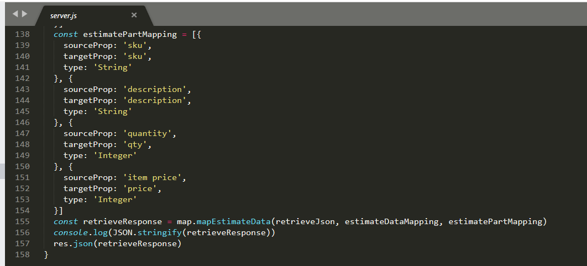

This helper function is defined in the `utils\estimate-mappers.js` file. It in turn invokes a number of other functions to parse different parts of the target structure (we will look at these next).

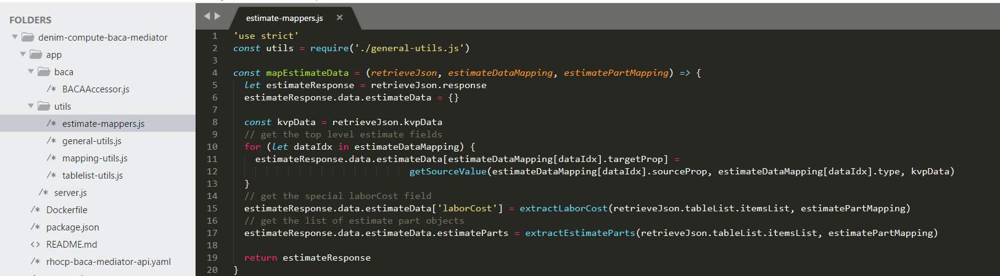

The `getSourceValue` function shown below is used to map and manipulate the top level KVP data that is in the estimate (the vehicle identity and total amounts fields).

The `extractEstimateParts` function first calls `getCandidatePart` in order to get the part data from the array and then it filters on those that have a valid first property representing the key of the object (the `sku` in our case). This is necessary because not all candidate parts are in fact parts because the repairers also include labor costs in the table which has a similar structure but it not in fact a part object at all.

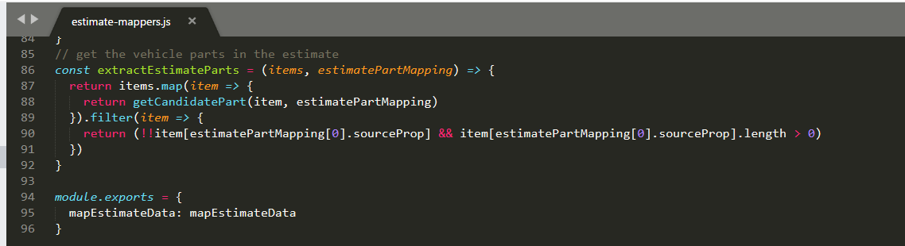

The `getCandidatePart` function is used to map the item to a potential part (which may also be the special labor cost item) and convert the more generic data to the specific types expected.

Finally the `extractLaborCost` function reuses `getCandidatePart` and then parses the data to identify the special case where the candidate has no `sku` property but contains the other expected fields. It then calculates the total cost to return to the caller.

### Delete resources
Once you have finished with an analysis in BACA, there is an API to call that will remove any resources used (such as the uploaded document the analysis was performed against).

As with the other methods, the point of entry is in `server.js` which then delegates to the `cleanup` method in `BACAAccessor`. It then sends the HTTP Response on return from `BACAAccessor`.

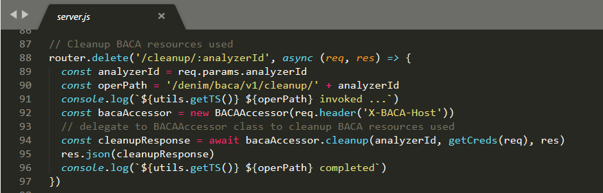

The `cleanup` method is shown which then invokes BACA using the r2 Node.js module and processes the response.

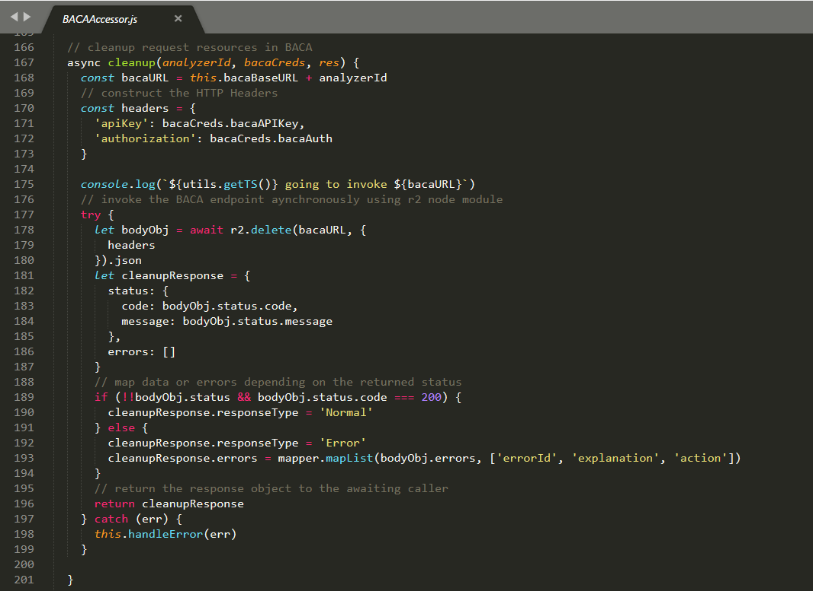

### Packaging

In order to run the micro-service in a Kubernetes environment (such as our target OCP environment),  we have to provide a declarative `Dockerfile` that is used by `Docker` to build the container for deployment.

This is shown below which contains various directives for copying source code and configuring permissions and specifying the initial entry script to run.

And here is that entry script which simple invokes an `npm` command that was defined earlier in the Node.js packaging file `package.json`.

