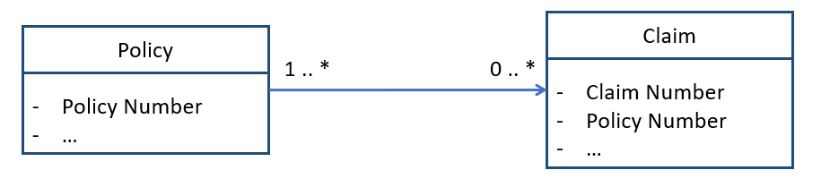
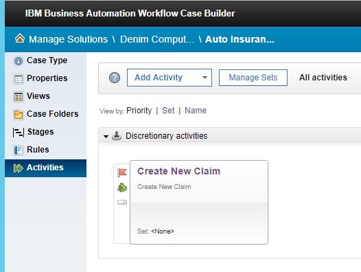
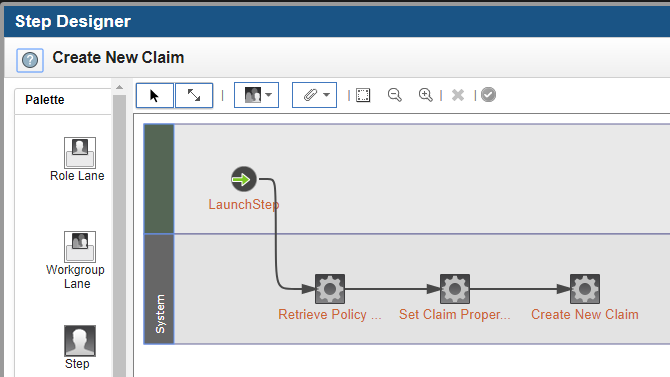

# Case activities
---

## Leveraging case persistence
The claims solution implements a Policy case which is persisted as a record to represent the insurance policy. The Policy case type stores the policy information and claims are generated from the policy by a *create claim* activity, which creates the new claim case and also transfer existing policy information into the claim.

 

#### Creating a Claim from Policy
When the first notice of loss is received by the claim representative the first task is to search for the insured Policy, once the Policy is found the claim representative starts a *discretionary activity* that will create the new *Claim case* and also automatically transfer the insured policy data into the claim.

The activity that creates the new claim case is implemented using FileNet workflow. FileNet Workflow and Process are both supported with BAW.
FileNet workflow is used to implement this activity to leverage the standard CE_Operations and ICM_Operations. The equivalent of these two builtin operations are not yet available in BAW 19.0.0.2 but will be available for the process in a subsequent release.
The details of the activity can be accessed from BAW Case Builder.

The Builder does not provide the ability to open the details of each step of the workflow or to edit these steps. In order to edit the step is necessary to open this FileNet Workflow using *"FileNet Process Designer"* which is a tool available as java application. *"Filenet Process Design"* is a workflow design tool used to implement FiLeNet Workflows and even if the names are similar it should not be confused with *"BPM Process Designer"*.

The FileNet Process Designer tool can usually be found on BAW installation directory:

`install_root/FileNet/ContentEngine/tools/PE/pedesigner.bat <connection point>`
 
Where <connection point> is the the FileNet workflow system connection point configured in your environment. In the following is show  the general view of the workflow and the details of the step and ICM_Operation to create a new claim case.

---

### Case data model and business objects
The Case data model currently does not fully support Business Objects, therefore an interim solution has been implemented to map properties.
The interface of the Case Manager data model with other BAW components may require the implementation of distinct case properties to match each element of a business object. A new upcoming version of Case Manager will fully support business objects and allow better data integration with other BAW components.

---
