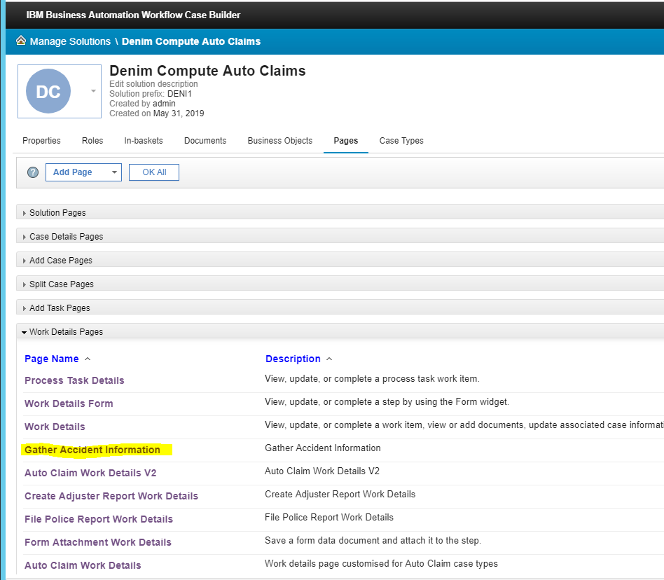
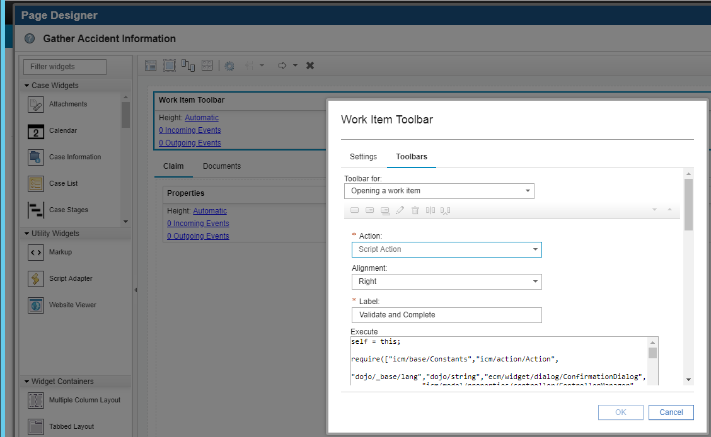

# Case user interface

## Case property validation

Case implements out of the box property validation in relation to type and format according template. However, additional, more complex validations can be implemented with custom scripts.
The solution implements a script action on the Work Details page of the activity `Gather Accident Information`. The script action validates two date properties:

- Date Reported
- Date-Time of Loss

These properties are compared against the current date and prevent a user to enter a date that is in future. The script action `Validate and Complete` replaces the original `Complete` action on the `Work Details` page.

In order to implement the validation, it is necessary to create a custom Complete action using a Script Action added to the Work Details page associated with that particular step in the workflow. In this case, the Activity has on one step and has the same name of the Activity "Gather Accident Information":

You can review the implementation by opening Cases pages and select under Work Details the page "Gather Accident Information"

 

Once the page is open for editing, select the Toolbar, open Settings (gear symbol on the right side), and check the new custom button in the Toolbar menu.

 

Once the new button opens, verify that the Action "Script Action" is selected, the label is according to "Validate and Complete" and the script action code is in the `Execute` pane.

The source code of the script action can be found in the [`validate-and-complete-workitem.js`](https://github.com/ibm-cloud-architecture/denim-compute/blob/master/source/case/validate-and-complete-workitem.js).

## Transfer case property to document
When a user files a document into the case, for instance a Police Report, some case properties should be transferred and automatically updated into the document class (Case Document Type).
The Claims solution implements a custom script action to perform this property transfer and update. The script action is implemented and deployed into the work details page when an activity is created to file a police report. The following properties are read from the case and transferred into the document class:

- Policy Number
- Claim Number

This script action requires the document class to have Policy Number and Claim Number as properties. Review the implementation of the code by opening the Work Details page "Gather Accident Information" like in the previous section and select this time the "Case Information" widget and open the Settings (gear on the right corner).

Select the custom button "Add Document and Set Property" and review the settings of the script action and the code in the field Execute.

The script action source code can be found in the [`file-police-report.js`](https://github.com/ibm-cloud-architecture/denim-compute/blob/master/source/case/file-police-report.js)/source/case.
