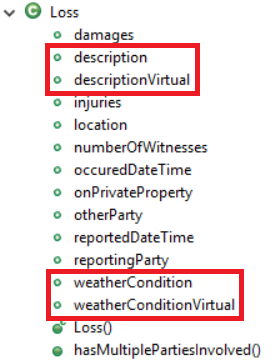
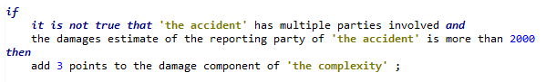
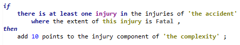
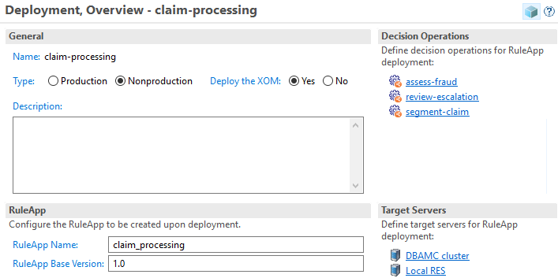
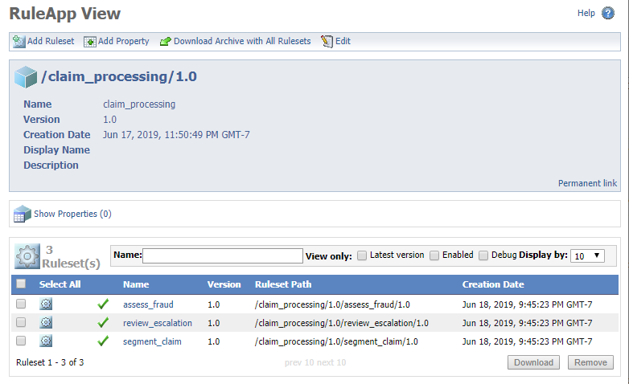
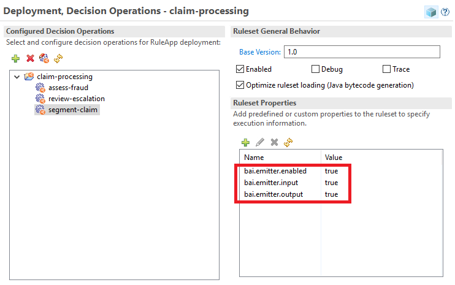
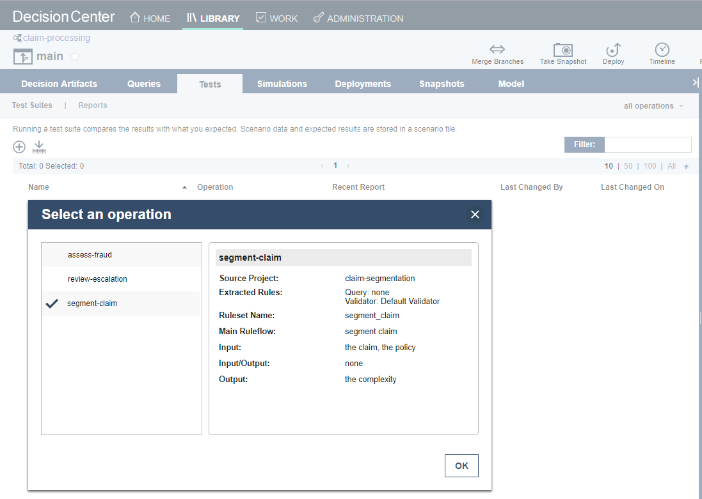
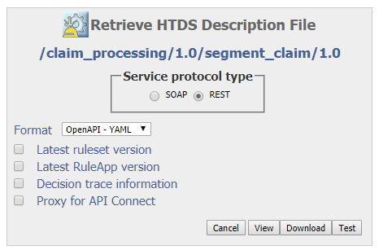
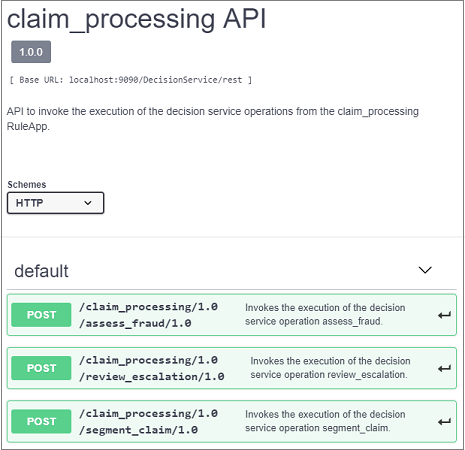

# Decisions development

## Business Object Model

The BOM is composed of two BOM entries, shown on the figure below The first one, `claim-model`, is built bottom-up from the Java object model. The second, `util-model`, holds purely virtual BOM classes that provides utilities to the decision service rules.

The domains for the different attributes of the object model are defined using Excel-based dynamic domains. The `domains.xls` spreadsheet under the `resources` folder of the BOM defines the different domains.
The domains are then associated with virtual classes defined under the `types` folder of `claim-model`. Finally, for each attribute which value is backed a domain, we create a corresponding virtual attribute which type is the domain class. We remove any verbalization from the attribute that maps to the Java model, and instead verbalize the virtual attribute.

We add the suffix `Virtual` to the original attribute name as the naming convention for the virtual attribute. For example, in the figure below, we create the `descriptionVirtual` attribute corresponding to the `description` attributes that is derived from the Java model.

## Sample rule artifacts

We show here a few rules from the `segment-claim` decision operation for illustration purpose. The rule flow for this operation is a simple sequence of 3 tasks.

The first one computes a complexity score for different aspects of the accident: *damages*, *injuries* and *others*. The second one is aggregating the different component scores and normalizes them on a single scale. The third task  derives a categorical complexity (low, medium, high) from the normalized score.

Below are 2 examples of rules, respectively contributing to the *damages* and *injuries* component:

`single vehicle damage` rule definition

`fatal injury` rule definition

## Deployment configuration

The `claim-processing` deployment configuration is defined to encapsulate the 3 decision operations `segment-claim`, `assess-fraud` and `review-escalation`.

Running this deployment configuration generates and deploys the `claim_processing` RuleApp, which encapsulates 3 rulesets, exposed through the following decision end-points:

- `http://{host}:{port}/DecisionService/rest/v1/claim_processing/1.0/segment_claim/1.0`
- `http://{host}:{port}/DecisionService/rest/v1/claim_processing/1.0/assess_fraud/1.0`
- `http://{host}:{port}/DecisionService/rest/v1/claim_processing/1.0/review_escalation/1.0`

## Connecting ruleset to BAI
To enable an ODM ruleset to send events to the BAI component, the `bai.emitter.enabled` ruleset property must be set to `true`. The additional boolean ruleset properties below allow to control the scope of the events that are emitted:
- `bai.emitter.input`
- `bai.emitter.output`
- `bai.emitter.trace`
We have set-up the following properties in the deployment configuration. Once deployed, the ruleset property values can be adjusted in the Rule Execution Server console.

## Ruleset testing
Once the claim processing decision service projects are deployed to Decision Center, you can exercise test scenarios on the different decision operations.

Sample test scenarios, in the form of business users friendly Excel spreadsheets, are provided [here](https://github.com/ibm-cloud-architecture/denim-compute/tree/master/solution/odm/test). To run a test suite, open the `claim-processing` decision service, and on the `Tests` tab, click the `New Test Suite` (+ sig) button, the select the decision operation you want to test, for example `segment-claim`:

In the file to use of the `Scenarios` section of the page, select the `Scenario File - Claim Segmentation.xlsx` file, then click the `Save and Run` button:

One the test suite run is complete, you will be switched to the `Reports` tab. You can then click on the newly generated test execution report to inspect the individual test scenarios execution:

## Sundries

### Integrating multiple decision services based on a common BOM
While ODM rulesets are grouped in a RuleApp deployment artifact, the corresponding service definitions are generated individually for each ruleset, as shown below: 

In our use case, we use one `claim_processing` RuleApp, and we have to generate three separate service definition files, one for each `segment_claim`, `assess_fraud` and `review_escalation`.

Because all three decision services are sharing the same [input object model](../design/decisions.md#odm-object-model), importing these separate service definition files in BAW will create three separate (but identical) versions of the business objects hierarchy.

One solution, using e.g. the YAML definition files, is to rename each `Request` and `Response` definitions in the generated service definition files with a unique name, and then merge the multiple YAML files into a single one that reflects the services exposed by the RuleApp.

