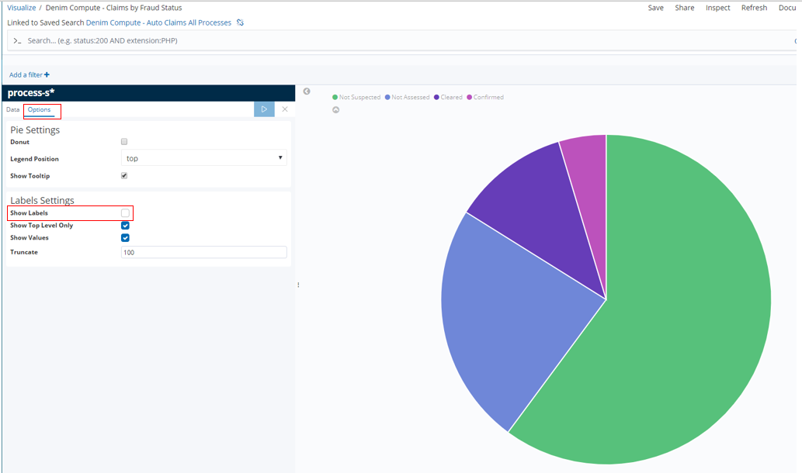
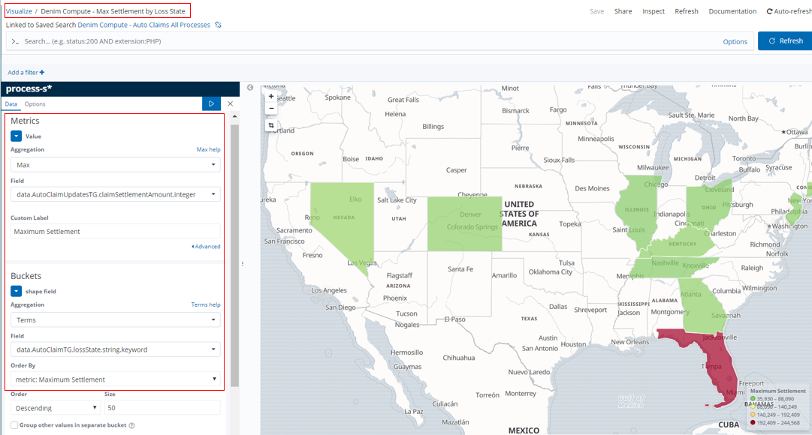
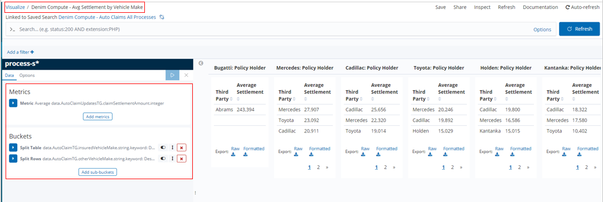
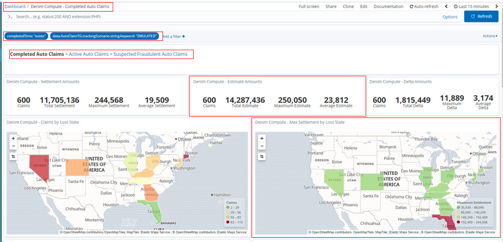

# Insights development

## Introduction
This section provides more in depth details to the design information in the [insights design](../design/insights.md) section. 

In order to integrate from BAW to BAI we have augmented different BAW solutions. The main scenario (see the [main scenario walkthrough](../usecase/resources/denim-compute-scenario-walkthrough.pdf)) is configured but as this involved a lot of human interaction it takes some time to progress through instances. In order to generate load and demonstrate realistic levels of claim cases we also have an emulated process and this is used as the basis for the BAI Dashboards as demonstrated in the [BAI scenario walkthrough](../usecase/bai-scenario-walkthrough.md).

## BAW tracking (general)
The data to be tracked in the workflows and sent to BAI as Dynamic Event Framework (DEF) events is defined in tracking groups in the BAW Toolkit named `Denim Compute Auto Claims - Common`.

Here you see they are found in the `Performance` section within Process Designer. `AutoClaimTG` is used to track static data that is available at the start of the workflow while `AutoClaimUpdatesTG` tracks more dynamic data that is updated in several places as the workflow progresses through to final settlement of the claim.

Here we see the details within one of the tracking groups and highlighted is one of the tracked fields named `lossDateReported` of type `Date/Time`.

## BAW tracking (main scenario)
For further information on the workflow itself please see [Development - Workflow](workflow-intro.md). In the main scenario workflow the tracking points are set in `Initiate Claims Processing` as highlighted in the image below.

The linked process named `Loss Assessment` also has some additional tracking points defined as shown below.

The post tracking point on the activity `Claim Initial Preparation` is highlighted below. Here you can see that it is tracking group named `AutoClaimTG` that is used and has data from the variables of the process mapped to the tracked fields. 

In the rest of the process the more dynamic data is mapped in various places to `AutoClaimUpdatesTG`. In the highlighted example an explicit tracking intermediate event is used because you cannot map to two different tracking groups at the same point, so because the data is available after `Claim Initial Preparation` we need this additional tracking point to capture the dynamic updates in `AutoClaimUpdatesTG`.

## BAW tracking (emulated scenario)
For further information on the workflow itself please see the [Workflow for emulated BAI](bai-emulated-workflow.md) section. In the emulated scenario workflow the tracking points are set in `Emulate Auto Claim Processing` as highlighted in the image below.

The pre-tracking point on the activity `Claim Initial Preparation` is highlighted below. Here you can see that it is tracking group named `AutoClaimTG` that is used and has data from the variables of the process mapped to the tracked fields.

The post-tracking point on the activity `Claim Initial Preparation` is highlighted below. Here you can see that it is tracking group named `AutoClaimUpdatesTG` that is used and has data from the variables of the process mapped to the tracked fields. This differs slightly from the main scenario it emulates due to the fact that there the initial data for tracking is available at the start of `Claim Initial Preparation` (because the workflow configures the emulated data prior to this activity).

## BAI (Kibana) search index patterns
In the Kibana dashboards some of the visualizations reference scripted fields defined on an index pattern. These are used where there is a requirement to derive or calculate data fields from the source tracked fields passed as events. The scripted fields section is shown here on `process-s*` which is the chosen index pattern that has been used as the basis for searches, visualizations, and dashboards.

Below you can see that three scripted fields have been defined named `ClaimDelta`, `Settlement Duration`, and `FormattedLossDate`. `ClaimDelta` is used to calculate the difference between estimate and settlement amounts in the claim which is then used in the visualization named `Denim Compute - Delta Amounts`. `SettlementDuration` is used to calculate the time difference between the date the loss was reported and the date the claim was settled. `FormattedLossDate` is just a way to display the loss date in a more condensed format in order to display it more succinctly on the visualization named `Denim Compute - Settlement Duration by Loss Status`.

## BAI (Kibana) searches
The data events sent from BAW to BAI are organized into active and completed summaries. BAI then has a number of index patterns defined that reference the `ElasticSearch` indices for these summaries. For the scenario end-goal of showing claim summaries on various charts (visualizations) we want just the top level process summary information. Here in the `Search` definition named `Denim Compute - Auto Claims All Processes` we are using the `process-s*` index pattern and have configured various filters so that we only see process level data for our process application. Note there are a number of filters configured and set as disabled. What this allows is for the user to turn them on / off in order to search for specific results in here while leaving the default saved settings that are relied upon by the visualizations that aggregate the data for display in the dashboards.

The `Search` is configured with viewable columns based on the `Selected fields` section where these fields have been added from the `Available fields` section below.

## BAI (Kibana) visualizations
All of the visualizations defined start with the keywords "Denim Compute" and can be found by providing a search entry as shown here.

To take an example of a `Pie` type here you see `Denim Compute - Claims by Fraud Status` and it references the `Search` we discussed in the previous section. In this example it uses a `Count aggregation` and then divides the `Pie` into `Buckets` based on the unique `Terms` found in the events for the `claimFraudStatus tracked field`.

In the `Options` section here we could have elected to `Show Labels` however we found that they did not resize properly when subsequently laying out in the available space of the target dashboard which seems to be a `Kibana` issue.

An example of a `Metric` type is shown here in `Denim Compute - Delta Amounts`. The `Metrics` section shows that the source field is the `ClaimData Scripted field` discussed earlier.

In `Denim Compute - Settlements by Driver Age` we have an example of a `Bar` type that shows various aggregates for comparison side by side on a bar chart. The dimension (defined in the `Buckets` section) that they are organized by is the driver's age (`driverAge tracked field`). Additionally a `Histogram` is used as the `bucket type` which then automatically groups the age ranges into groups of 10.

In this `Bar` we want to show aggregates that have different scales (for example the Claims numbers will be much lower that the settlement amounts), therefore to do that we assign the aggregates to different axes in the `Metrics & Axes` section.

In `Denim Compute - Max Settlement by Loss State` we have an example of a `Region Map` type that shows data according to the US state it relates to (specifically the `lossState tracked field`).

In the `Options` section the settings are configured specific to rendering US states on the map (which matches our scenario data that only uses a subset of US states).

In `Denim Compute - Avg Estimates by Policy Cover` we have an example of a `Gauge` type that organizes estimated amounts according to the type of Policy Cover.

`Gauges` allow for setting ranges that allow you to track things like a RAG status as illustrated here. This is done by configuring `Ranges` as shown.

In `Denim Compute - Avg Settlement by Vehicle Make` we have an example of a `Data Table` type that organizes settlement amounts according to the policy holder's vehicle make and within that the vehicle make of the other vehicle involved. In the `Buckets` section the `Split Table` setting arranges columns of the `insuredVehicleMake tracked field` and `Split Rows` further sub-divides each row against the `otherVehicleMake tracked field`.

When using this `Data Table` we spotted a deficiency in the options the `Kibana Visualization` provides. Ideally we want to display the average figures for the column as well as for the intersections of insured vehicle / other vehicle. However the only option is to `Show total` which in facts adds all the averages up and is not what we want. This is not displayed on the provided saved visualization named `Denim Compute - Avg Settlement by Vehicle Make`, we are only showing it here in order to illustrate the issue).

There are various other `Visualizations` for you to explore, we have covered the essential ones here that illustrate some of the data and configuration patterns used.

## BAI (Kibana) dashboards
The Kibana Dashboards provided for the scenario are shown below.

Looking in more detail at one of them (`Denim Compute - Completed Auto Claims`), here we have filters defined on the dashboard itself. This allows for reusing `Visualizations` and their underlying `Searches` across different `Dashboards` by setting filters here that are specific to the intent of the dashboard (in this case to only focus on completed Auto Claim instances). Navigating between the provided `Dashboards` is achieved by `breadcrumbs` implemented in `Markdown` in a special type of `Markdown Visualization`. Also highlighted are two of the earlier covered `Visualizations` laid out as tiles on the dashboard. 

Below you see the different filters defined for the other `Dashboards` in the scenario. There is also a disabled filter in the case of `Denim Compute - Suspected Fraudulent Auto Claims` which means all potential frauds are displayed by default. The end user can then enable and adjust the provided filter to drill down into the sub-categories of suspected fraud (those confirmed to be real frauds versus those cleared by the fraud investigation).

