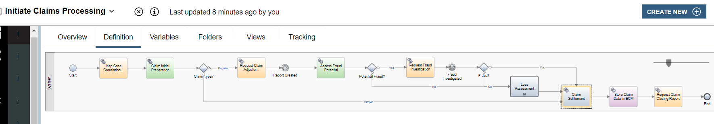
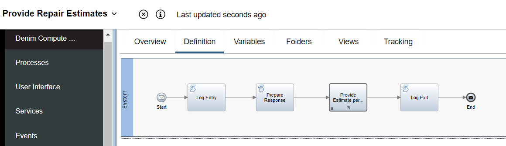
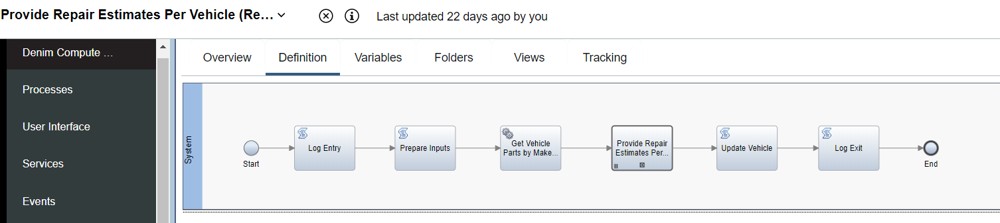
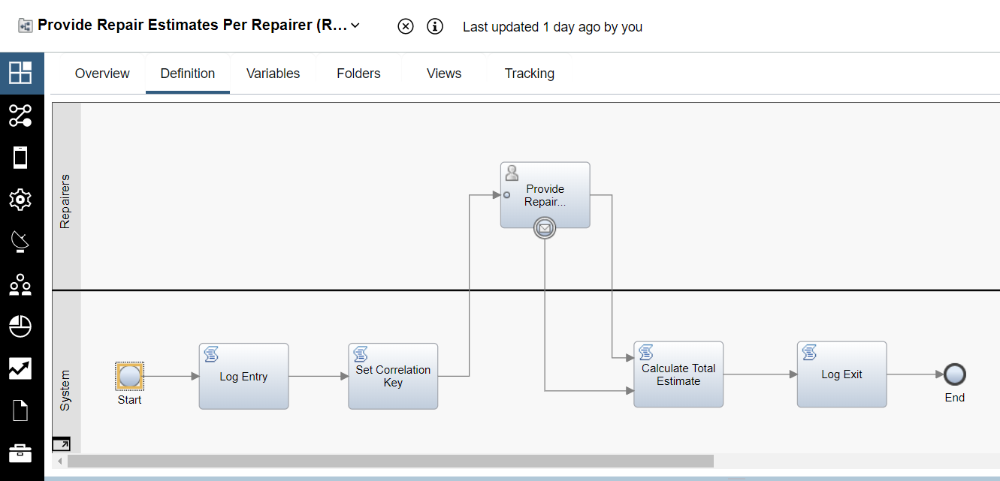
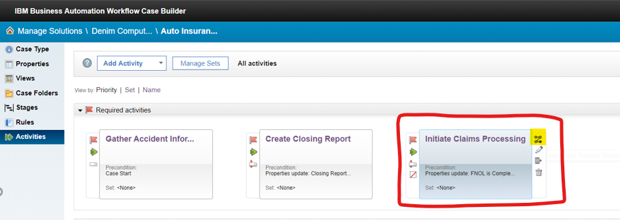
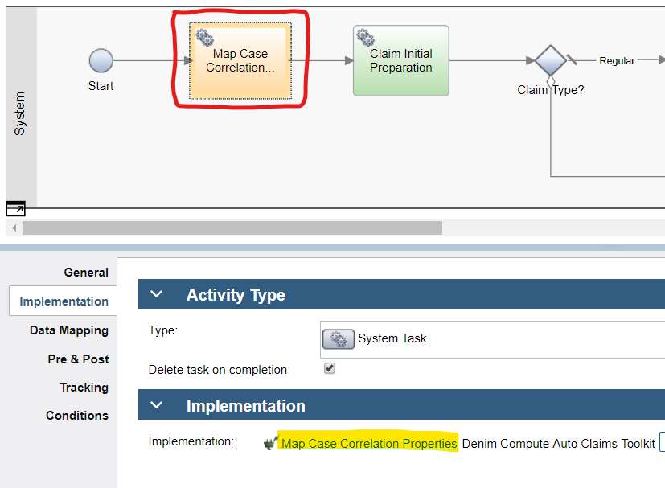
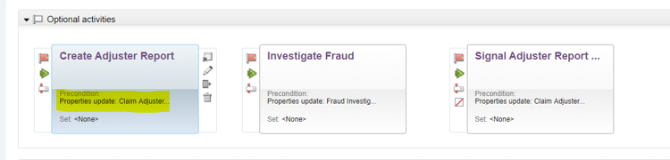
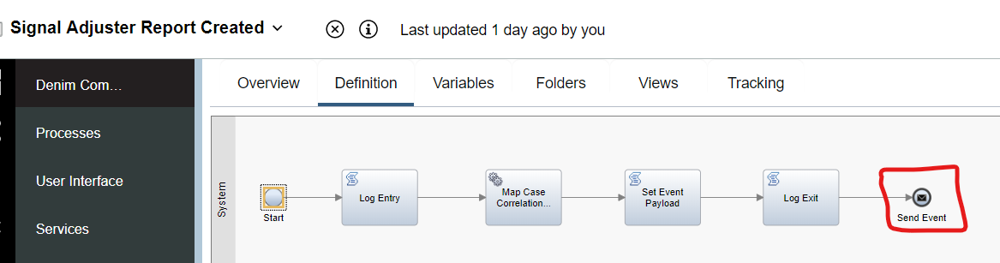

# Process flow control

## Process hierarchy

The top level process that is called from the`Gather Accident Information` Case activity when the FNOL (First Notice of Loss) stage is complete is `Initiate Claims Processing`, shown below. The process diagram is color-coded to highlight specific patterns of processing as follows:

- Orange for integration between Case and Process
- Green for integration between Process and ODM (Operational Decision Manager)
- Purple for integration between process and ECM (Enterprise Content Management)

The `Initiate Claims Processing` process includes a call to the linked process `Loss Assessment`. In the below image, we focus on the MVP path through that process (which matches the scenario in the [Scenario walkthrough](../usecase/resources/denim-compute-scenario-walkthrough.pdf) section). There are additional steps to handle the situation where the ODM service `Review Escalation Conditions` results in a path that needs review and potential rework which you can expect by opening up the process in the Process Designer tool.

`Loss Assessment` in turn calls the linked process `Estimate Damage` which involves two user tasks (that are implemented in BAW with client-side human services that contain one or more coaches for user interaction) `Tender for Estimates` and `Review and Select Estimate`. In between these two user tasks is a message exchange (for more details on the message exchange pattern see the *Process message exchange* section in the [Process services](process-services.md) section) which invokes a further process and receives the result.

The `Provide Repair Estimates` process is a kind of batch processing paradigm as it needs to manage the soliciting and obtaining of multiple repair estimates which it does by invoking a further linked process, `Provide Repair Estimates Per Vehicle`, using a multi-instance loop construct.

The `Provide Repair Estimates Per Vehicle` process shown below handles the processing for each vehicle in the claim. It then delegates to a further multi-instance loop to call the linked process `Provide Repair Estimates Per Repairer`.

The `Provide Repair Estimates Per Repairer` process then handles the collecting of a repair estimate from an individual repairer for a single vehicle.

## Process synchronization with Case

As discussed in the [Workflow Design](../design/workflow.md) section, the workflow solution involves a collaboration between Case ad-hoc activities and process sequential activities. That collaboration is achieved in a number of ways, first the main process is implemented as a Case activity as highlighted below.

Within `Initiate Claims Processing`, there is a need to synchronize the case properties by reading them from the parent Case and this is done in the service flow implementation `Map Case Correlation Properties`, which is part of the referenced Toolkit `Denim Compute Auto Claims Toolkit`.

For more details on the synchronization framework, please see the *Case properties synchronization* section within the [Process services](process-services.md) section.

When the process needs to pass control back to Case and invoke another case activity. It does that by updating one or more Case properties that are used as the pre-condition of that target activity.

The logic to do this is illustrated by the activity with service flow implementation `Request Claim Adjuster Report` shown below, which again uses the synchronization framework.

Here we see the target Case activity called `Create Adjuster Report` (which is implemented as a P8 process) and the highlighted start pre-condition which references a Case property that has been updated to trigger this activity.

The above screen shot also shows the follow-on Case activity called `Signal Adjuster Report Created` which is triggered from a property update that is done within the previous `Create Adjuster Report` activity.

That activity is implemented as a further process that then uses a *Message Send Event* (highlighted) to communicate to the main `Initiate Claims Processing` process. For further details on the mechanics of message event exchanges, see the *Process message exchange* section of [Process services](process-services.md).

To complete the message exchange pattern, here we see the awaiting `Intermediate Message Event` of type `receiving` inside `Initiate Claims Processing` which then "awakens" that quiesced process based on correlating information supplied to it from `Signal Adjuster Report Created`.

