# Process services

This section provides details on service flow implementation chains of process activities. To understand the processes themselves that this section builds upon, please see the [Process flow control](process-flow-control.md) section.

## Process message exchange

Processes communicate asynchronously via message events whereby one process will send an outbound message and the other receives it. In the figure below we see an example of this pattern whereby the sending process (`Signal Adjuster Report Created`) on the left side and the receiving process (`Initiate Claims Processing`) on the right side reference the same message Under Cover Agent (UCA).

In the sending process, the outbound message event has `Data Mapping` setup with a mapping to the correlating data plus the event payload. The correlating data is important because there is a need to identify the specific `Initiate Claims Processing` process instance that is awaiting the response from `Signale Adjuster Report Created`.

Here on the other side of the exchange you can see that the event data's `claimCorrelationId` is designated as the correlation variable and is used then to compare to the `claimCaseId` values of instances in order to match and resume processing in the correct instance.

## Case properties synchronization

In order for Case properties to be referenced inside processes they need to be retrieved. Inside the process, an `AutoClaim Business Object` is modeled which represents those data items of interest to the process, a large majority of which are also Case properties.

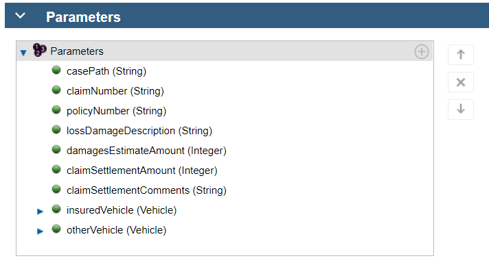

A framework of services has been developed to allow for obtaining Case properties and setting them on the various levels within the complex Business Object (BO) structure (and updating them as we will cover later in this section). The principle is that each BO within a higher level complex structure has a mapping service such as illustrated in the below `Map Vehicle Input` (which is inside the `Denim Compute Auto Claim Toolkit`) for a vehicle object. That service in turn calls a generic service `Map BO Input` to perform the mapping.

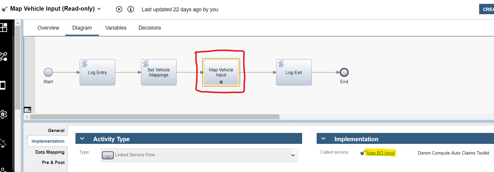

The data mapping on the service accepts as input an `ANY` type representing the BO to populate and then returns it populated with data from the corresponding Case properties. The other key input is a String list representing the set of property to attribute mappings.

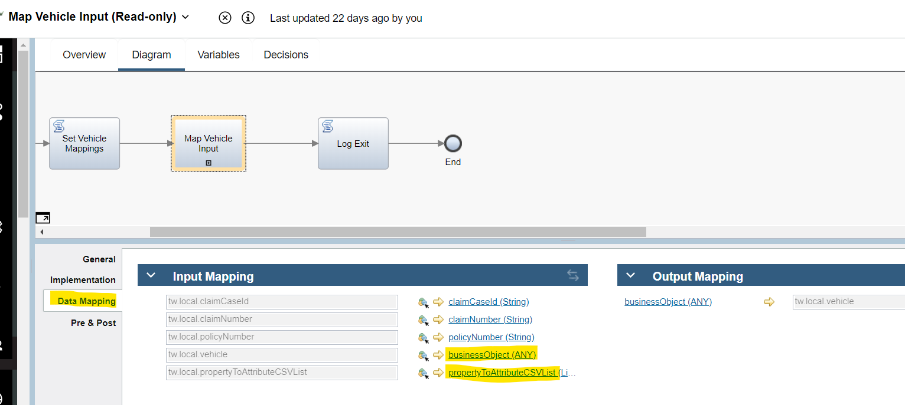

In the `Set Vehicle Mappings`script, the CSV list is created. This list has an entry for each target attribute in the BO and passes in for each entry a formatted string, an example of which is highlighted. To take that value `DENI1_VehicleMake:make:String` the first part represents the unique name of the case property, the second is the BO attribute name, and the third is the data type.

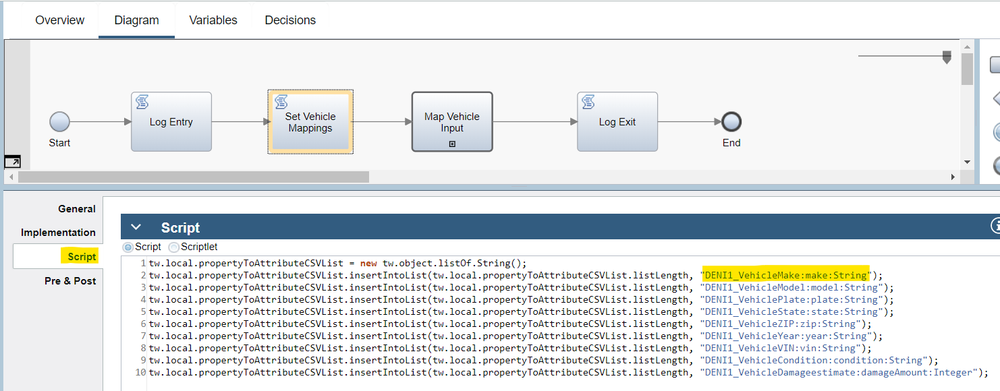

Here is the corresponding case property named `Vehicle Make` showing where the unique identifier comes from inside `Case Builder`.

The `Map BO Input` service is shown here, it makes calls to a number of helper services in order to interact with Case using the JavaScript API.  
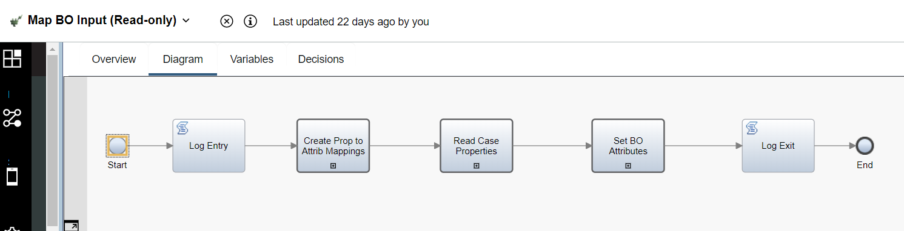

Returning to the mapping, the higher level AutoClaim BO is mapped similarly in a service `Map AutoClaim Input` and also it delegates to lower level services (such as `Map Vehicle Input` shown earlier) to perform the mappings of the contained BOs within it.

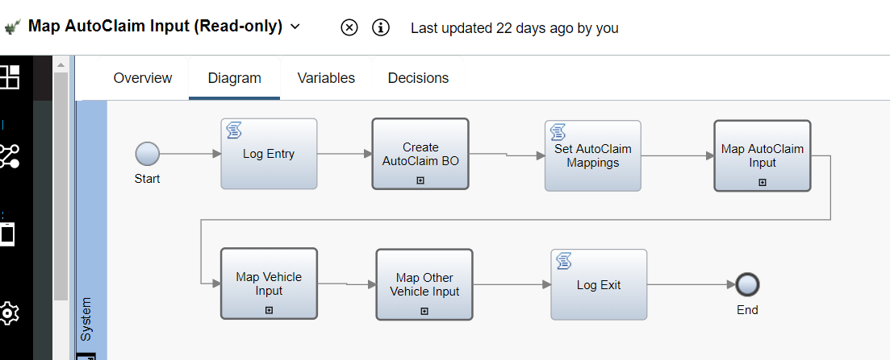

When data is required to be updated in Case the pattern is to set the inputs on and invoke a generic service `Write Case Properties` as illustrated in the service `Update Claim Settlement Details` (found in the `Denim Compute Auto Claims` Toolkit) shown here.

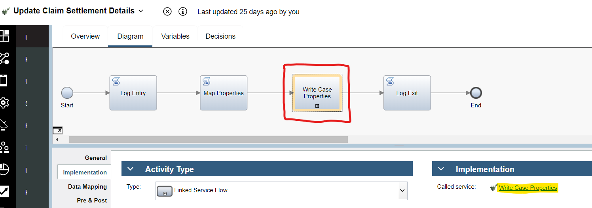

The `Map Properties` script sets the `casePropertyUpdateList` variable used as the input mapping on the target `Write Case Properties` service.

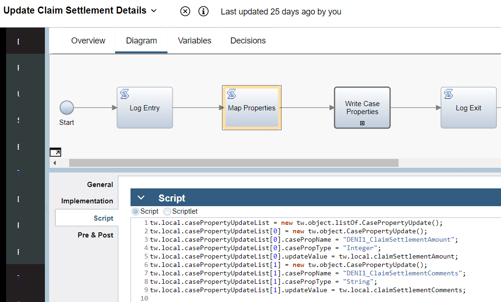

## ODM integration

BAW integration to ODM is by using a REST `External Service`. The service includes the three ODM operations used in the scenario, it is named `Denim ODM Service` and found in the `Denim Compute Decision Services Toolkit` Toolkit shown here:

An example usage of the `External Service` is in `Perform Claim Segmentation` within `Denim Compute Auto Claim Toolkit` Toolkit. Note in the scenario that there is a boundary error event handler in case the ODM service is unavailable and this then sets the outputs to follow a default path. The inputs to the ODM operation are set from case properties using the pattern already described in the *Case properties synchronization* sub-section above.

## ECM integration

BAW uses two main patterns to integrate to ECM, first it has to read existing documents from ECM in order to display them to the user inside client-side human service coaches and second it has to write a new JSON document to ECM with the complex data structures populated within BPM. For the first pattern a service flow named `Get Claim ECM Documents` in `Denim Compute Auto Claims Toolkit` Toolkit is called from the `Loss Assessment` process as shown here.

In the `Data Mapping` inputs to that service we provide the `claimCaseId` and `claimSubfolderPath` which are used to find the Case ECM folder and the sub folder within it of interest (in this situation that is `Damages Evidence`).

Here is the `Get Claim ECM Documents` service flow where it uses the `Content Integration` feature to makes calls to `Get Folder by Path` and `Get Documents in Folder`.

It then filters the returned documents to ensure that they match the `Document Class` of interest and that they have metadata for the `Vehicle Plate` that matches the vehicle that is bound to this particular service flow.

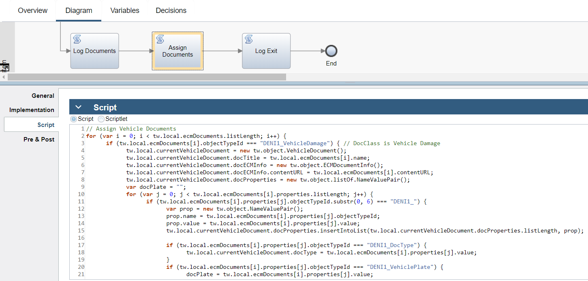

The `Loss Assessment` process we saw earlier then invokes the `Tender for Estimates` `Client Side Human Service`. In the `Coach` layout a reusable `View` named `Vehicle Documents` (found in `Denim Compute Auto Claims - Common` Toolkit) is used and has the documents that were retrieved bound to it.

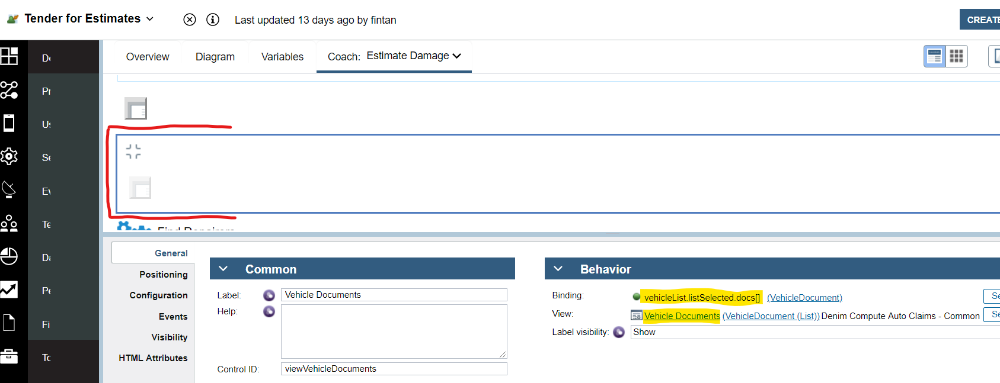

In `Vehicle Documents` a Viewer control from the `Content Management` Toolkit is used to display the document content as shown here.

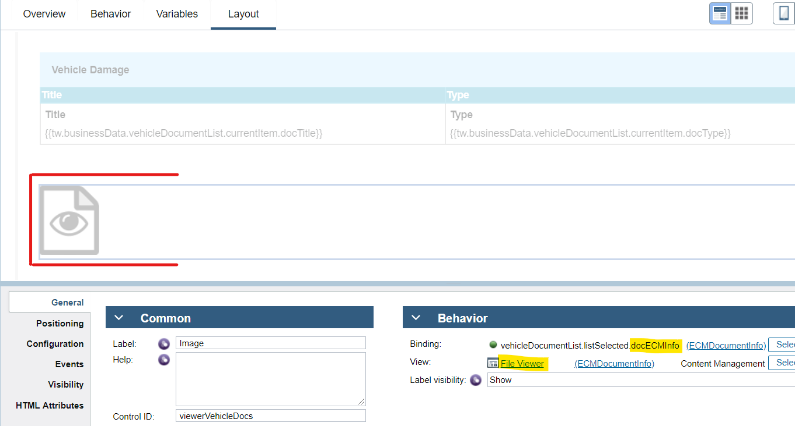

Moving now to the second pattern, in the `Initiate Claims Processing` process one of the last activities is to store the JSON representation of the complex BO structure in the Case folder by invoking the service flow `Write AutoClaim JSON Output`.

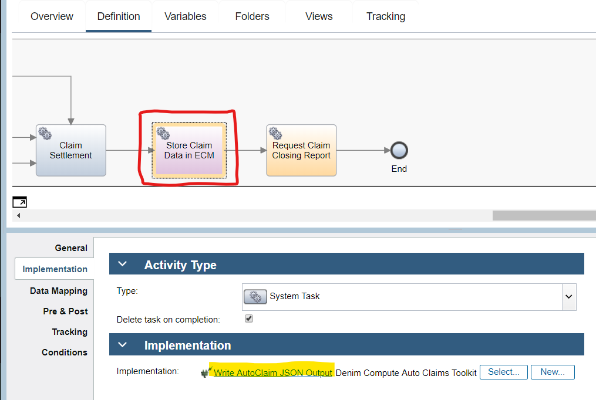

In `Write AutoClaim JSON Output` (within `Denim Compute Auto Claims` Toolkit) the steps include a call to a `Content Integration` step using the `Create document` operation.

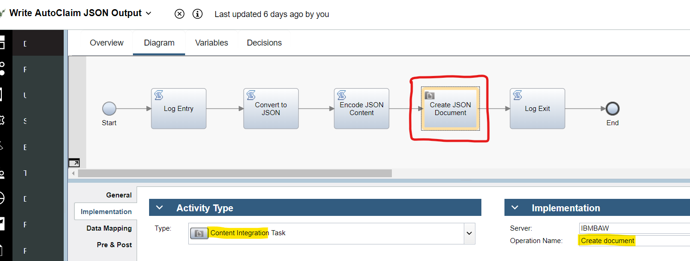

A previous step `Convert to JSON` is used to parse the `AutoClaim` BO and convert it into native JS equivalents and from that to extract the JSON formatted output.

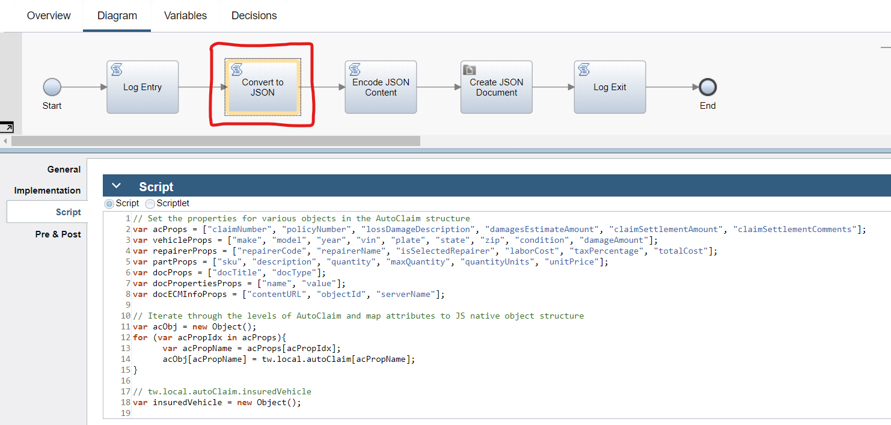

## BACA integration 

As seen in the *mediated BACA integration* section of the [workflow design](../design/workflow.md), the `Case Activity` implementation (`Process Repair Estimate`) on receipt of an estimate PDF processes the document via BACA and then sends an event notification where it sets correlation data and the `VehicleRepair` BO.

The event message correlates to the corresponding running instance of `Provide Repair Estimates Per Repairer` by matching on the correlation key data (the combination of `claimNumber`, `repairerCode`, and `vehicleVIN`). This then interrupts (and in effect cancels) the user task `Provide Repair Estimate` as it is no longer needed when the `VehicleRepair` data has been validated and provided by the BACA integration.

`Process Repair Estimate` invokes the linked process `Handle Received Vehicle Repair Estimate` in `Denim Compute Auto Claims Toolkit` to perform the main logic to fetch the uploaded document, provide it to BACA and parse the results and then create the event data for return to `Process Repair Estimate`.

The interaction with BACA is done via a mediation [micro-service](./capture.md) implemented in Node.js and deployed on Red Hat OpenShift Container Platform (OCP). The `Service Flow` invoked by `Handle Received Vehicle Repair Estimate` that handles the top level interaction with the microservice is `Analyze and Parse Auto Repair Estimate` shown below. The high level sequence of the logic is:

- Call the microservice to upload the PDF for analysis
- Wait before making a call to the microservice to check the status of the analysis and check that it has been parsed OK
- Retrieve the resulting Vehicle Repair Estimate from the microservice

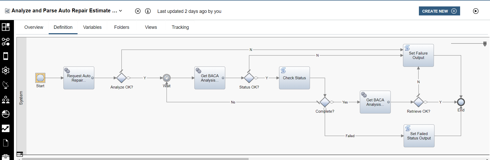

The integration to the microservice (which in turn integrates to BACA) is self-contained in the Toolkit named `Denim Compute Content Analysis Services`. The REST integration to the microservice is via an `External Service` that exposes several operations (but not all as some cannot be processed in BAW as we shall see later).

The `Service Flow` named `Request Auto Repair Estimate Analysis` shown below needs to use a `Script` node to invoke one of the operations on the interface. This is because that operation (named `requestAnalysis` that allows for a file upload) uses a MIME type of `multipart/form-data` which BAW does not yet support.
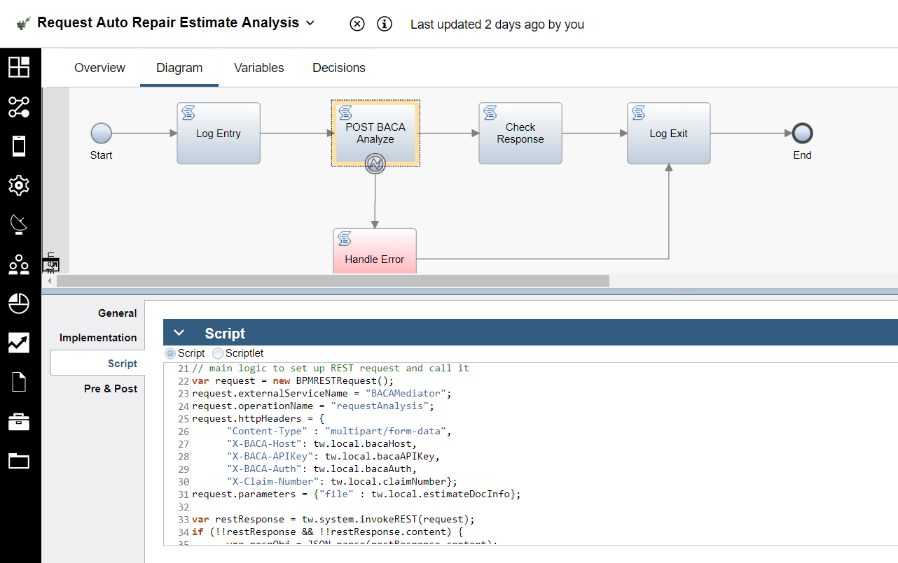

The `Service Flow` named `Get BACA Analysis Status` invokes the `External Service` operation named `getStatusByAnalyzerId`  as shown below.

The `Data Mapping` section shows the various input data supplied to the operation. A number of these are `REST Headers` data and the other is the `analyzerId` which is returned as a response from the previous call to the `requestAnalysis` operation.

The `Service Flow` named `Get BACA Analysis Results` invokes the `External Service` operation named `retrieveJSONByAnalyzerId` in order to retrieve the resulting parsed estimate data from BACA.

Finally the flow also invokes the `External Service` operation named `cleanupByAnalyzerId` in order to delete the resources used by the request inside BACA.

