# Process user interface

## Referencing views

The BPM UI API provides a number of ways to reference other controls (Views)
depending on the context. The most simple example is to reference a control from
itself:

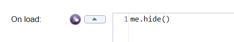

Next when you want to reference another control inside an event of a control you
use the `${\<controlId\>}` notation:

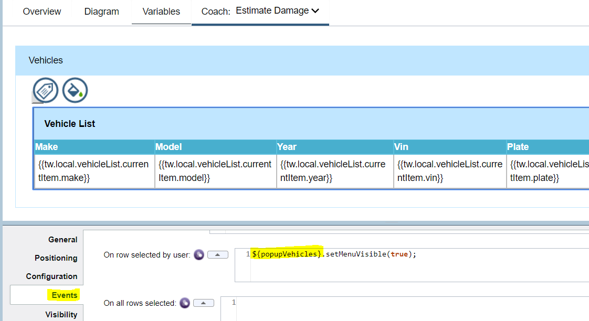

You can use a shortcut notation of `getSibling()` to refer to a control at same
level (i.e. inside the same view):

From inside a Table column you need to use `${../\<controlId\>}` to navigate up
to reference controls at the same level as the Table (this principle also
applies from inside a view to reference things that are siblings of the view on
the parent Coach):

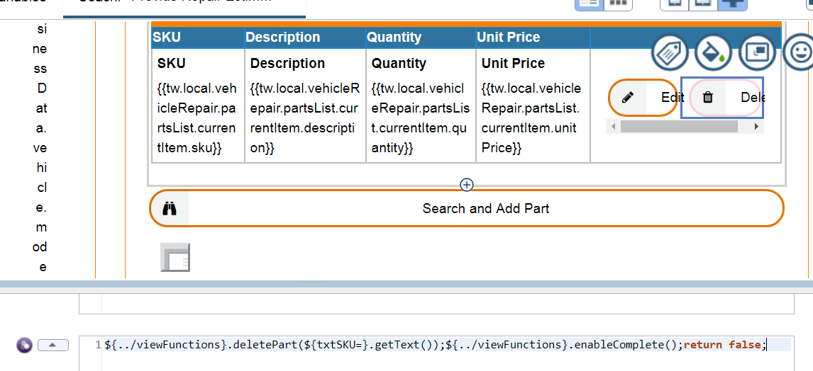

(Note the above also shows an example of using internal Table shortcut
references – in this case to reference a control from same row with `${txtSKU=}`
notation).

To reference controls that are on the Coach (the page) you use `page.ui.get()`:

To reference controls inside a view’s logic use `this.ui.get()`:

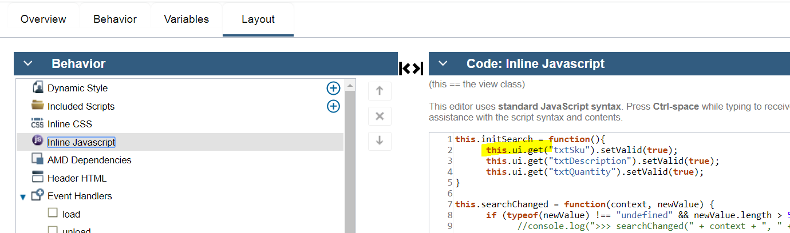

To reference view logic (functions) from a contained control inside a view use
`view.xxx`:

##Using formulas

The BPM UI API provides formulas where you reference other fields and when those
fields change the formula is automatically recalculated. An example of that is
in the Create Settlement Offer Coach where the Claim Settlement Amount is a
calculated field that uses a formula to refer to other fields. Any time one of
those referenced fields changes then the formula is re-evaluated:

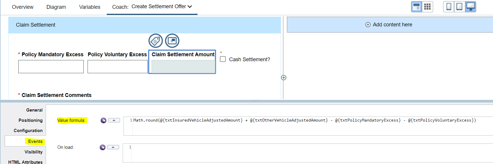

However sometimes setting a formula does not meet the requirements and you have
to adopt an alternative approach. Here is an example of trying to set a formula
that references the selected rows in some tables:

The first issue is that it gives errors because the `getSelectedRecord()` at load
returns null:

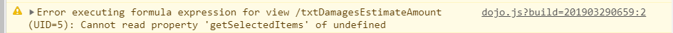

The second issue (and the critical one in this case) is that an automatic update
does not seem to get triggered when you select the row in the table. To work
around this we take a different approach were we will use a function to perform
the calculation and set the target field and place this function in a reusable
view that we then add to the Coach:

The view function is shown here:

Now then the table row is selected we can call the view’s function from the
event:

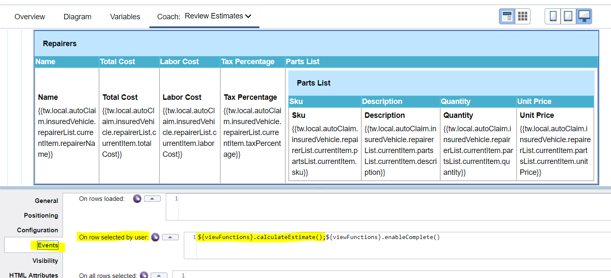

## View events examples

Events on a view (control) are the key to detecting a change and reacting to it
(e.g. a data field is set or updated) with BPM UI API calls. A typical event is
an on click of a button – here is an example of invoking a view’s function and
passing in as an argument a reference to another control’s bound data property:

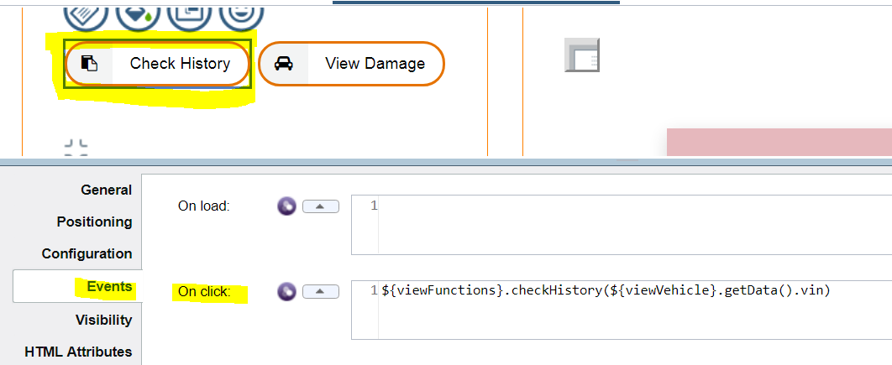

Here is an example of reacting to a data change event and it also shows you can
put multiple statements in the implementation (you can even add arbitrary JS
logic like `if() {} else {}`):

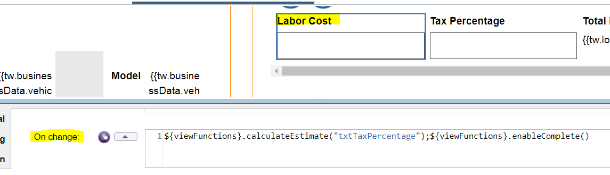

Her is an example of detecting a table row selection:

## Table view API manipulation

The BPM UI Table view API has a number of methods, snippets of the ones that
were used most regularly in the processing are shown here:

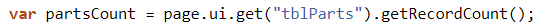

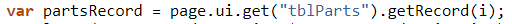

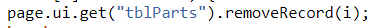

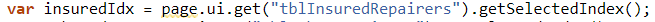

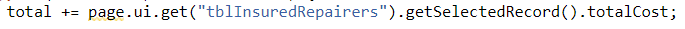

## Editing table rows with Flyout

The BPM UI Samples recommend using a view inside a
table column that edits a row (and uses Deferred Sections for lazy loading). The
key to this is that the Modal section is placed within a table column and bound
to the list’s `currentItem`:

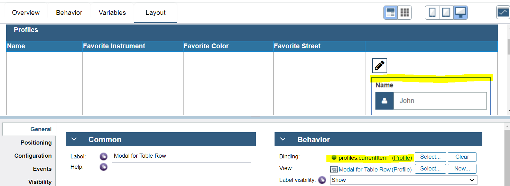

While this allows for editing the table row, it makes direct edits to the
underlying row and does not preserve the existing value. In our scenario we want
to provide an enhanced user experience so they can Edit a row and then decide
whether to commit those changes or cancel them. To support this we can not use
the approach of binding to the list’s `currentItem`. Instead we create a separate
local variable of type `VehiclePart` which represents the currently editable Part
and bind that to the Modal that will include the Part editing fields:

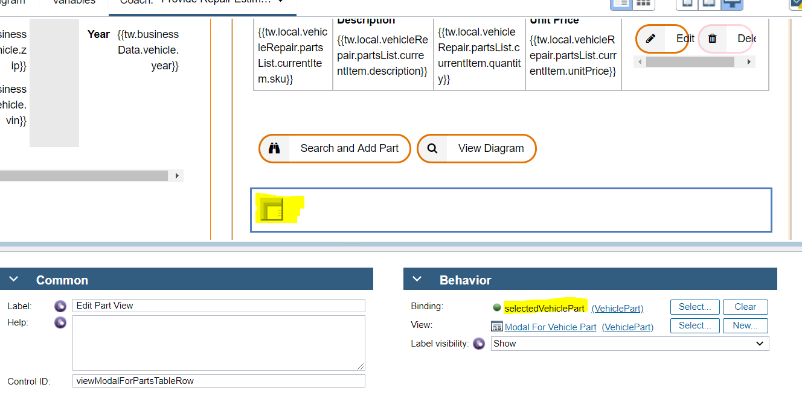

When `Edit` is clicked the event then calls an `editPart()` method defined in a
reusable view and passes in the `SKU` for the selected row:

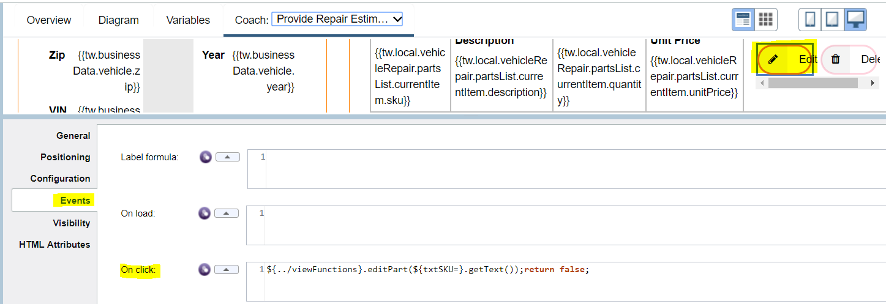

Here is the `editPart()` method within `Provide Repair Estimate Functions` view that
then sets the bound data on the mobile from the selected item in the Parts table
plus it also sets a hidden field for the part index as we will need to reference
this in the case of the user choosing the `Save Changes` option on the Modal:

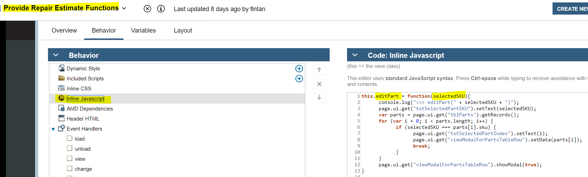

The `Save Changes` boundary event is then used to transition to a client-side
script where the `partsList` is updated at the saved index (and if the user
selects to `Cancel` we just close the Modal and do not make any updates to the
`partsList`):

## Putting reusable functions in a view

Formulas etc on controls are great for one time actions but you often find that
you want to do multiple things on an event and while you can add many statements
separated by *“;”* in an event it becomes unwieldly and difficult to maintain.
Also if you find yourself having to do a lot of chained behavior on different
controls (e.g. a table updates so you have to check button visibility, plus
popup a model, plus re-initialize a variable, etc) then it is hard to keep
track. (Another example is for a Table with a requirement to switch Button
visibility depending on row count – the Table’s `on rows loaded` event worked for
most cases but it did not fire when you programmatically called `table.add()` to
add a new row). So we considered it better to have a function that does the
multiple things and call that function. However if you use `Custom HTML` on a
Coach then you can’t reference that function in client-side scripts so you would
end up with duplicating the logic (where you had to transition out of Coach and
call the same behavioural logic). To get round this we created a view that has
no content (well we put a hidden 100px Spacer on it so we could see it visually
on the parent Coach canvas):

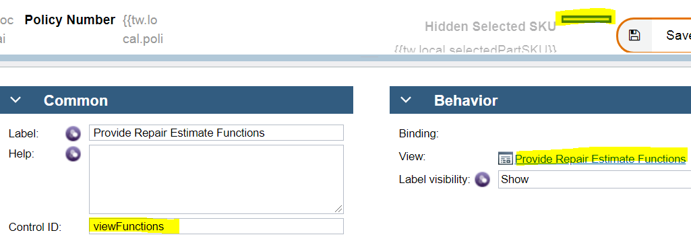

And an example of referencing the functions:

The downside is that the view with functions has to refer to control Id names
that are volatile (if they change on Coach then the code inside the view
functions will break):

However you would be in a similar situation if you used `Custom HTML` as again you
would have to edit the code for every change to a `Control ID`. 

##Transitioning to client-side scripts

While the ability to encapsulate all UI logic in a view is desirable to allow
for maximum reuse, sometimes it is not possible to self-contain everything on
the Coach or in a view – you have to transition out to a `client-side script` to
complete the necessary logic. The most common situation is where you need to
refer to a variable that is not bound to anything on the coach so it does not
have any DOM representation that you can make BPM UI API calls (e.g.
`page.ui.get(\<controlId\>)`) against. Here is an example from the `Tender For
Estimates` Coach where the `vehicleList.repairerList` does not have any binding to
a visual control and so it cannot be referenced in BPM UI API calls:

Here is another example where there is a reference to `duplicatePartWarning` which has no binding on the Coach:

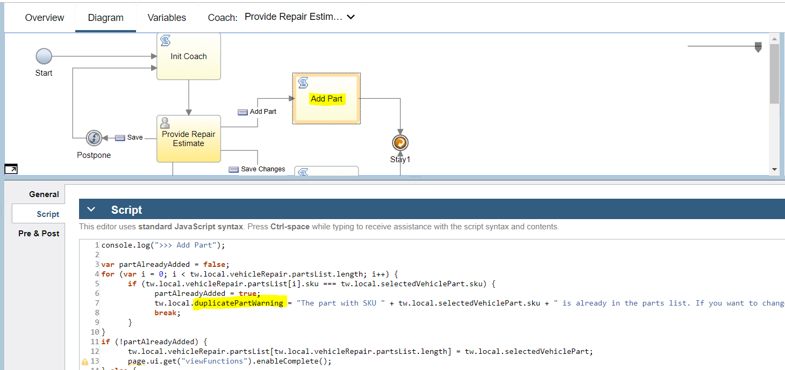

(Note: `duplicatePartWarning` is a String bound to the Help section of a `Modal
Alert` view from UI Toolkit that is added on the Coach and there is no exposed
API method on it that lets you set the Help value thus the need to manipulate
the `duplicatePartWarning` variable):

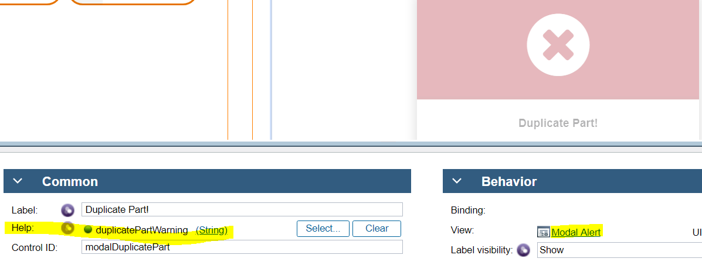

Note in both of the above cases it may be possible to avoid these transitions if
really necessary by putting hidden controls on the Coach that are bound to the
variables that need to be manipulated. That way the BPM UI API can be used to
access and update the bindings on those hidden controls.

An other example is where the event is not exposed – such as in a Modal with
buttons encapsulated within it so you cannot get access to the button events:

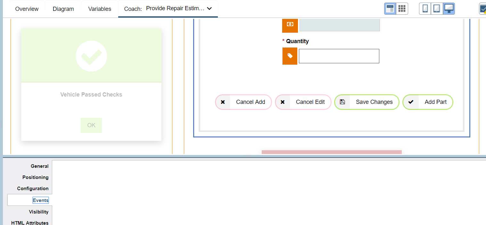

You have to then react to the boundary event instead and transition to a
`client-side script`:

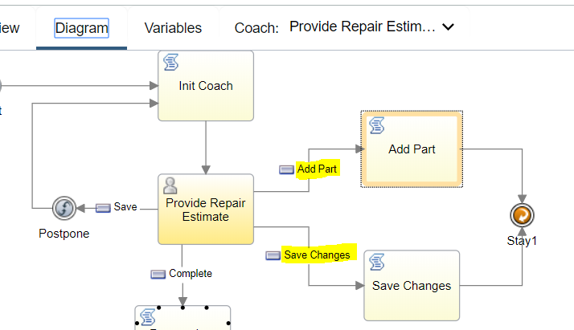

You may also be able to avoid this situation in a number of (increasing
complexity in terms of coding) ways. The easiest solution might be to not
encapsulate the buttons inside the Modal but have them directly on the Coach /
view that needs to react to their events. An alternative, and more complex,
option would be to expose the inner button events to the interface of the
containing view. This requires using BPM UI Coach Framework APIs to detect the
button events programmatically and to fire an event option on the parent view.

## Coach views loading order

The loading order of the tree of views contained in a coach is inside out – a
section with controls loads after all the contained controls inside it have
loaded and so on. We utilise a top level `Vertical Layout` container in each Coach
and do initialization things that reference multiple controls in the `onLoad()`
event of it – that way we can ensure all dependent controls are already loaded
and can be referenced with `page.ui.get(\<controlId\>)` / `${\<controlId\>}` etc.
Here is an example with the outermost `Vertical Layout` shown and in there it
calls an embedded view with the JS functions to perform checking whether to
enable the `Complete` button or not:

## Deferred section views and asynchronous loading

A common pattern when using a Modal popup is to defer the loading of it until
needed (especially if it is complex and put within the column of a table) using
the `Deferred Section` (DS) view. You have to be very careful about the loading
order – you will get errors showing up in the browser debugger such as
“*page.ui.get(\<controlId\>) not defined*” if you are trying to reference DOM
items that are not loaded yet. A way to avoid such issues is to encapsulate the
actions in a function and ensure it is called only when the DS has loaded. Here
is a view with a DS that inside has a Modal and a Table and other controls:

An initializing function (`showModal()` below) is called from parent Coach (say
from a button click event) that checks whether the DS is loaded and if not it
calls `lazyLoad()` on it otherwise it calls the function that prepares the view by
setting visibility etc:

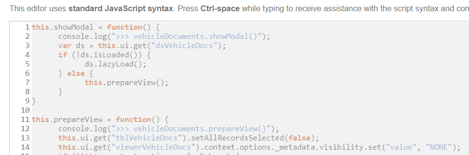

This same `prepareView()` function should be called only when the DS has
lazy-loaded:

## Forcing boundary event triggers

Sometimes you want to react to an event on a control by executing some
`client-side script` logic but the control does not have its own boundary event
that fits the need. So you add a `Navigation Event` control:

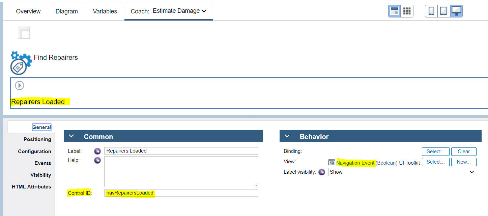

And in the source for the event (in this example the return from a `Service Call`)
you call `fire()` on it:

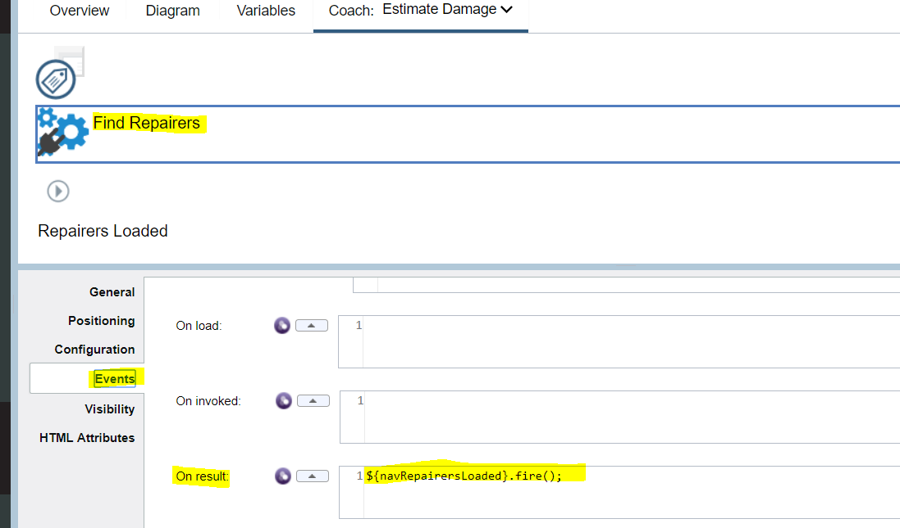

Which then lets you transition out to the `client-side script`:

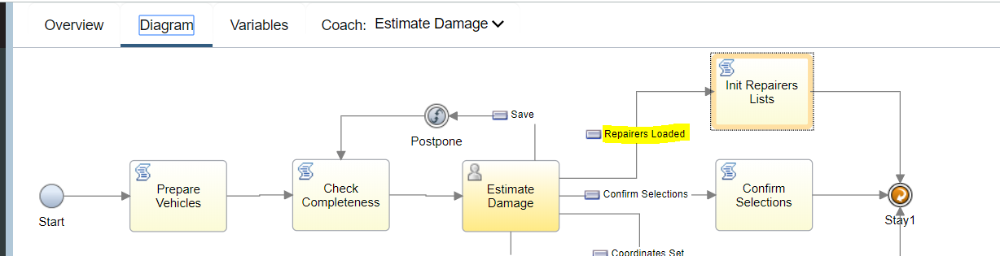

## Map control reacting to binding changes

We use a BPM UI `Map` view in the `Tender for Estimates` Coach to show the location
of a `Vehicle`. The BPM UI `Map` view has configuration options for the `latitude` /
`longitude` settings:

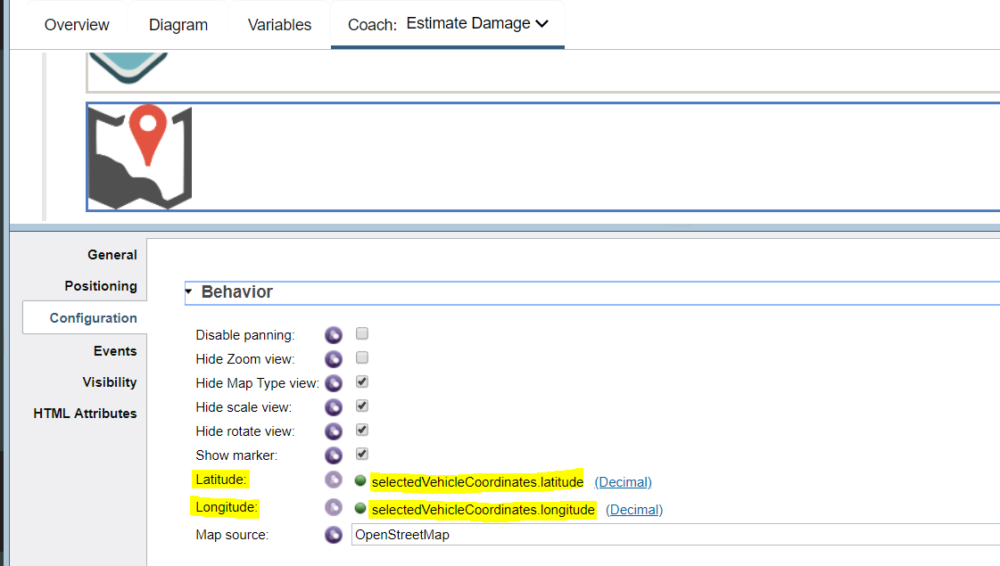

While these work on first load of the `Map` inside the popup Modal on the Coach,
subsequent changing of these values (for example when the selected Vehicle is
changed) did not trigger an update of the location shown on the Map. To get
around this we need to use a specific `Map` API method. First let’s look at the
sequence of events, When a `Vehicle` is selected the `ZIP` is passed to a `Service Call` view (`Get Coordinates`) which invokes a service to translate the `ZIP` into
Geo coordinates. On return from that `Service Call` we then need to force a transition and that is done by in turn calling the `fire()` method of a `Navigation Event` view:

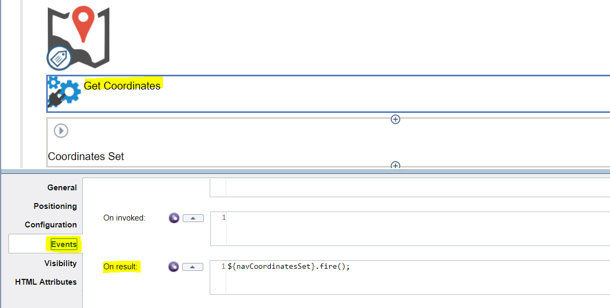

The `Navigation Event` then provides us a boundary event which we can use to
transition to the `Show Map` `client-side script`:

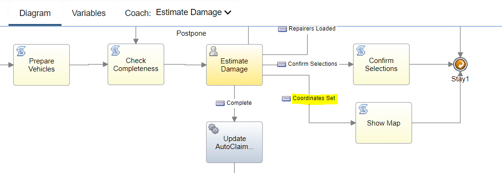

And in the script (among other things) we have to explicitly call the
`setCenter()` method on the `Map` to ensure it refreshes:

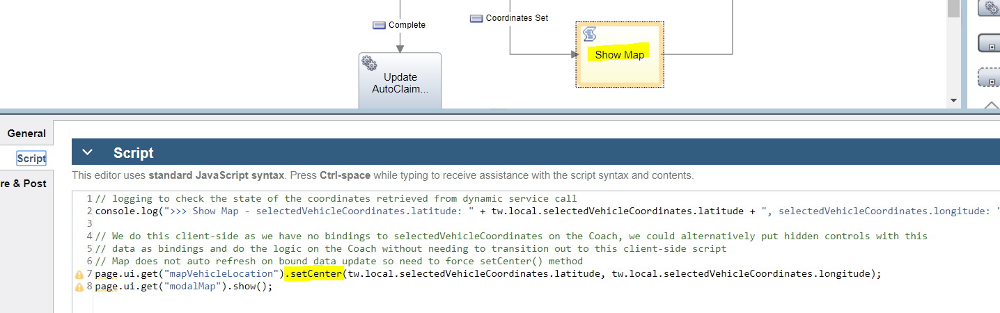

Note that while this results in the `Map` correctly showing the new coordinates,
however the `Marker` is not shown (it may be possible to set this with the method
<https://support.salientprocess.com/docs/enterprise/Map.html#addMarker> but we
did not check this as it was not vital to the scenario).

## Access view configuration option complex BO

There is a defined way to navigate through the structure of a complex BO
(`Business Object`) bound as a configuration option of a view. In this case you
get the top level BO (`searchableVehicleParts`) and then a property that is a list
(`partsList`):

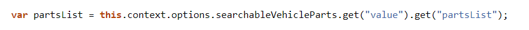

Then a further call uses the index to get a specific entry from the list and
then reference attributes of that entry (an instance of `VehiclePart` BO):

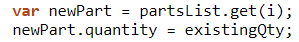
