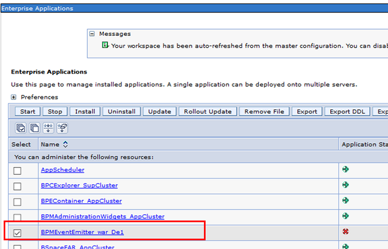
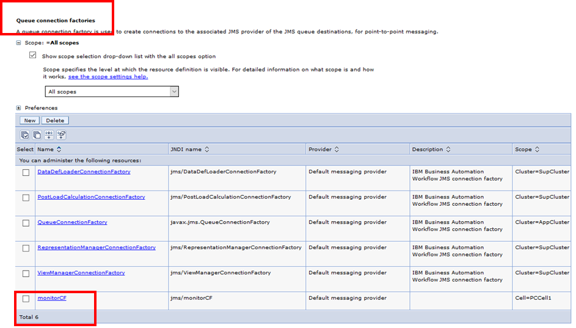
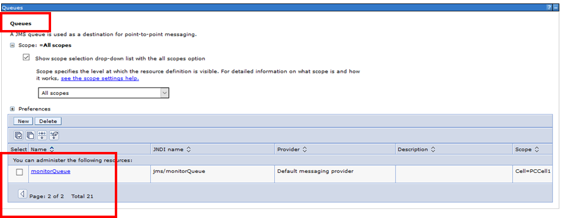
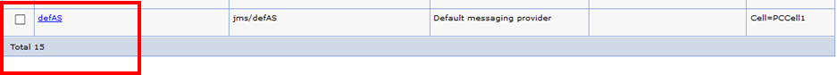
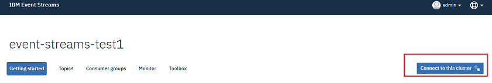
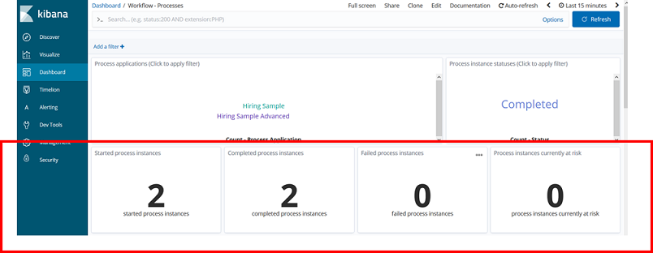

This chapter details the install activities for the BAI component and the associated emitters for BPMN, BPEL, Case Management and ODM.

## Installing the BPMN event emitter
This section provides a playback of the [IBM Knowledge Center BAW emitter install documentation](https://www.ibm.com/support/knowledgecenter/SSYHZ8_19.0.x/com.ibm.dba.bai/topics/con_bai_top_bpmn_emitter_install_config.html) steps.
Before starting on your install, make sure you have the following node information available:

- IBM Event Streams bootstrap host IP and port (e.g. `172.16.52.216:32254`)
- IBM Event Streams broker-[0..n] host and port
- IBM Event Streams topicName, e.g. `event-streams-test1-ibm-bai-ingress`
- IBM Event Streams console URL
- BAI Kibana UI URL

You will also need the credentials for the BPM deployment environment administrator.
Next, check the install prerequisites, which are listed [here](https://www.ibm.com/support/knowledgecenter/SSYHZ8_19.0.x/com.ibm.dba.bai/topics/tsk_bai_bpmn_emitter_install_prereq.html).

### Run the EnableBAI script
The documentation instructions for this task are [here](https://www.ibm.com/support/knowledgecenter/SSYHZ8_19.0.x/com.ibm.dba.bai/topics/tsk_bai_bpmn_emitter_first_install_config.html). The first step is to install the emitter application and create a set of JMS resources. Log in to the BAW deployment manager node and run the `EnableBAI.py` script. You will need to use the BPM deployment environment administrator credentials to run the script.
```
cd /opt/IBM/BPM
./profiles/DmgrProfile/bin/wsadmin.sh -f ./BPM/Lombardi/tools/def/EnableBAI.py -enable
```
You should see the following output:
```
ADMA5016I: Installation of BPMEventEmitter_war_De1 started.
ADMA5058I: Application and module versions are validated with versions of deployment targets.
ADMA5005I: The application BPMEventEmitter_war_De1 is configured in the WebSphere Application Server repository.
ADMA5005I: The application BPMEventEmitter_war_De1 is configured in the WebSphere Application Server repository.
ADMA5081I: The bootstrap address for client module is configured in the WebSphere Application Server repository.
ADMA5053I: The library references for the installed optional package are created.
ADMA5005I: The application BPMEventEmitter_war_De1 is configured in the WebSphere Application Server repository.
ADMA5001I: The application binaries are saved in /opt/IBM/BPM/profiles/DmgrProfile/wstemp/Script16bb8535ebd/workspace/cells/PCCell1/applications/BPMEventEmitter_war_De1.ear/BPMEventEmitter_war_De1.ear
ADMA5005I: The application BPMEventEmitter_war_De1 is configured in the WebSphere Application Server repository.
SECJ0400I: Successfully updated the application BPMEventEmitter_war_De1 with the appContextIDForSecurity information.
ADMA5005I: The application BPMEventEmitter_war_De1 is configured in the WebSphere Application Server repository.
ADMA5005I: The application BPMEventEmitter_war_De1 is configured in the WebSphere Application Server repository.
ADMA5113I: Activation plan created successfully.
ADMA5011I: The cleanup of the temp directory for application BPMEventEmitter_war_De1 is complete.
ADMA5013I: Application BPMEventEmitter_war_De1 installed successfully.
Saving Configuration
Class loader order is changed to 'classes loaded with local class loader first'.
Connection update skipped
---------------------------------------------------------------
 AdminNodeManagement:        Synchronize the active nodes
 Usage: AdminNodeManagement.syncActiveNodes()
 Return: If the command is successfully invoked, a value of 1 is returned.
---------------------------------------------------------------

Node1
Node2
Configuration synchronized.
```
After the script execution completes, you will have:

- The `BPMEventEmitter` application installed:


- The `monitorCF` connection factory created:


- The `monitorQueue` created:


- The `defAS` activation spec is created:


Once the script completes, you need to restart BAW. This step may take a while: the deployment manager node may be slow to stop, restart and communicate with the BAW cluster members.

### Prepare secure connection to IBM Event Streams
The documentation instructions for this task are [here](https://www.ibm.com/support/knowledgecenter/SSYHZ8_19.0.x/com.ibm.dba.install/topics/tsk_preparing_bai_using_event_streams.html#task_amz_qsx_kfb). The steps are the following:

- Generate the API key
- Log in to the IBM Event Stream console as administrator.
- Connect to the cluster:

- Download the truststore and PEM certificate as shown below:

- Copy the truststore (e.g. `es-cert.jks` file) and PEM certificate (e.g. `es-cert.pem` file) in a folder (e.g. `/opt/IBM/BPM/EventStreamKeyStore`) on the deployment manager node
- Import the certificates on the deployment manager by running the following command:
```
/opt/IBM/BPM/java/bin/keytool -importcert -alias kafkaServer -keystore es-cert.jks -file es-cert.pem -noprompt
```

### Prepare secure connection for BPM event emitter
Documentation instructions for this task are [here](https://www.ibm.com/support/knowledgecenter/SSYHZ8_19.0.x/com.ibm.dba.bai/topics/tsk_bai_bpmn_emitter_config.html). The steps are the following:

- Edit the configuration property file `/opt/IBM/BPM/BPM/Lombardi/tools/def/BAIConfigure.properties`
  - `DeploymentEnvironmentName` is set to `None` as we only have one DE
  - `bootstrapServer`s is set to the Event Stream bootstrap and 3 boot servers IP/port
  - `topicName` is set to the kafka ingress topic that was configured when installing BAI
  - `bpmCellName` is set to the name of the BAW BPM cell
  - `type` is set to `plain_ssl` as this is the security configure by default on IBM Event Streams
  - `trustStore` is set to the location of the trust store downloaded from IBM Event Stream
  - `trustStore.password` is set to the IBM Event Stream trust store password
  - `username` is set to `token`
  - `password` is set to the API key generated from IBM Event Streams
Below is an example of the configuration file:
```
DeploymentEnvironmentName=None
bootstrapServers=172.16.52.216:32254,172.16.52.216:31027,172.16.52.216:31571,172.16.52.216:30457
topicName=event-streams-test1-ibm-bai-ingress
bpmCellName=PCCell1

type=plain_ssl
# SSL
trustStore=/opt/IBM/BPM/EventStreamKeyStore/es-cert.jks
trustStore.password=password
# Authentication
username=token
password=gbSA_jxUBeoVyqmvdoZvePoPWS_W1SaHOKmuQCk-xH93
```

- Run the EnableBAI configuration script again as follows:
```
cd /opt/IBM/BPM
./profiles/DmgrProfile/bin/wsadmin.sh -f ./BPM/Lombardi/tools/def/EnableBAI.py --update=connection --property=./BPM/Lombardi/tools/def/BAIConfigure.properties
```

- Start the BPM event emitter application. The log should show the following:
```
[7/3/19 12:22:01:913 EDT] 000000a4 ConfigConnect I   CWMCD1003I: The Kafka connection is created.
[7/3/19 12:22:01:915 EDT] 000000a4 LifeCycleMana I   CWMCD1014I: The BPMEventEmitter message-driven bean (MDB) is started.
[7/3/19 12:22:01:936 EDT] 000000a4 ApplicationMg A   WSVR0221I: Application started: BPMEventEmitter_war_De1
[7/3/19 12:22:01:937 EDT] 000000a4 CompositionUn A   WSVR0191I: Composition unit WebSphere:cuname=BPMEventEmitter_war_De1 in BLA WebSphere:blaname=BPMEventEmitter_war_De1 started.
```

### Test the connection to BAI
Test the install by running sample processes from the process portal. You should see the `Workflow - Processes` default dashboard in Kibana being updated, as shown below:



## Installing the Case event emitter
*TBD*

## Installing the ODM event emitter
Unlike for an on-prem install, where you have to manually configure the ODM emitter install, the emitter for ODM is installed as part of the ODM containers deployment through IBACC. You will need to have handy the information shown on the screen shot below during the ODM deployment.


