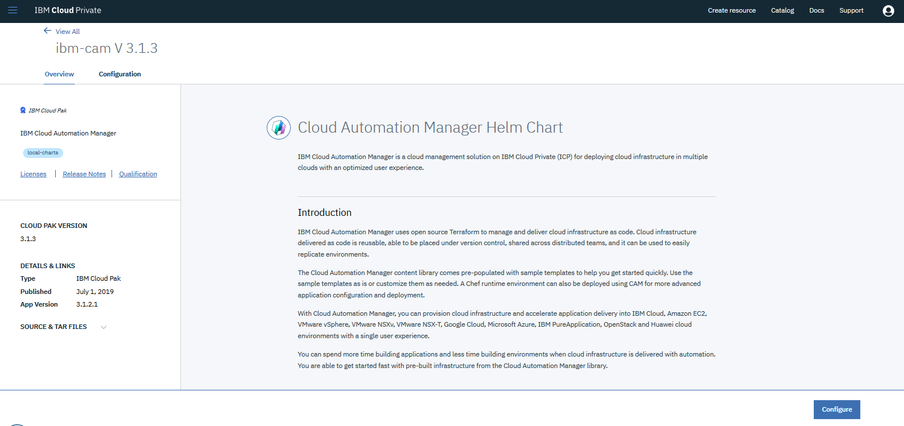

## Introduction

IBM Cloud Automation Manager (CAM) is a cloud management solution in IBM Cloud Private for deploying cloud infrastructure in multiple clouds with an optimized user experience. 

Cloud Automation Manager uses open source Terraform to manage and deliver cloud infrastructure as code. Cloud infrastructure that is delivered as code is reusable, is able to be placed under version control, can be shared across distributed teams, and can be used to easily replicate environments.

In relation to ICP4A, CAM is used to deploy IBM Business Automation Workflow (BAW) to traditional WebSphere nodes.

Eventually, IBM BAW will be deployed as containers which will mean that CAM would not be used in this case.

CAM will still be strategic for deploying any VM based offering. CAM will also soon support OpenShift. As long as there are WAS-ND based offerings, CAM will be used to deploy them.

Even after IBM BAW is delivered in containers, customers will still want to or need to use VM (WAS-ND) based versions if they: 

- Are using IID/BPEL content, which is almost 50% of Workflow clients
- They are dependent upon deprecated code which will be removed in the Container version of Workflow and can't yet refactor their apps. 

There are several steps to install CAM, described in the [IBM CAM Knowledge Center](https://www.ibm.com/support/knowledgecenter/en/SS2L37_3.1.2.1/cam_install_offline_EE.html) documentation.

Notice that we did an offline installation as opposed to an online installation. The difference is that we will load the CAM software into our ICP catalog. Online installations download the CAM software from a public Docker registry.

## Load CAM software

### Download software

First, download [`icp-cam-x86_64-3.1.2.1.tar.gz`](https://www-945.ibm.com/support/fixcentral/swg/selectFixes?parent=ibm~WebSphere&product=ibm/WebSphere/IBM+Cloud+Private&release=All&platform=All&function=fixId&fixids=icp-cam-3.1.2-build520157&includeSupersedes=0) from Fix Central.
Place the tar file into the directory `/download`s an a Master node:
```
$ ls -l
total 10025452
-rw-r--r-- 1 root root 10266055420 May 31 20:22 icp-cam-x86_64-3.1.2.1.tar.gz
```

### Log into ICP and Docker
```
$ cloudctl login -a https://dbamc.icp:8443 --skip-ssl-validation -u admin -p admin -n services
Authenticating...
OK

Targeted account dbamc Account (id-dbamc-account)

Targeted namespace services

Configuring kubectl ...
Property "clusters.dbamc" unset.
Property "users.dbamc-user" unset.
Property "contexts.dbamc-context" unset.
Cluster "dbamc" set.
User "dbamc-user" set.
Context "dbamc-context" created.
Switched to context "dbamc-context".
OK

Configuring helm: /root/.helm
OK
root@dbamc-icp-ubuntu-master3:/downloads# docker login dbamc.icp:8500
Authenticating with existing credentials...
WARNING! Your password will be stored unencrypted in /root/.docker/config.json.
Configure a credential helper to remove this warning. See
https://docs.docker.com/engine/reference/commandline/login/#credentials-store

Login Succeeded
```

### Load the software into the catalog
```
cloudctl catalog load-archive --archive /downloads/icp-cam-x86_64-3.1.2.1.tar.gz
```

### Generate API Key

You will need to generate an API key to install CAM because its required as one of the configuration parameters. Here are the commands to do this.
```
export serviceIDName='service-deploy'
export serviceApiKeyName='service-deploy-api-key'
cloudctl login -a https://dbamc.icp:8443 --skip-ssl-validation -u admin -p admin -n services
cloudctl iam service-id-create ${serviceIDName} -d 'Service ID for service-deploy'
cloudctl iam service-policy-create ${serviceIDName} -r Administrator,ClusterAdministrator --service-name 'idmgmt'
cloudctl iam service-policy-create ${serviceIDName} -r Administrator,ClusterAdministrator --service-name 'identity'
cloudctl iam service-api-key-create ${serviceApiKeyName} ${serviceIDName} -d 'Api key for service-deploy'
```
The output is:
```
Name          service-deploy-api-key   
Description   Api key for service-deploy   
Bound To      crn:v1:icp:private:iam-identity:dbamc:n/services::serviceid:ServiceId-bce5616f-b7b5-4d8c-9098-e7ffc61a7125   
Created At    2019-06-06T05:39+0000   
API Key       gWWji7Nf0qJCgSWOHAyzwCkD-86nRk7scPbuHz5Hp2Vw   
```
You need to save this API Key somewhere. You will never be able to view it again, and you will need it later as a parameter when installing CAM into ICP.

NOTE: One other thing that is happening when you run the above commands is that you are creating a Service ID for CAM. If you log into the ICP console, navigate to: Manage -> Identity & Access -> Service IDs

And there you will see a Service ID called service-deploy.


### Create PV folders in NFS

CAM needs multiple persistent volumes (PV) to be configured. The first thing you need to do is create directories that the Persistent Volumes will bind to. Most likely, you will create these directories on a shared server so that the directories can be shared by multiple instances of CAM.


- Via command line: login to the NFS server and execute:

```
export exportdir=/data/export

mkdir -p \
${exportdir}/CAM_db ${exportdir}/CAM_terraform/ \
cam-provider-terraform \
${exportdir}/CAM_logs/cam-provider-terraform \
${exportdir}/CAM_BPD_appdata/mysql \
${exportdir}/CAM_BPD_appdata/repositories \
${exportdir}/CAM_BPD_appdata/workspace

chmod -R 2775 ${exportdir}/CAM_db ${exportdir}/CAM_logs ${exportdir}/CAM_terraform ${exportdir}/CAM_BPD_appdata
chown -R root:1000 ${exportdir}/CAM_logs ${exportdir}/CAM_BPD_appdata
chown -R root:1111 ${exportdir}/CAM_terraform ${exportdir}/CAM_logs/cam-provider-terraform
chown -R 999:999 ${exportdir}/CAM_BPD_appdata/mysql ${exportdir}/CAM_db 
```

## Install CAM

### Create persistent volumes

You can create the PVs in the ICP console or via Kubernetes commands. Make sure you set the server and path attributes to match your environment.

- Log into the boot node

- Authenticate to ICP from the command line:
```
cloudctl login -a https://dbamc.icp:8443 --skip-ssl-validation -u admin -p admin -n services
```

- Kubernetes command for `cam-mongo-pv`
```
kubectl create -f - <<EOF
"kind": "PersistentVolume"
"apiVersion": "v1"
"metadata":
  "name": "cam-mongo-pv"
  "labels":
    "type": "cam-mongo"
"spec":
  "capacity":
    "storage": "15Gi"
  "accessModes":
     - "ReadWriteMany"
  "nfs":
    "server": "172.16.52.212"
    "path": "/data/export/CAM_db"
EOF
```

- Kubernetes command for `cam-logs-pv`
```
kubectl create -f - <<EOF
"kind": "PersistentVolume"
"apiVersion": "v1"
"metadata":
  "name": "cam-logs-pv"
  "labels":
    "type": "cam-logs"
"spec":
  "capacity":
    "storage": "10Gi"
  "accessModes":
    - "ReadWriteMany"
  "nfs":
    "server": "172.16.52.212"
    "path": "/data/export/CAM_logs"
EOF
```

- Kubernetes command for `cam-terraform-pv`
```
kubectl create -f - <<EOF
"kind": "PersistentVolume"
"apiVersion": "v1"
"metadata":
  "name": "cam-terraform-pv"
  "labels":
    "type": "cam-terraform"
"spec":
  "capacity":
    "storage": "15Gi"
  "accessModes":
    - "ReadWriteMany"
  "nfs":
    "server": "172.16.52.212"
    "path": "/data/export/CAM_terraform"
EOF
```

- Kubernetes command for `cam-bpd-appdata-pv`
```
kubectl create -f - <<EOF
"kind": "PersistentVolume"
"apiVersion": "v1"
"metadata":
  "name": "cam-bpd-appdata-pv"
  "labels":
    "type": "cam-bpd-appdata"
"spec":
  "capacity":
    "storage": "20Gi"
  "accessModes":
    - "ReadWriteMany"
  "nfs":
    "server": "172.16.52.212"
    "path": "/data/export/CAM_BPD_appdata"
EOF
```

### Install interactively

- Log into the ICP Console and navigate to  Manage -> Helm Repositories:


- Click Sync Repositories on the right:


- Again, on ICP home page, select catalog in the upper-right hand side.

- Using the search bar, search for CAM.

- Select the `ibm-cam` Helm Chart from the local-charts repository (there will be two ibm-cam icons, one for the online version and one for the local version that you installed above. Pick the local version.)



- Click the Configuration tab and use the following settings:

Helm release name: `cam`
Target namespace: `services`
Check the license agreement
IAM service API key: use the key copied in task above.

- Click Install

- Check the status of the deployment from the command line:
```
kubectl get po -n services
```

### Installl with command line
You can also install the helm chart via the command line.

 - Download the Helm chart
```
curl -kLo /root/cam/ibm-cam-3.1.3.tgz https://dbamc.icp:8443/helm-repo/requiredAssets/ibm-cam-3.1.3.tgz
```

- Install CAM Helm chart
```
helm install /root/cam/ibm-cam-3.1.3.tgz --name cam --namespace services --set license=accept,global.iam.deployApiKey=gWWji7Nf0qJCgSWOHAyzwCkD-86nRk7scPbuHz5Hp2Vw,image.repository=dbamc.icp:8500/services/,auditService.image.repository=dbamc.icp:8500/ibmcom/ --tls
```

## Uninstall

#### Purge Helm Release
```
kubectl delete clusterservicebrokers.servicecatalog.k8s.io cam-broker
helm del cam --purge --tls
kubectl delete pod --grace-period=0 --force --namespace services -l release=cam
kubectl delete secret cam-docker-secret -n services
```

#### Delete PV and PVC
```
kubectl delete PersistentVolumeClaim cam-terraform-pv -n services
kubectl delete PersistentVolumeClaim cam-bpd-appdata-pv -n services
kubectl delete PersistentVolumeClaim cam-logs-pv -n services
kubectl delete PersistentVolumeClaim cam-mongo-pv -n services

cd /root/cam
kubectl delete -f pv.yaml
```

#### Clean PVs NFS folders
```
ssh nfs
rm -Rf /data/export/CAM_db/*
```
  
## Troubleshooting 

#### `cam-bpd-ui` not available

See [this](https://www.ibm.com/support/knowledgecenter/en/SS2L37_3.1.2.1/ts_cam_install.html) documentation reference

```
# Get into the MariaDB pod
kubectl exec -it -n services cam-bpd-mariadb-d84b5b9d8-lpdg7 -- bash

#  Get the MariaDB root password
env | grep MYSQL_ROOT_PASSWORD

# Run the mysql command line tool
mysql -u root -p <password_found_above>  
# for example: mysql -u root -pbcb19ee3dee0
# you might only need mysql without any credentials

# Show the databases
show databases;

# Verify database ibm_ucdp exists. If it does, then
use ibm_ucdp;
show tables;

# Verify there are many tables (should show around 61)

# Verify the user "ucdpadmin" exists

SELECT User,Host FROM mysql.user;

drop database ibm_ucdp;

CREATE DATABASE ibm_ucdp;
CREATE USER 'ucdpadmin'@'%' IDENTIFIED BY 'bcb19ee3dee0';
GRANT ALL ON ibm_ucdp.* TO 'ucdpadmin'@'%' ;
FLUSH PRIVILEGES;

kubectl delete pod cam-bpd-ui-77dd68957f-jxvb8 -n services
```
