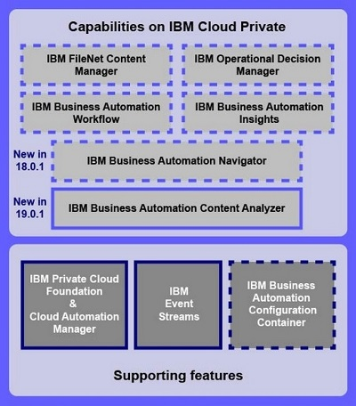
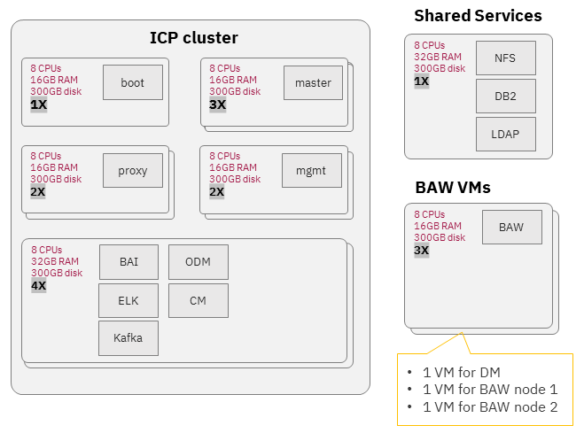

The components involved in building the Denim Compute environment for [IBM Cloud Private](https://www.ibm.com/support/knowledgecenter/SSBS6K_3.2.0/kc_welcome_containers.html) are shown on the figure below:



## Topology and sizing

One of the goal of Denim Compute is to create a highly available environment to run solutions with the IBM Cloud Pak for Automation. This section reviews a set of documents that provide configuration and sizing recommendations towards that goal.

### Cloud Pak sizing

- [This report](https://www.ibm.com/software/reports/compatibility/clarity-reports/report/html/hardwareReqsForProduct?deliverableId=77D6C42017D411E9AEAFE0FEBCE2D22F&osPlatforms=Linux&duComponentIds=D002%7CD001%7CS005%7CS008%7CS003%7CS006%7CS004%7CS007) provides hardware requirements (CPU, RAM, disk) for the different Cloud Pak components, but it is difficult to derive an aggregated requirement for a cluster that will support multiple capabilities.

### ICP sizing

For ICP sizing, this [ICP system requirement document](https://github.com/ibm-cloud-architecture/refarch-privatecloud/blob/master/icp-on-rhel/icp-system-requirements.md) from the IBM Cloud Private Reference Architecture is very useful, especially the "Summary of production system requirements" section.

### Selected topology

Based on various sizing guidance, we settled on the following topology for our HA cluster:



We created:

* (1) boot node
* (3) master nodes
* (2) proxy nodes
* (2) management nodes
* (4) worker nodes (BAI pushed us to four nodes)
* (1) shared services node (DB2, LDAP, NFS server)
* (3) BAW nodes (one Deployment Manager and two nodes)


## Install

We use [these instructions](https://github.com/ibm-cloud-architecture/refarch-privatecloud/blob/master/Installing_ICp_on_prem_ubuntu.md) from the from the IBM Cloud Private Reference Architecture as the primary reference.

### Create VM templates

We created our environment in a VMware vSphere environment. To start, we created two templates that we would use to clone all of the ICP and BAW nodes. The shared services node was a one-off and we didn't create a template to clone it.

Both templates used this operating system:

- Distributor ID: Ubuntu
- Description:    Ubuntu 16.04.6 LTS
- Release:        16.04
- Codename:       xenial

Here is the worker template:


The worker template was used for boot, proxy, worker and BAW nodes.

Here is the master template:


The master template was used for master and management nodes.

**NB**: The shared services node uses Red Hat Enterprise Linux Server release 7.6 (Maipo) and has 8 CPU, 32 GB RAM and 300 GB disk space. No template was used to create it.

### Configure VM templates

Before we cloned our nodes from the templates, we followed some configuration steps. This is better because if we cloned first, we would have to do the same step on every clone.

#### Allow root login

Execute the following commands on both template VMs. This enables root login remotely via `ssh`.

- Set a password for the root user
```
sudo su - # provide your user password to get to the root shell
passwd # Set the root password
```

- Enable remote login as root
```
sed -i 's/prohibit-password/yes/' /etc/ssh sshd_config
systemctl restart ssh
```

#### Update NTP 
ICP requires all nodes be in time synchronization, so we need to update the NTP (Network Time Protocol) settings to make sure time stays in sync.
 
- Get the latest apt updates and install ntp
```
apt-get update
apt-get install -y ntp
```

- If using an internal NTP server, edit `/etc/ntp.conf` and add your internal server to the list and then restart the ntp server. In the following configuration, the server is configured to use a local NTP server (`ntp.{your-network-name}.local`) and fall back to public servers if that server is unavailable.
```
# Specify one or more NTP servers.
pool ntp.{your-network-name}.local
```

- After making configuration changes restart the NTP server with the command `systemctl restart ntp`

- Test the status of your NTP servers to make sure they are working.

```
$ ntpq -p
remote                          refid      st t when poll reach   delay   offset  jitter
========================================================================================
*ntp.{your-network-name}.local 129.6.15.30 2 u  183 1024  377    0.770   -0.140   1.026
```

- If the ufw firewall is enabled, disable it. ICP will install iptables.
```
$ ufw disable
Firewall stopped and disabled on system startup

$ ufw status
Status: inactive
```

#### Configure Virtual Memory
This configuration is required for ELK.

- Update the vm.max_map_count setting to 262144:
```
sysctl -w vm.max_map_count=262144
```

- Make the changes permanent by adding the following line to the bottom of the `/etc/sysctl.conf` file:

```
vm.max_map_count=262144
```

- To check the current value, use the following command:
```
$ sysctl vm.max_map_count
vm.max_map_count = 262144
```

#### Install NFS common packages
```
apt-get install -y nfs-common
```

#### Install Python
```
apt-get install -y python-setuptools
```

#### Install Docker

- Update your ubuntu repositories:
```
apt-get update
```

- Install Linux image extra packages
```
apt-get install -y linux-image-extra-$(uname -r) linux-image-extra-virtual
```

- Install additional needed packages
```
apt-get install -y apt-transport-https ca-certificates curl software-properties-common
```

**N.B.**: These packages may all exist depending on what packages were included when the operating system installed. If they already exist, you will just see output indicating they already exist. If you assume they exist, however, and do not do this step and they are not there, the installation will fail.

- Add Docker’s official GPG key
```
curl -fsSL https://download.docker.com/linux/ubuntu/gpg | apt-key add -
```

- Verify that the key fingerprint is 9DC8 5822 9FC7 DD38 854A E2D8 8D81 803C 0EBF CD88
```
$ apt-key fingerprint 0EBFCD88
pub   4096R/0EBFCD88 2017-02-22
Key fingerprint = 9DC8 5822 9FC7 DD38 854A  E2D8 8D81 803C 0EBF CD88
uid                  Docker Release (CE deb) <docker@docker.com>
sub   4096R/F273FCD8 2017-02-22
```	
	
- Setup the docker stable repository and update the local cache
```
add-apt-repository "deb [arch=amd64] https://download.docker.com/linux/ubuntu $(lsb_release -cs) stable"
apt-get update
```

- Install docker
```
apt-get install -y docker-ce
```

- Make sure docker is running and pulling correctly from the internet
```
docker run hello-world
```
This should downloaded the latest hello-world docker image version and put some text on the screen indicating a working installation.


### Clone cluster VMs

- Shutdown your VMs: `shutdown -h now`
- Using those VMs, convert them to templates.
- Clone your templates for each of the needed nodes in your cluster as specified below. 

Note that you can create a minimal, non-HA environment by just using a single node for each below (a Vulnerability Advisor (VA) is not required):

- master template -> icp-master1, icp-master2, icp-master3
- master template -> icp-mgmt1, icp-mgmt2
- worker template -> icp-proxy1, icp-proxy2
- worker template -> icp-worker1, icp-worker2, icp-worker3, icp-worker4
- worker template -> icp-boot
- worker template -> baw1, baw2, baw3

**N.B.**: We created the shared services node as a one-off and used RHEL. For High Availability and to provide for workload persistent storage, you will need an NFS node which does not need to be configured with any of the packages used by the above server. If an enterprise NFS server already exists which can be used for this environment it can be used, otherwise, an additional NFS node will need to be created to support this environment.

- Configure your newly cloned VMs and set their hostnames and static IP addresses.

**N.B.**: The VMs can use DHCP assigned IP addresses, however, DHCP addresses are subject to change and if any addresses change your environment will break. For any kind of permanent environment, static IP addresses should be used.

If your network interface is configured for DHCP, boot all of the newly provisioned nodes and then, using the VMware console, login to each VM and reconfigure the hostname and add the appropriate static IP address.

IMPORTANT: If you do not have a DHCP server and configured your original VMs with a static IPs, you will need to boot each VM in turn, configuring each with its new IP address before booting the next to prevent having duplicate IP addresses on your network.

Perform the following tasks to change the IP address and hostname on each respective node.

- Change the hostname using `hostnamectl set-hostname node_name`, replacing `node_nam`e with the new hostname for your node.

- Modify `/etc/network/interfaces` to configure a static IP address. Your file should look something like this on Ubuntu 16.04 (other OS may be slightly different):
    
```
# This file describes the network interfaces available on your system
# and how to activate them. For more information, see interfaces(5).

source /etc/network/interfaces.d/*

# The loopback network interface
auto lo
iface lo inet loopback

# The primary network interface
auto ens160
iface ens160 inet static
address 172.16.53.220
netmask 255.255.0.0
broadcast 172.16.255.255
gateway 172.16.255.250
dns-nameservers 172.16.0.11 172.16.0.17
dns-search {your-network-name}.local
```

- Shut down the VM: `shutdown -r now`

- Configure passwordless SSH from the master node to all other nodes. You should now have all of your hosts prepared, named properly, and containing the proper IP addresses. The next step is to configure passwordless SSH between the boot-master node and the other nodes. You first need to create a passwordless SSH key that can be used across the implementation.

- Login as to the boot node as root
- From the root’s home directory (`cd ~`), execute:
```
ssh-keygen -t rsa -P ''     # Upper case P and two single quotes for no password
```
- Accept the default location of `/root/.ssh/id_rsa` for the new key file
- Executing `ls ~/.ssh` should show three files: id_rsa, id_rsa.pub and known_hosts
- Copy the resulting id_rsa key file from the boot node to each node in the cluster
```
ssh-copy-id -i .ssh/id_rsa root@node_name
```
You will be required to type the root password for each node during this process, but not thereafter.  When this is complete you should be able to ssh from the boot node to each of the other nodes without having to provide a password. Test this now by executing the following for each node in the cluster, using `ssh root@node_name`

Now update the `/etc/hosts` file on your boot node and add entries for each of your nodes and propagate that file to all of your other nodes. For example:
```
# /etc/hosts
172.16.52.220  dbamc-icp-ubuntu-boot.{your-network-name}.local dbamc-icp-ubuntu-boot boot
172.16.52.221  dbamc-icp-ubuntu-master1.{your-network-name}.local dbamc-icp-ubuntu-master1 master1
172.16.52.222  dbamc-icp-ubuntu-master2.{your-network-name}.local dbamc-icp-ubuntu-master2 master2
172.16.52.223  dbamc-icp-ubuntu-master3.{your-network-name}.local dbamc-icp-ubuntu-master3 master3
172.16.52.224  dbamc-icp-ubuntu-mgmt1.{your-network-name}.local dbamc-icp-ubuntu-mgmt1 mgmt1
172.16.52.225  dbamc-icp-ubuntu-mgmt2.{your-network-name}.local dbamc-icp-ubuntu-mgmt2 mgmt2
172.16.52.226  dbamc-icp-ubuntu-proxy1.{your-network-name}.local dbamc-icp-ubuntu-proxy1 proxy1
172.16.52.227  dbamc-icp-ubuntu-proxy2.{your-network-name}.local dbamc-icp-ubuntu-proxy2 proxy2
172.16.52.228  dbamc-icp-ubuntu-worker1.{your-network-name}.local dbamc-icp-ubuntu-worker1 worker1
172.16.52.229  dbamc-icp-ubuntu-worker2.{your-network-name}.local dbamc-icp-ubuntu-worker2 worker2
172.16.52.230  dbamc-icp-ubuntu-worker3.{your-network-name}.local dbamc-icp-ubuntu-worker3 worker3
172.16.52.231  dbamc-icp-ubuntu-worker4.{your-network-name}.local dbamc-icp-ubuntu-worker4 worker4
172.16.52.212  dbamc-icp-shared-services.{your-network-name}.local dbamc-icp-shared-services
```

With your `/etc/hosts` file configured correctly on the boot node, propagate it to all the other nodes in your cluster with remote copy:
```
scp /etc/hosts node_name:/etc/hosts
```
Your VMs are now ready to install ICP. 

### Install ICP

- Load your ICP tarball into your boot node's docker registry. Only on the boot node, load the inception image from the ICP tarball into boot node's local docker registry.
```
tar -xvf /downloads/ibm-cloud-private-x86_64-3.1.2.tar.gz ibm-inception-amd64-3.1.2.tar -O |docker load
```
Note that this will take quite some time and a lot of disk space and memory because tar has to gunzip the entire tar file before it can extract any images. This takes memory, filespace in /tmp, and quite a lot of time. 

You can check the name and tag of the current inception image. To find your release information execute the following command on the boot node:
```
$ docker images -a |grep inception
ibmcom/icp-inception-amd64                      3.1.2-ee                         4dbdab8a176e        5 months ago        779MB
```
In this case, the inception image name is `ibmcom/icp-inception-amd64` and the version tag is `3.1.2-ee`.
You will replace the image name and version tag in the next commands with the ones you got when you issued the command above.

- Create a directory to hold installation configuration files
``
mkdir /opt/icp
cd /opt/icp
``

- Extract the installation configuration files
```
docker run -e LICENSE=accept --rm -v /opt/icp:/data ibmcom/icp-inception-amd64:3.1.2-ee cp -r cluster /data
```

After this command, you should have a folder named `/opt/icp/cluster`. Because you are installing the Enterprise Edition, you have to move the ICP tarball to the `/opt/icp/cluster/images` directory.
```
mkdir -p  /opt/icp/cluster/images
mv /downloads/ibm-cloud-private-x86_64-3.1.2.tar.gz /opt/icp/cluster/images/
```

- Copy the ssh key to the installation directory
```
cp ~/.ssh/id_rsa /opt/icp/cluster/ssh_key
chmod 400 /opt/icp/cluster/ssh_key
```

- Edit the `/opt/icp/cluster/hosts` file and enter the IP addresses of all nodes. The result should look something like this:

```
[master]
172.16.52.221
172.16.52.222
172.16.52.223

[worker]
172.16.52.228
172.16.52.229
172.16.52.230
172.16.52.231

[proxy]
172.16.52.226
172.16.52.227

[management]
172.16.52.224
172.16.52.225

#[va]
#5.5.5.5
```

- Share NFS directories. In an HA environment, there are three directories which must be shared by all master nodes. These are `/var/lib/registry`, `/var/lib/icp/audit`, and `/var/log/audit`.
On your NFS server, create directories for each of these paths e.g. `/data/registry`, `/data/audit`, and `/data/log/audit`.
```
mkdir -p /data/registry
mkdir -p /data/audit
mkdir -p /data/log/audit
```
Your NFS server should export the directories with the sync parameter set. Add these lines to the `/etc/exports` file on the NFS server. For example:
```
/data/registry *(rw,sync,no_root_squash)
/data/audit *(rw,sync,no_root_squash)
/data/log/audit *(rw,sync,no_root_squash)
```
Execute the `exportfs` command to make sure the directories are exported.
```
exportfs -ra
```
On each of the master nodes, edit the `/etc/fstab` file so that the mounts will be reestablished after a reboot. The `/etc/fstab` entries should look something like this:
```
172.16.52.212:/data/registry /var/lib/registry nfs rw,suid,dev,exec,auto,nouser,async,soft 1 2
172.16.52.212:/data/audit /var/lib/icp/audit nfs rw,suid,dev,exec,auto,nouser,async,soft 1 2
172.16.52.212:/data/log/audit /var/log/audit nfs rw,suid,dev,exec,auto,nouser,async,soft 1 2
```

Mount the directories in the current environment
```
    mount /var/lib/registry
    mount /var/lib/icp/audit
    mount /var/log/audit
```
**N.B.**: You can also run this command:
```
mount -a
```
which will remount everything in the `/etc/fstab` file.

You can validate that you successfully mounted a remote directory by running this command:
```
$ df -P -T /var/log/audit | tail -n +2 | awk '{print $2}'
nfs4
```
If you see `nfs4`, then you are pointing to the remote directory. If you see `ext4`, you are still pointing to a local directory.

### Deploy the ICP environment

On the boot node, run these commands:
```
cd /opt/icp/cluster
docker run --rm -t -e LICENSE=accept --net=host -v /opt/icp/cluster:/installer/cluster ibmcom/icp-inception-amd64:3.1.2-ee install -vvv |tee install.log
```
Some time later (about 30 minutes), you should have a deployed IBM Cloud private implementation.
You can login to your cluster with a browser with credentials admin/admin.


