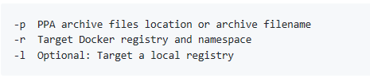
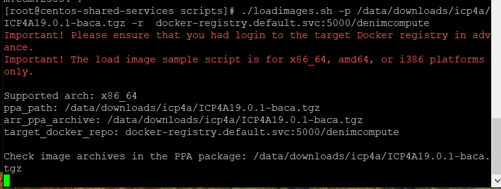
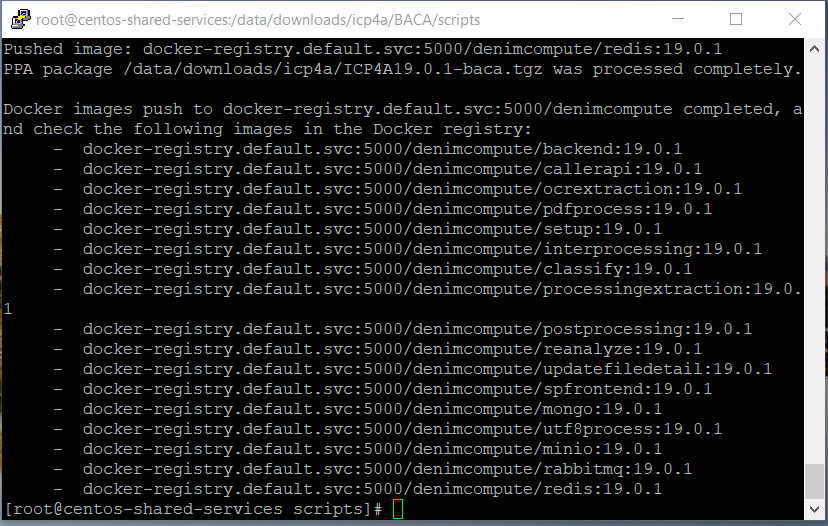
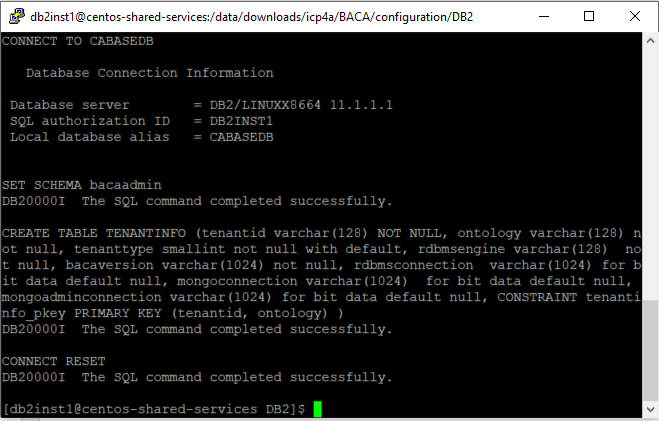
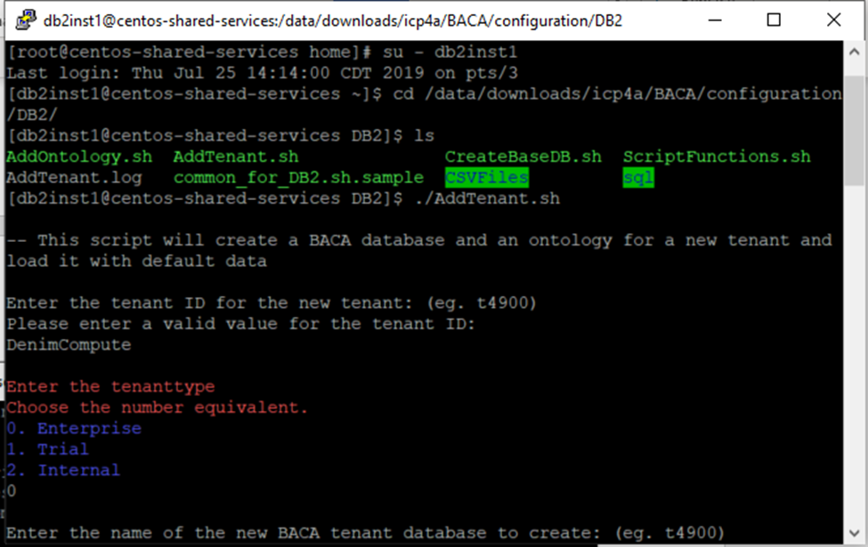
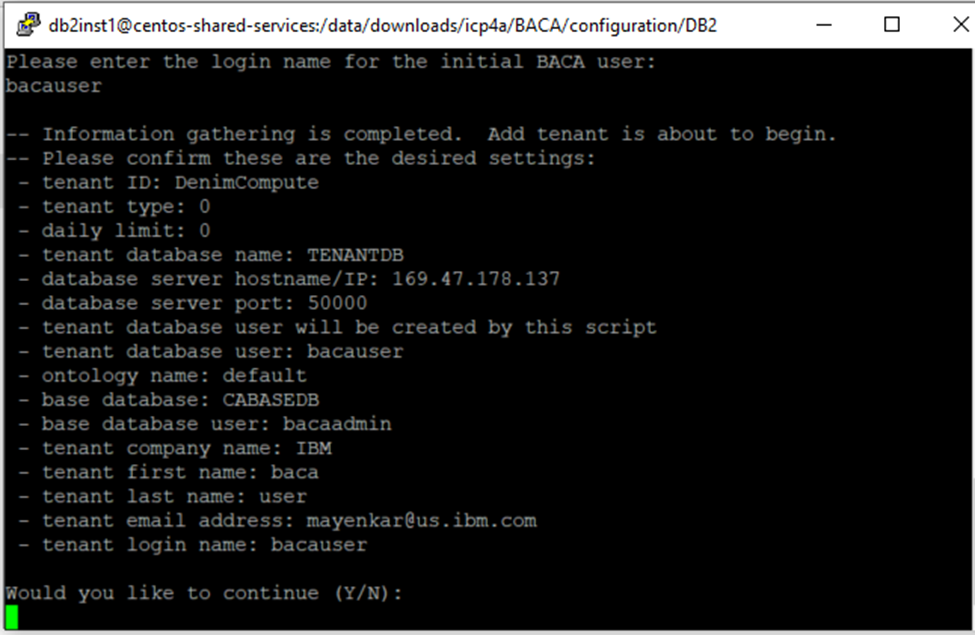
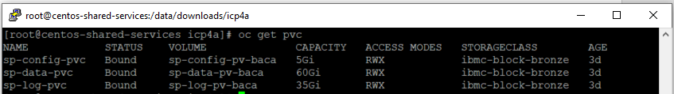

- Prepare your environment by following the instructions on [IBM Cloud Pak for Automation 19.0.1 on Certified Kubernetes](https://github.com/icp4a/cert-kubernetes/blob/19.0.1/README.md).
The instructions ask you to validate that you have the right version of Kubernetes, Helm, Kubernetes CLI and OpenShift container platform CLI installed on the machine that you are using for installation. Furthermore, the containers require access to database(s) and LDAP (if using LDAP). Ensure that the version of the database and LDAP are supported for IBM Cloud Pak for Automation version that you are installing.

- Ensure that you have downloaded PPA package for the version of IBM Business Automation Content Analyzer you are planning to install. We used ICP4A19.0.1-baca.tgz to install IBM Business Automation Content Analyzer version 19.0.1.

- Download the [loadimages.sh](https://github.com/icp4a/cert-kubernetes/blob/19.0.1/scripts/loadimages.sh) script from GitHub.

- Create an OpenShift project (namespace) where you want to install IBM Business Automation Content Analyzer version 19.0.1 and make the new project (namespace) the current project. To create new project use command `oc new-project <projectname>` where `<projectname>` is the name of the project for example `baca`.

- Login to the OpenShift Docker registry following instructions in the [Load the Cloud Pak images](rhos-create-cluster.md).

- Run the `loadimages.sh` script to tag and push the product container images into your Docker registry. Specify the two mandatory parameters in the command line that `loadimages.sh` script requires. The namespace is the `<projectname>` that you specified earlier. 


 
In the screen shot below, target docker registry is `docker-registry.default.svc:5000` and namespace is `denimcompute`.


 
- IBM BACA 19.0.1 consists of 17 images and the `loadimages.sh` script lists all the images that it uploads to the Docker registry on successful completion.



- Prepare environment for IBM Business Automation Content Analyzer. See [Preparing to install automation containers on Kubernetes](https://www.ibm.com/support/knowledgecenter/SSYHZ8_19.0.x/com.ibm.dba.install/k8s_topics/tsk_prepare_bacak8s.html). These procedures include setting up databases, LDAP, storage, and configuration files that are required for use and operation.

- If you are using LDAP for authentication, BACA users need to be configured on the LDAP server. An initial user is created in IBM Business Automation Content Analyzer when first creating the Db2 database. The user name must match the LDAP user name when specified. If LDAP is not used for authentication, pre-setup of users is not required. Refer to [Preparing users for IBM Business Automation Content Analyzer](https://www.ibm.com/support/knowledgecenter/SSYHZ8_19.0.x/com.ibm.dba.install/k8s_topics/tsk_prepare_bacak8s_usergroups.html) for more information.

- If you do not have a DB2 database, set up a new DB2 environment. Download database scripts from [this GitHub repo](https://github.com/icp4a/cert-kubernetes/tree/19.0.1/BACA/configuration/DB2). Refer to [Creating and Configuring a DB2 database](https://www.ibm.com/support/knowledgecenter/SSYHZ8_19.0.x/com.ibm.dba.install/k8s_topics/tsk_prepare_bacak8s_db.html) for more information.

- Log into DB2 instance using DB2 instance administrator id such as db2inst1 (refer the section [Setup DB2](rhos-create-cluster.md).

- Set up the base database by running the following command:
```
./CreateBaseDB.sh.
```
Enter the following details:

- Name of the IBM Business Automation Content Analyzer Base database - (enter a unique name of 8 characters or less and no special characters).
- Name of database user - (enter a database user name) - can be a new or existing Db2 user.
- Password for the user - (enter a password) - each time when prompted. If it is an existing user, the prompt is skipped

Enter `Y` when you are asked `Would you like to continue (Y/N):`




- Create the tenant database by following [these instructions](https://www.ibm.com/support/knowledgecenter/SSYHZ8_19.0.x/com.ibm.dba.install/k8s_topics/tsk_prepare_bacak8s_db.html). Once the tenant database is created and populated with initial content, the tenant id and ontology is displayed (see screen shots below).





- External storage is needed in the content services environment. You set up and configure storage to prepare for the container configuration and deployment. Follow instructions at [Configuring storage for the Business Automation Content Analyzer environment](https://www.ibm.com/support/knowledgecenter/SSYHZ8_19.0.x/com.ibm.dba.install/k8s_topics/tsk_prepare_bacak8s_storage.html) to create persistent volumes (PV) and persistent volume claims (PVC). The screen below shows pv and pvc created in project `<projectname>` (for example` baca`) created earlier.



- You need to create SSL certificates and secrets before you install via Helm chart. You can run the `init_deployment.sh` script provided [here](https://github.com/icp4a/cert-kubernetes/tree/19.0.1/BACA/configuration/) to create SSL certificates and secrets.
The `init_deployment.sh` scripts requires you to populate parameters in common.sh file. Use common_OCP_template.sh as basis for `common.sh` to be used for installation on OpenShift.
Information on populating the parameters in `common.sh` can be found at [Prerequisite install parameters](https://www.ibm.com/support/knowledgecenter/SSYHZ8_19.0.x/com.ibm.dba.ref/topics/ref_baca_common_params.html).
The screen shot below captures `common.sh` that we used in our installation process. Please note that we selected `PVCCHOICE` as `2` as we created, persistent volumes and persistent volume claims manually in the earlier step. Furthermore, please set `HELM_INIT_BEFORE` as `Y` as Helm has been installed earlier and we do not want to install Helm as part of running `init_deployment.sh` script.


- Run `./init_deployment.sh` so that it creates SSL certificates and secrets required for Content Analyzer. 
> Please note the `init_deployment.sh` uses `loginToCluster` function in `bashfunctions.sh` to log into OpenShift cluster.
> 
> - The `loginToCluster` function assumes that Kubernetes API server is exposed on port `8443` and also requires user id and password to log into the cluster.
> If you are using Managed OpenShift cluster on IBM Cloud then this assumption is not valid. Thus, you will have to modify the function to use login command copied from OpenShift web console.
> - Copy login command is available as drop down in upper right corner of OpenShift web console and update `loginToCLuster` function with the copied command.

Please make sure that before you run the script, the OpenShift project that you created earlier is the current project. If it is not, make it a current project using the command `oc project <projectname>`. 


 
- Validate the objects created by running  the following commands. To check secrets, run the following command:
```
kubectl -n <projectname> get secrets
```
or
```
oc get secrets
```


- Verify that 9 secrets were created (7 if not using LDAP or ingress). Refer to [Create PVs, PVCs, certificates and secrets using init_deployment.sh](https://github.com/icp4a/cert-kubernetes/blob/19.0.1/BACA/docs/init_deployment.md) for more information.

- Run `./generateMemoryValues.sh <limited>` or `./generateMemoryValues.sh <distributed>`. For smaller system (5 worker-nodes or less) where the Mongo database pods will be on the same worker node as other pods, use limited option.


- Copy these values for replacement in the `values.yaml` file if you want to deploy CA using Helm chart or replacing these values in the `ca-deploy.yml` file if you want to deploy CA using kubernetes YAML files. Refer to [Limiting the amount of available memory](https://www.ibm.com/support/knowledgecenter/SSYHZ8_19.0.x/com.ibm.dba.install/topics/tsk_preparing_baca_deploy_limitram.html) for more information.

- Download the [Helm Chart](https://github.com/icp4a/cert-kubernetes/tree/19.0.1/BACA/helm-charts). Extract the helm chart from `ibm-dba-prod-1.0.0.tgz` and copy to the `ibm-dbamc-baca-prod` directory.

- Edit the `values.yaml` file to populate configuration parameters. Go through the [Helm Chart configuration parameters section](https://www.ibm.com/support/knowledgecenter/SSYHZ8_19.0.x/com.ibm.dba.ref/topics/ref_baca_globaloptions_params.html) and [populating `values.yaml` with correct values](https://github.com/icp4a/cert-kubernetes/blob/19.0.1/BACA/docs/values_yaml_parameters.md) for options with the parameters and values.
Note that anything not documented here typically does not need to be changed.

- After the `values.yaml` is filled out properly, you can proceed to deploy Content Analyzer with the Helm chart. However, before you run helm, the Tiller server will need at least "edit" access to each project where it will manage applications. In the case that Tiller will be handling Charts containing Role objects, *admin* access will be needed. Refer to [Getting started with Helm on OpenShift](https://blog.openshift.com/getting-started-helm-openshift/) for more information. Run the command `oc policy add-role-to-user edit "system:serviceaccount:${TILLER_NAMESPACE}:tiller"` to grant the Tiller edit access to the project.


 
- To deploy Content Analyzer, from the `ibm-dba-baca-prod` directory run:
```
$ helm install . --name celery<projectname> -f values.yaml  --namespace <projectname> --tiller-namespace tiller
```
where `<projectname>` is the name of the project you created earlier.
Due to the configuration of the readiness probes, after the pods start, it may take up to 10 or more minutes before the pods enter a ready state. Refer to [Deploying with Helm charts](https://github.com/icp4a/cert-kubernetes/blob/19.0.1/BACA/helm-charts/README.md) for more information.


- Once all the pods are running, complete the post deployments steps listed [here](https://github.com/icp4a/cert-kubernetes/blob/19.0.1/BACA/docs/post-deployment.md).
