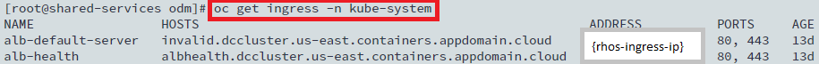

## Install Kafka

- Add the Helm repository:
```
helm repo add incubator http://storage.googleapis.com/kubernetes-charts-incubator
```

- Create the namespace:
```
oc new-project kafka
oc project kafka
## Grant the tiller server edit access to current project
oc adm policy add-role-to-user edit "system:serviceaccount:tiller:tiller"
```

- Install the Helm chart:
```
helm install incubator/kafka --name my-kafka --namespace kafka -f values.yaml
```

- Set-up the Kafka bootstrap server: If access is from inside the OpenShift cluster environment, then the bootstrap server is `my-kafka-headless.kafka.svc.cluster.local:9092`. If access is from external system, we need to:

1- Retrieve the OpenShift ingress address with the following command:


2- Use this ingress address to set the bootstrap server to `{rhos-ingress-ip}:31090,{rhos-ingress-ip}:31091,{rhos-ingress-ip}:31092`.

3- Add the line `{rhos-ingress-ip} kafka.cluster.local` to the `/etc/hosts` file.

## Install BAI

- Create PVs on the NFS server:
```
mkdir -p /data/persistentvolumes/bai/ibm-bai-pv
sudo chown 9999:9999 /data/persistentvolumes/bai/ibm-bai-pv
sudo chmod 770 /data/persistentvolumes/bai/ibm-bai-pv

mkdir -p /data/persistentvolumes/bai/ibm-bai-ek-pv-0
mkdir -p /data/persistentvolumes/bai/ibm-bai-ek-pv-1
mkdir -p /data/persistentvolumes/bai/ibm-bai-ek-pv-2
mkdir -p /data/persistentvolumes/bai/ibm-bai-ek-pv-3
sudo chown 1000:1000 /data/persistentvolumes/bai/ibm-bai-ek-pv-0
sudo chown 1000:1000 /data/persistentvolumes/bai/ibm-bai-ek-pv-1
sudo chown 1000:1000 /data/persistentvolumes/bai/ibm-bai-ek-pv-2
sudo chown 1000:1000 /data/persistentvolumes/bai/ibm-bai-ek-pv-3
sudo chmod 770 /data/persistentvolumes/bai/ibm-bai-ek-pv-0
sudo chmod 770 /data/persistentvolumes/bai/ibm-bai-ek-pv-1
sudo chmod 770 /data/persistentvolumes/bai/ibm-bai-ek-pv-2
sudo chmod 770 /data/persistentvolumes/bai/ibm-bai-ek-pv-3

mkdir /data/persistentvolumes/bai/es-snapshots-pv
sudo chown 1000:1000 /data/persistentvolumes/bai/es-snapshots-pv
sudo chmod 770 /data/persistentvolumes/bai/es-snapshots-pv
```

- Create namespace `baiproject`:
```
oc new-project baiproject
oc project baiproject
## Grant the tiller server edit access to current project
oc adm policy add-role-to-user edit "system:serviceaccount:tiller:tiller"
```

- Update SCC:
```
oc create serviceaccount bai-prod-release-bai-psp-sa
oc adm policy add-scc-to-user ibm-privileged-scc -z bai-prod-release-bai-psp-sa
oc adm policy add-scc-to-user ibm-anyuid-scc -z bai-prod-release-bai-psp-sa
```

- Login to Docker and push BAI images:
```
docker login -u $(oc whoami) -p $(oc whoami -t) docker-registry.default.svc:5000
wget https://raw.githubusercontent.com/icp4a/cert-kubernetes/19.0.1/scripts/loadimages.sh
chmod +x loadimages.sh
./loadimages.sh -p /data/downloads/icp4a/ICP4A19.0.1-bai.tgz -r docker-registry.default.svc:5000/baiproject
```

- Create PV:
```	 
oc apply -f pv.yaml
```

- Download the Helm chart and install it:
```
wget https://github.com/icp4a/cert-kubernetes/raw/master/BAI/helm-charts/ibm-business-automation-insights-3.1.0.tgz
helm install ibm-business-automation-insights-3.1.0.tgz --name bai-prod-release --namespace baiproject -f values.yaml
```

- Expose the Kibana service
```
oc apply -f route.yaml
```
