# Running the solution

## Deploy the case solution in Workflow Center
- Login to Workflow Center and open the Case Solution named `Denim Compute Auto Claims`:

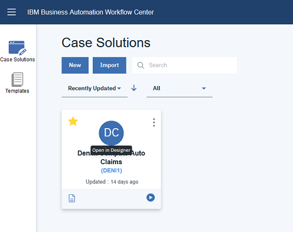

- Click the deploy icon in the upper-right corner of the Case Builder:

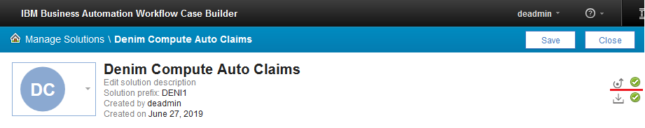

## Create Case security configuration

- In the Workflow Center, select the solution and click the contextual menu and then `Advanced`.

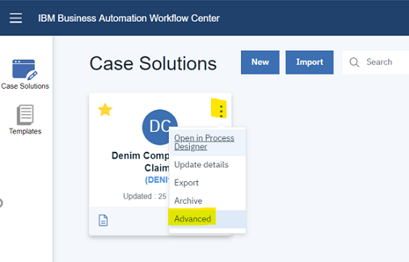

- With the `Denim Compute` solution selected click `Actions`, then `Manage` and then `Security Configuration`.

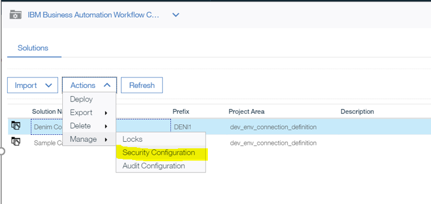

- Select the option to `Create a security configuration` and click `Next`.

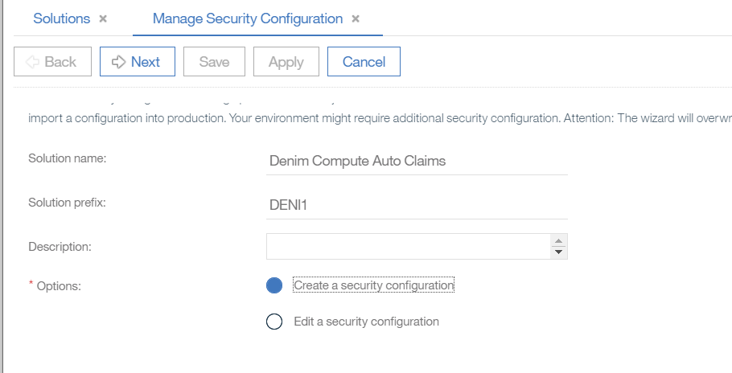

- Provide a `Security manifest name` (e.g. `denim_security_config`) and click `Next`.

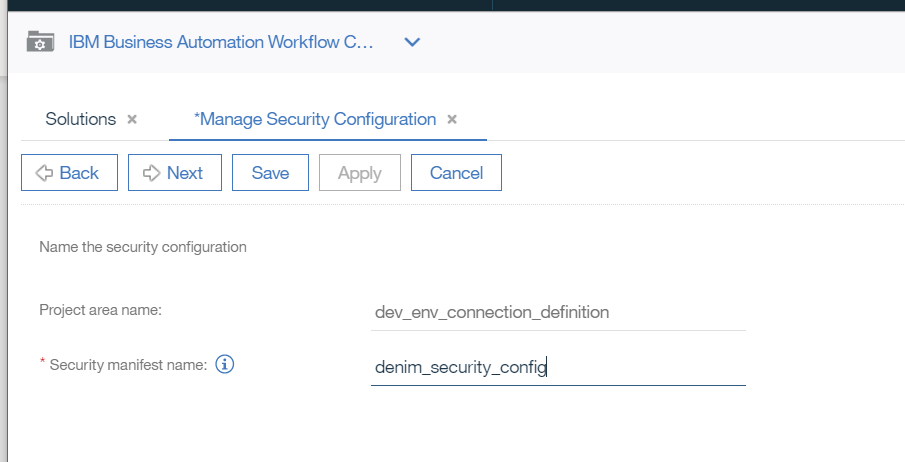

- Set permissions against the security roles (in this example all permissions are assigned to each role) and click `Next`.

- In this step, you set the administrators. You can add administrators besides the pre-defined one if you want, by clicking the `Add` button, or you can just click `Next`.

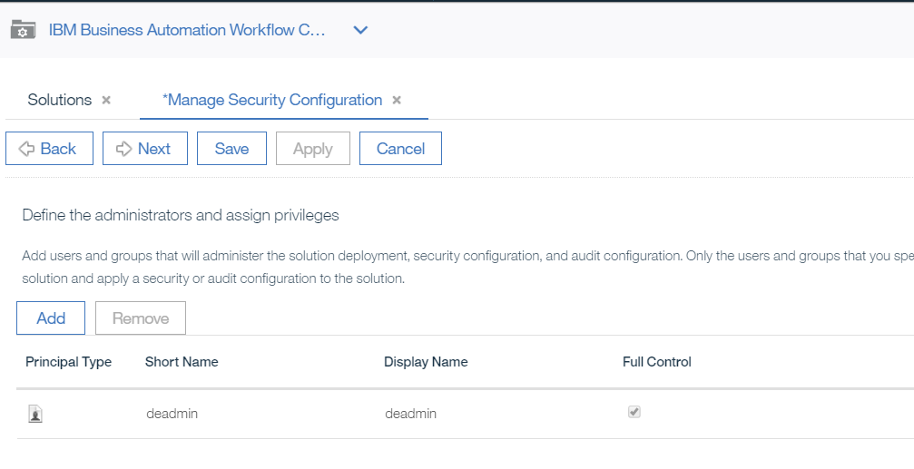

- In the `Add Users and Groups` modal dialogue you can add users or groups. You start typing partial names and then click the magnifying glass icon to find matching users that appear in the `Available` section. You can then use the arrows to move between `Available` and `Selected` and when done you click `Add` to complete. When done with this section click `Next` to continue.

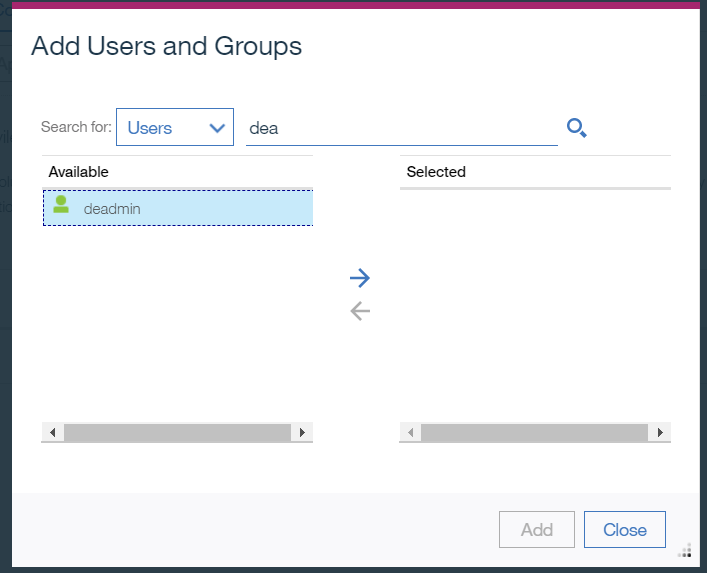

- Next you map groups and users to the Case roles. Select each role and click `Add` then follow the earlier instructions for how to find and assign users and groups.

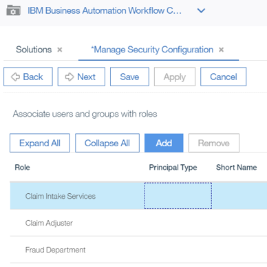

- In this example, we have just added a default user to the `Claim Intake Services` `Role`. You repeat these steps for the other `Roles`.

- Here is the final situation, where example users are added to each role (if you want a more realistic scenario you should setup different users and groups and assign them to the roles). Click `Next` when done with this section.

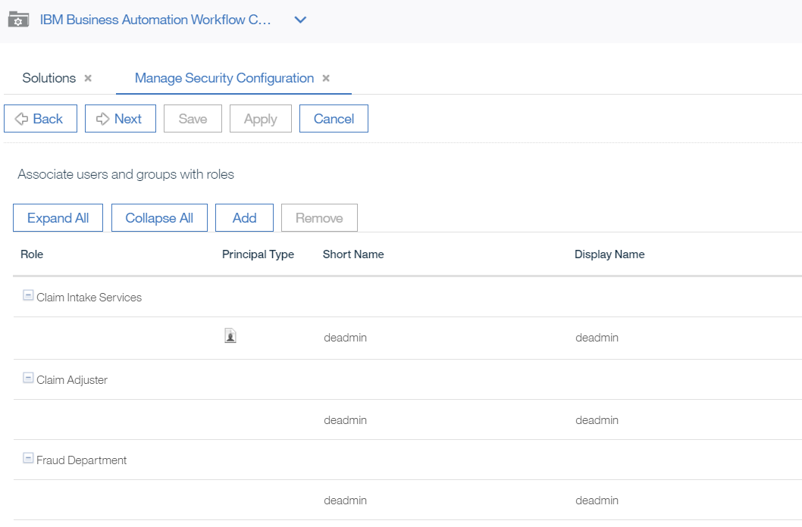

- Now you can check the box next to `Apply the security configuration` and click `Apply`.

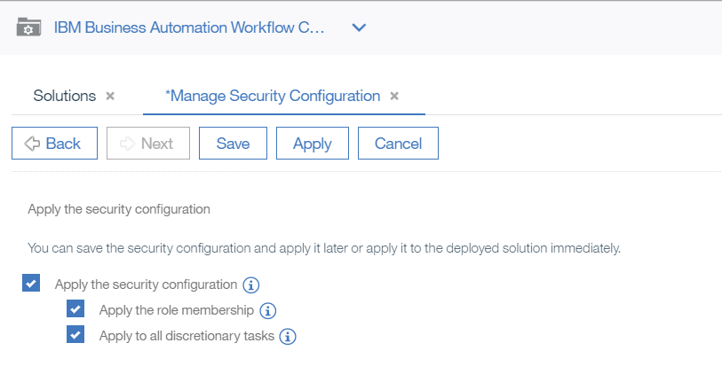

- You should get confirmation that the security configuration was successfully applied (you can then `Close` this dialog).

- Note if you ever need to review or change the security configuration settings you can launch it again and choose the `Edit a security configuration` option as shown here.

## Create BPM user groups

- The solution has a number of BPM teams defined that need to be mapped to users and groups. To do that, launch the Process Admin Console and then select `Server Admin` section.

- Open `User Management`, select `Group Management` and type `denim` in `Select Group to Modify` and you should see the groups that have been created as a result of the team definitions.

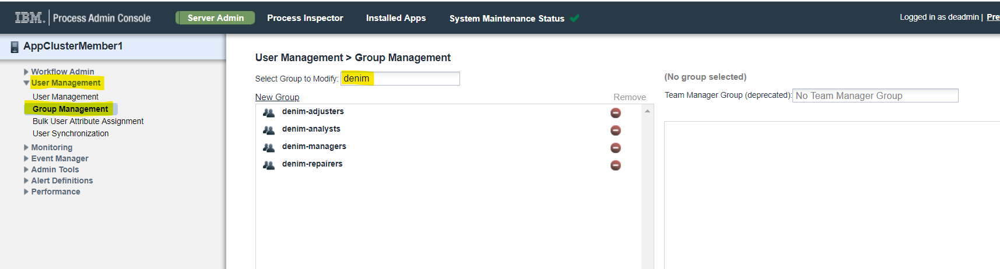

- You then need to assign users and groups for your environment against those pre-defined groups. Here is an example where we have assigned a number of users to the `denim-adjusters` group.

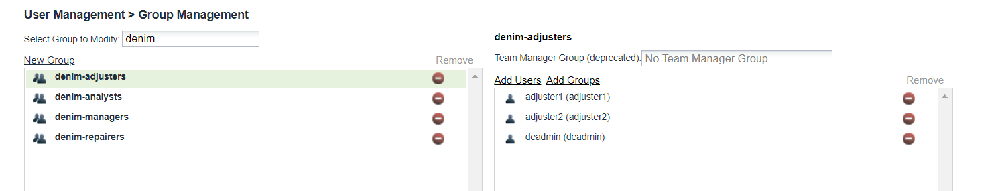

## Configure servers 

The solution integrates with the ODM and ECM components by using defined servers. By default, these are mapped to the environment that we used for testing purpose. Obviously, you have to re-map these servers to your own cluster environment. To do this, use the following instructions:

- First, ensure that the deployed BAW solution is activated. Select it in the Workflow Center and click the `View Details` icon in the lower left corner of the tile.

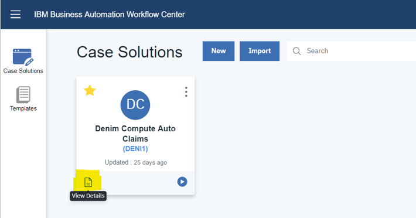

- Next choose the `Snapshots` section, select your snapshot (NB: the latest available snapshot is now v0.10.0) and from the contextual menu you `Activate` it.

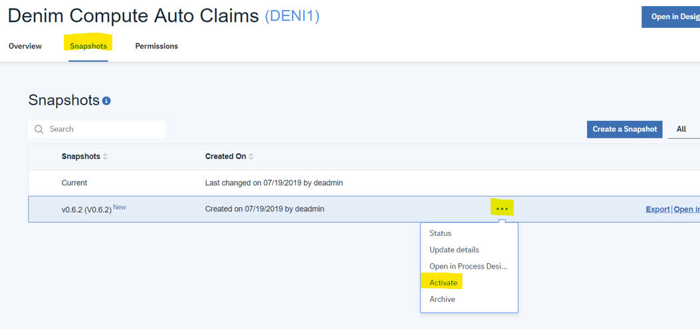

Note the next steps reference environment variables which require information from the [deployment of the micro-service](#deploy-the-baca-mediator-microservice) so if you have not completed that yet then go to that section and return here to complete the `BAW` servers configuration.

- After this you can now go to the `Process Admin Console` and you should see the snapshot in the list of `Installed Apps`.

- You click on the snapshot and then select the `Servers` section and you should see the two server definitions used (`DenimODMServer` for the referenced ODM Sever and `IBMBAW` for the referenced ECM server).

- You should change the settings for the respective configured servers to match how you installed your environment (the `Hostname`, `Port` (if non standard) and user credentials (where relevant) need to be configured).

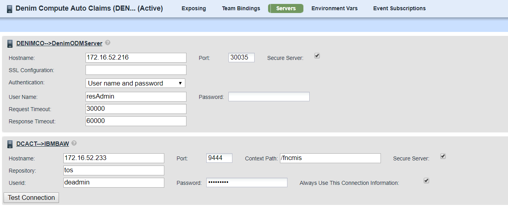

- You should provide entries for the highlighted environment variables (note for `BACA` you get these values from the `API` section of the administration console, `bacaAuth` needs to be Base64 encoded of username:password).

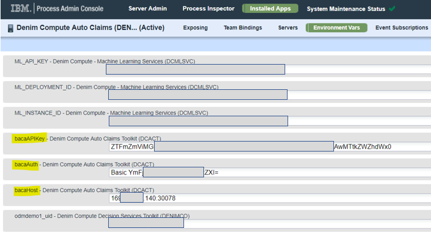

## Configure BACA ontology
Currently `Business Automation Content Analyzer (BACA)` only allows for the import and export of an entire ontology, there is no merge capability of selective import. Therefore we recommend that you backup any existing ontology before proceeding.

- First use the `Export Ontology` option as shown and save your existing ontology.

- Then use `Import Ontology` and select the [`dc-baca-ontology.json`](https://github.com/ibm-cloud-architecture/denim-compute/blob/master/solution/baca/dc-baca-ontology.json) file.

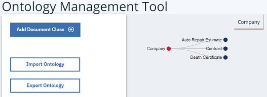

- You should now have an ontology similar to that shown below:

When you are finished with trying out the [BACA scenario](../usecase/baca-scenario-walkthrough.md) you can re-import the saved JSON export of your original ontology.

## Deploy the BACA Mediator micro-service

**NB:** The following instructions are for an OCP 3.11 cluster.

### Configure GitHub repository
We recommend using a secure private repository rather than a `GitHub` Public one and these instructions assume that is the case. The start point is that you should fork this repository so that you can then configure your own security settings.

- Generate an `SSH Key pair` and ensure to specify the flag for no passphrase as shown below.

- In your target GitHub repository go to `Settings` then `Deploy keys` and click **Add deploy key**. 

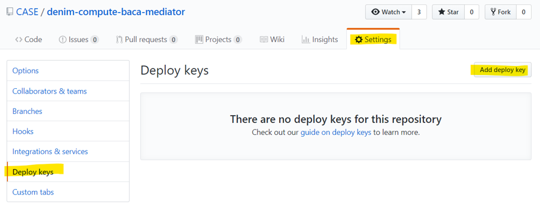

- Provide a meaningful title that shows what the key is for (in our case to allow source code deploy in OCP) and then upload the public key that was generated earlier and then click **Add key**.

- You should now have something like that shown below for our repository.

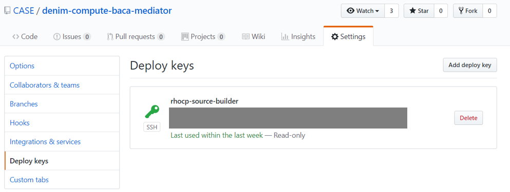

### Create Project in OCP
- From the OCP web console select the **Create Project** option.

- Provide a name (we suggest something like `baca-mediate-app`) and **Create**.

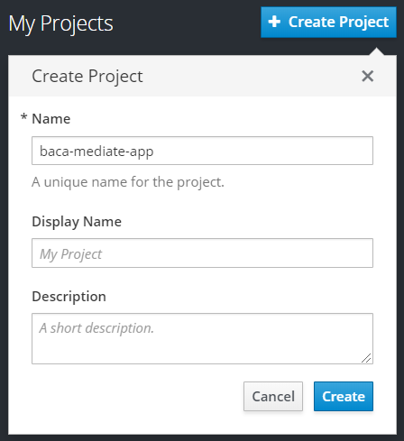

### Create Secret in OCP
We need to create a secret to reference the `SSH Key` generated earlier for interacting with the source repository in `GitHub`.

- In the newly created Project, select `Resources`, then `Secrets` and click **Create Secret**.

- Select `Source Secret`, enter the name `dc-gh-baca-mediator-secret`, select `SSH Key` and click **Browse.." and then find the `SSH Private Key` generated earlier.

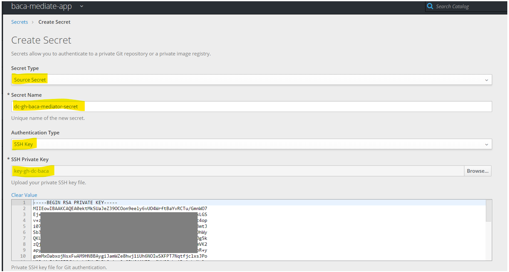

- Check the option to link the secret and choose `builder` as the target `Service Account`, then click **Create** to finish.

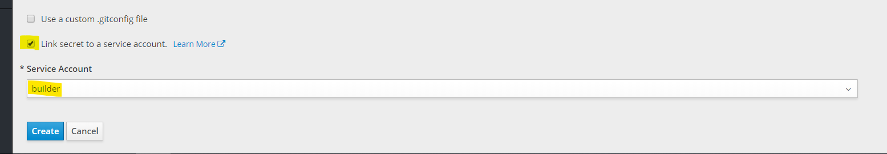

### Deploy using Source to Image (S2I)
There are a number of options for deploying to OCP, we are going to use `Source to Image` which directly builds from a source code repository such as `GitHub`.

- Click **Add to Project** and select the **Browse Catalog** option.

- Find and select the `Node.js` option which launches a dialog as shown here.

- Supply an application name and provide the SSH url for the target GitHub repository. Then it is important to click the **advanced options** link as we need to configure some non-standard items as this is a secure repository.

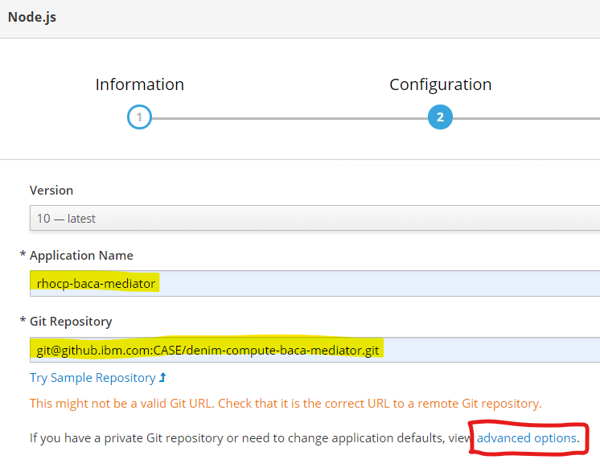

- Find the `Source Secret` section and select the earlier `Secret` that you created.

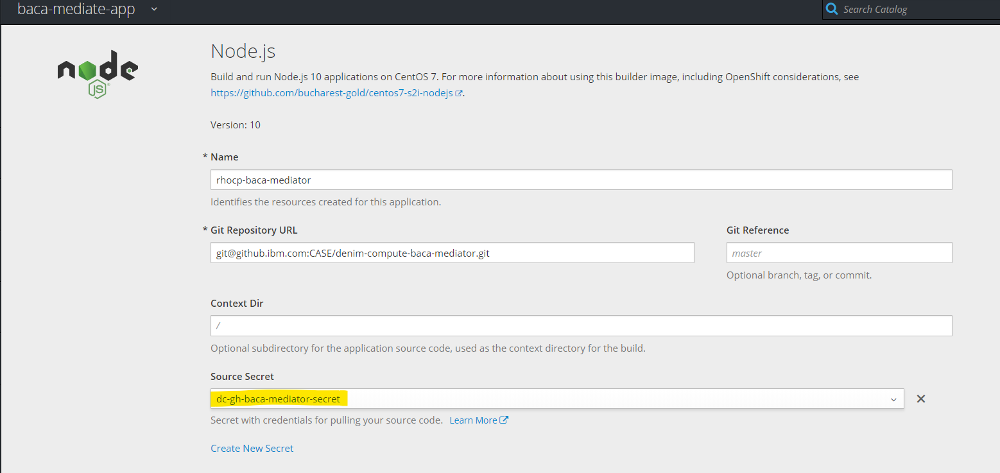

- There are many other options available but we want to go with the defaults so scroll down and click the **Create** button to complete.

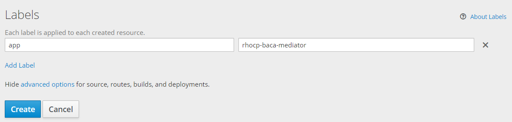

- A number of `Kubernetes Resources` will now be created including a `Build Config` and `Build` that will pull the source and build a deployment. When done on the overview section you should see summary information for the `Deployment Config` including that it has 1 `Pod` (note in a realistic environment we would set this to have > 1 Pod for failover but it makes it easier for us to see logs with this 1 Pod running without having to configure an `ELK` stack) and it is running. Take note also of the `Route` highlighted which is the public ingress point to the micro-service and this is needed for configuring the environment variable in the `BAW` [config section](#configure-servers) above.

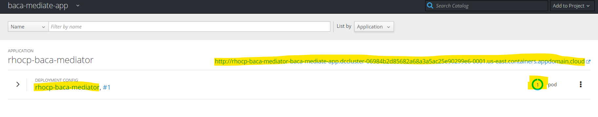

- Expand the twisty and you see more information on the `Deployment Config` including links to other resources which you can click on and explore. For now we want to verify the `Pod` is as expected so click on the icon of the `Pod` (top right).

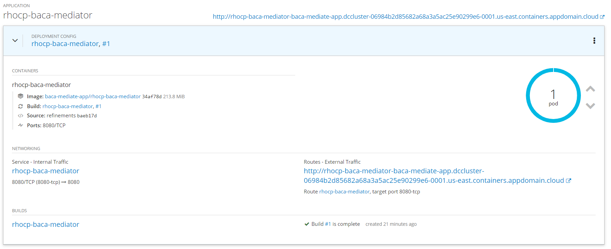

- You are taken to the `Pod` summary and within that there is a `Logs` tab.

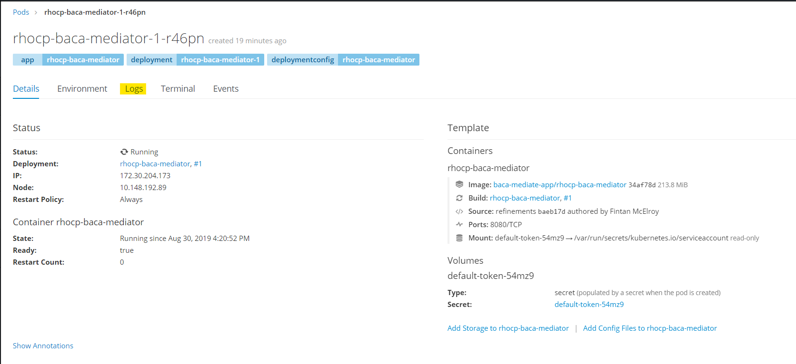

- In the `Logs` you can now verify that the micro-service is up and ready to accept requests.

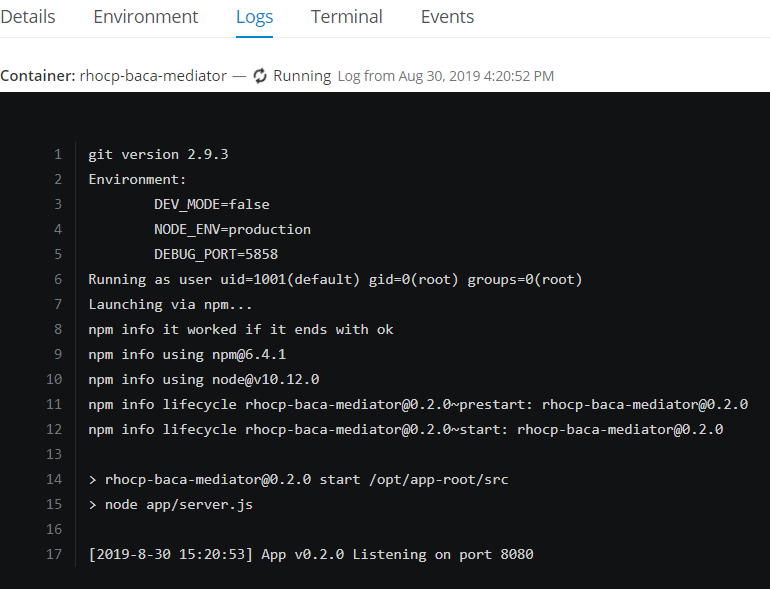
