# BAI scenario walkthrough

## Scenario summary
Before proceeding with this scenario it is recommended you familiarise yourself with the main IBM Cloud Pak for Automation scenario as described in [Main scenario walkthrough](./resources/denim-compute-scenario-walkthrough.pdf). That scenario shows the interactions for a "day in the life" of a Case instance of Auto Claims and while that sends data through for visualizing in Business Automation Insights (BAI), to fully appreciate the power of BAI you need to generate some realistic loads. To do that we have created a separate scenario that emulates the main scenario but without any real human interactions (so that it can execute many concurrent instances in a batch and you can appreciate `BAI` in a short space of time). This emulation generates random data based on some configuration settings that are exposed for the end user to control as we shall see later in this document. 

If you want to follow along with this scenario on your own environment, see the instructions for installing in the [Scenario installation](#scenario-installation) section later in this document.

## Business Automation Workflow
The starting point is the Process Portal where any user can launch the `Denim Compute Auto Claims - Emulation Generator` workflow after which a work item `Set Emulation Controls` will appear to be actioned. 

The user interface `Coach` is displayed allowing for configuring options to control the spread of emulated instances and how they then affect the business insights data that will be later viewed in BAI. We will explain these settings a little later.

If this is being run for the first time in a `IBM Cloud Pak for Automation` environment it is a good idea to first verify the process behaves as expected without creating a lot of workflow instances. To do this set the `Number of Claims` to something like 300 instances (this will exercise the emulation's batch control which submits workflow instances in minimum batches of 100) and then choose the `Test Emulation` button option.

This will exercise a path through the workflow that does everything except for instantiating the instances (the logic has a `feature flag` switch that treats it as in test mode and skips the `message event` which will spawn workflow instances). To verify the test you access the workflow instance in `Process Inspector` within the `Process Admin Console` as shown below.
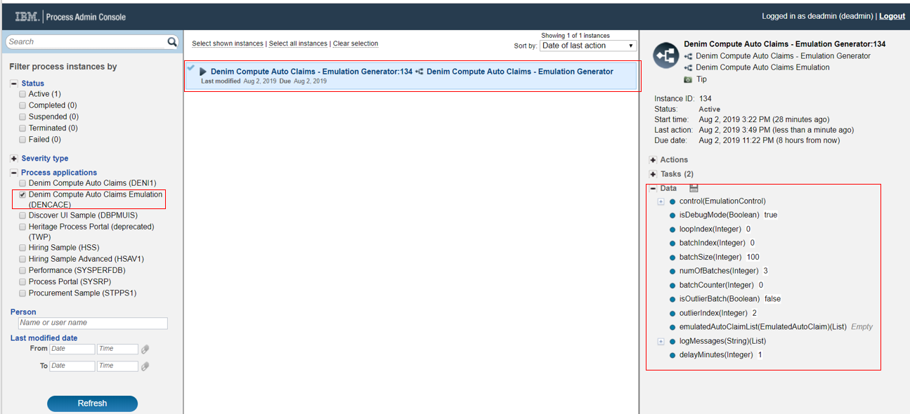

As the test emulation progresses you will see data variables set including the batch of emulated `Auto Claim` `Business Objects` (one is expanded in the list below for illustration).  

The emulation workflow instances may take a few minutes to complete depending on the total number of claims that were specified as the logic organises the data into batches with a timed delay between them. When the emulation workflow instance has completed (which can be verified in `Process Inspector`) and we are satisfied it behaves as expected we can then relaunch the workflow and this time submit a real emulation run. Here in this first section we have set `Number of Claims` to 500 and the `Maximum Claim Amount` to 50000. (Please be aware that the more instances that are created here the more work for the `Business Automation Workflow (BAW)` operations team to clean up afterwards and purge the completed instances. Also the more instances requested the higher the relative load on the system so we recommend you exercise due care here and not unduly load a system that might have other business-critical workloads on it. If in doubt check with your operations team).

The next set of settings control the spread of paths through the `Auto Claims` workflow. `Simple` scenarios do not have any adjustment, fraud checking etc and so we set a relatively low figure for this. Next the `Percentage in Progress` setting controls the spread of items that have emulated delays in processing (so that later in `BAI Dashboards` you can see interactively how active instances behave and the changes that occur as they move through their lifecycles). `Percentage Potential Fraud` emulates the path in the workflow whereby the call out to `Operational Decision Management (ODM)` rules determines whether there is a potential fraud situation that needs investigating. The `Percentage Confirmed Fraud` setting then controls what percentage of those potential frauds have been determined to be actual frauds (the rest will end up as being cleared of fraud). 

The final section controls the time delays for each part of the workflow that is not `STP (Straight Through Processing)`. Here in the settings 30 minutes delay is set for each so it will configure variable times up to that maximum, this should mean that all 500 instances will have completed in approximately 2 hours elapsed time.

We can visualize this in the BAW emulation workflow itself where the items color-coded green are `STP` and those in orange are the human interaction steps which matches how the main scenario behaves.

Once satisfied with the settings the request is submitted by clicking the `Run Emulation` button option.

After giving it a few minutes you should start to see the instances getting created and registering in `Process Inspector` as shown here.
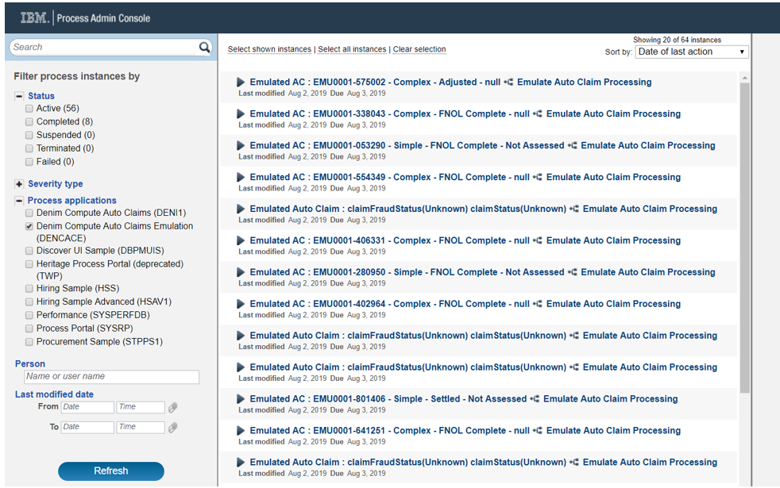

## Business Automation Insights

When new tracking data fields are first encountered in BAI (in Elasticsearch) the `Index Pattern` that we want to use needs to be refreshed to pick up those field definitions. This is done from the `Kibana` console by clicking `Management` then `Index Patterns` and selecting the `Index Pattern` you are using, which in this scenario is the `process-s*` entry. Then click on the `Refresh` icon as highlighted below and confirm.
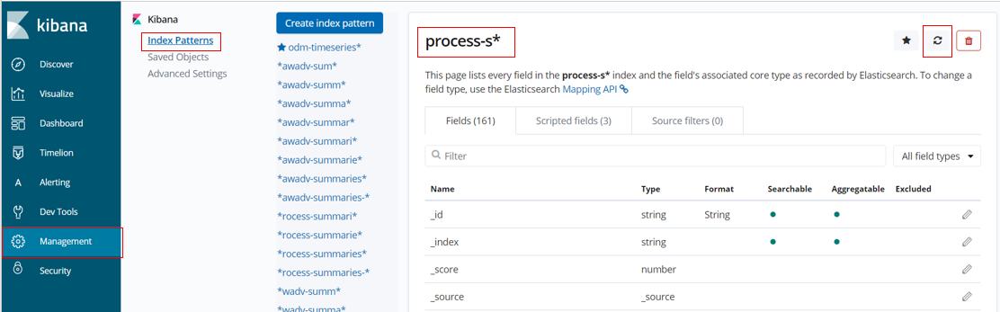

Next we want to confirm that the events have been received in BAI from BAW and we can see some of the process summaries. We do this by moving to the `Discover` section in `Kibana` and then select the `Search` named `Denim Compute - Auto Claims All Processes` (you can do this by choosing the `Open` option and then filtering and finding the target `Search` definition). The screenshot below shows a point in time view of this `Search` where it has retrieved 193 hits. Highlighted are the active `Filters` used to identify the process summaries of interest for our scenario.
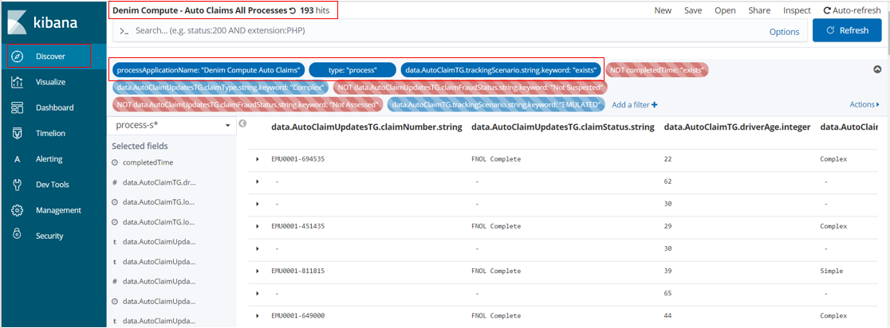

(Note if you are following along in your own environment and you do not see any hits then ensure you have followed the instructions in the [Scenario installation](#scenario-installation) section of this document and in the [OpenShift BAI installation](../environment/rhos-install-bai.md) section).

So at this point we are ready to start examining the configured `Dashboards` in `Kibana`. Here from the `Dashboard` section we `Open` the one named `Denim Compute - Active Auto Claims` and there we see some `Visualizations` have been configured and arranged on the `Dashboard`. Additionally highlighted is a feature in `Kibana` where you can set the `Dashboard` to `Auto Refresh` and set a frequency. You can then also pause and play if you want to halt the refreshes in order to examine something in detail. Also note that there is a breadcrumbs trail that allows for switching between the various `Dashboards` that will be used for the scenario.
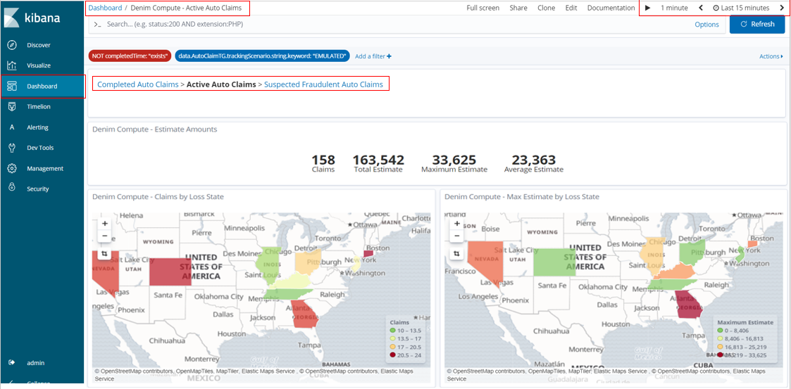

Scrolling down the page we can see some variations in types of `Visualization` and the aggregated data that is displayed on them to highlight certain trends such as the influence of the `Weather Condition` on the estimate value of the claim. We also have a chart for tracking at what lifecycle stage various in-flight claims are (`Active Claims by Age and Status`).

As the `Active Claims by Age and Status` X axis legend is hard to see with the restricted space you can maximise that `Visualization` (from the contextual menu on it) to see it in more detail.
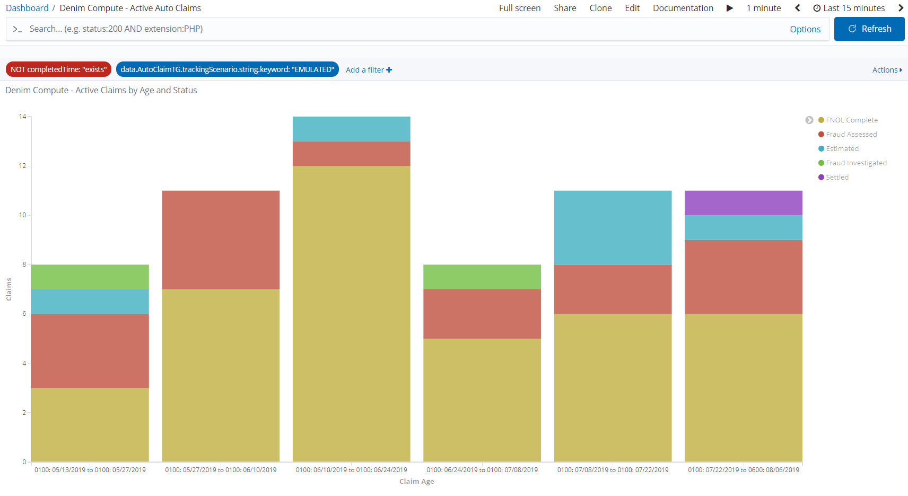

You can also use the contextual menu to `Inspect` the underlying data for a `Visualization` and even export it out in `CSV` format.

After returning back to the main `Dashboard`view, at the bottom of the page are some `Data Table` types of `Visualization` that shows the breakdown of claims by the `Vehicle Make` for both the `insured party` and the `third party` involved. 

Next we want to look at a different `Dashboard` that focuses on completed instances, so do that by clicking the `Completed Auto Claims` breadcrumb link. This `Dashboard` is named `Denim Compute - Completed Auto Claims` (note how it has a `Filter` configured that checks that the `completedTime` exists). In this `Dashboard` we can now show `Claim Settlement` figures and compare them to the `Damage Estimates`.
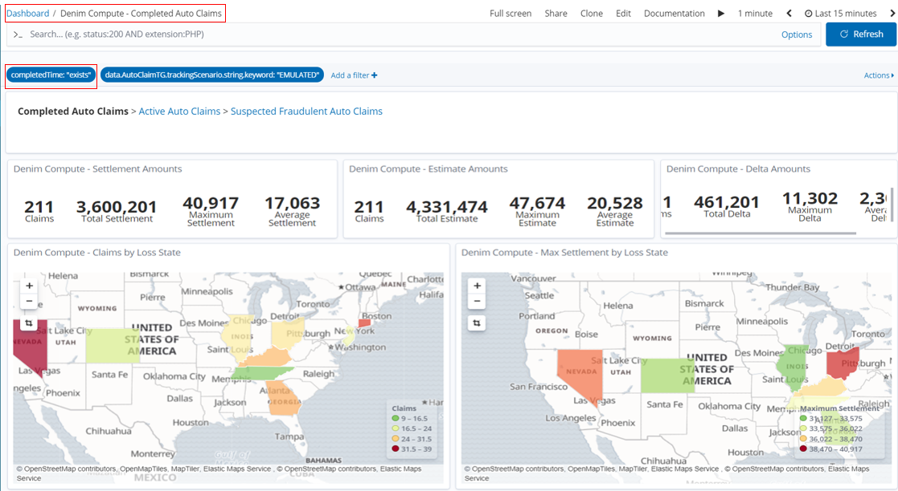

Similar to the previous `Dashboard`, this one uses various `Visualizations` but this time it focuses on the aggregation of `Claim Settlement` figures against various dimensions. Also notice that there is a `Pie Chart` that highlights the breakdown of claims into whether Fraud was suspected or not and then whether it was confirmed or cleared following investigation. We will see later that there is a further `Dashboard` dedicated to the area of suspected fraudulent claims.
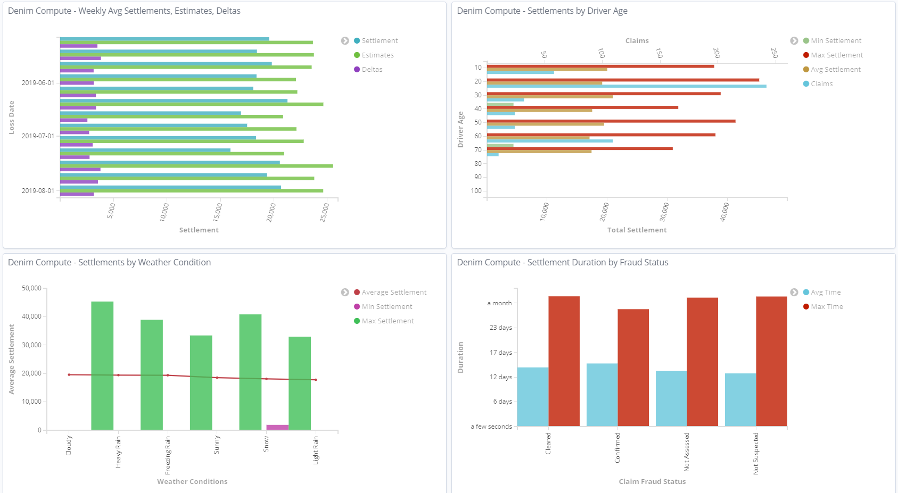

We again use the set of `Gauges` that focus on the `Policy Cover` dimension.
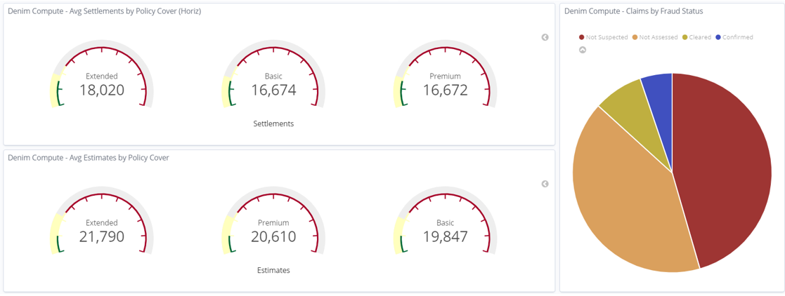

In the bottom section of the `Dashboard` we again see the `Data Tables` organised by `Vehicle Make` and again focussing on `Claim Settlement` data.

With the `Visualization` named `Settlements by Driver Age` opened in full screen mode we highlight one of the bars and can see the underlying data, in this case it is reflecting the age profiles (in the emulation we deliberately allocate more claims to certain higher risk age groups).

Next we change to the `Dashboard` named `Denim Compute - Suspected Fraudulent Auto Claims` (accessed by clicking on the `Suspected Fraudulent Auto Claims` breadcrumb).

It has a small subset of the `Visualizations` just to illustrate that we can look at similar data but filtered to the subset of data that involves potential and investigated fraud cases.
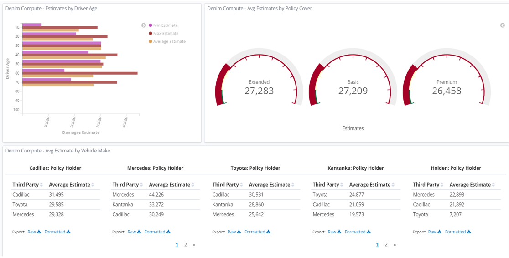

The `Dashboard` is pre-configured with a `Filter` that is disabled by default. This `Filter` will allow us to find only those potential frauds that were confirmed by investigation.
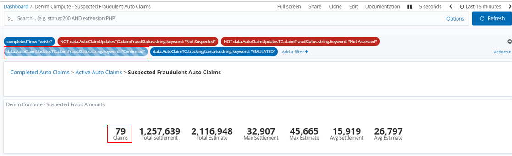

So to enable this we hover over the `Filter` where the options become visible, in this case we want the one to `Enable filter`.

The result is then dynamically updated in the `Dashboard` and we can see in this example that of the 79 potential frauds in fact 20 were confirmed (and of course in that case the `Claim Settlement` figures are 0 as no payment is made for fraud cases).

We can also switch the `Filter` to `Exclude matches` which in this case is looking for data on all potential frauds that were not proven 

Again the `Dashboard` refreshes to take account of the changed `Filter` and we see that 59 claims were not proven and in this case they do have payments made that are shown in the `Claim Settlement` figures.

Once the emulation batch of 500 instances have completed in `Denim Compute - Completed Auto Claims` we now notice that there is an anomaly with the maximum amounts. This is because the emulation logic deliberately throws an "outlier" case into every execution run so that we can highlight here in the `Dashboard`. We also highlight below that the skewed figure is in the state of Florida.
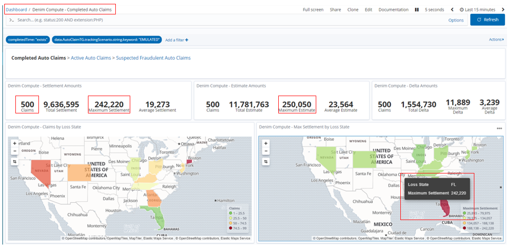

If we select that state in the `Region Map` a dynamic `Filter` is added and applied so that the `Dashboard` now shows data just for that state.

We can also use `Exclude matches` as we saw before on this new `Filter` and this allows us to examine the various dimensions without the false trends that the outlier case was contributing to.
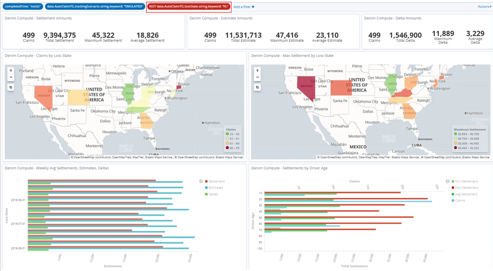

Back in the `Discover` section and with the `Search` set to `Denim Compute - Auto Claims All Processes` we can filter for and examine the outlier case. By default a `Filter` on the state of `FL` has been provided and disabled so you enable that and it should then show just that one outlier instance.  
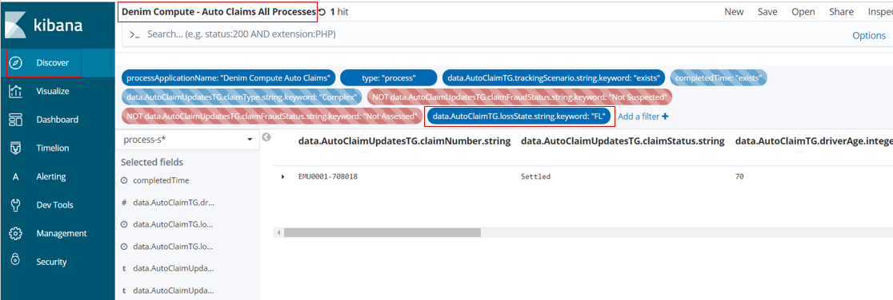

You can then expand the twisty against the row and it will allow inspecting the data in a `Table` or as raw `JSON`.

You now can see all the tracking data that was summarised into this process summary from the events sent to BAI from BAW. Take a look at some of the key data items and see if you can figure out what unusual set of circumstances led to this large claim and especially the high differential in damage amounts between the two vehicles involved. Also note that no fraud was suspected (see the highlighted tracking field below) even in such odd claim data, this is because the emulation uses random spreads of data and does not use any in depth intelligence in identifying and investigating fraud cases. In a later iteration we will start infusing `Artificial Intelligence (AI)` into this scenario in order to greatly improve this situation.

## Scenario installation

### Prerequisites
You should have installed the Cloud Pak for Automation as instructed in the various installation guidance documents in the [OpenShift](../environment/rhos-intro.md) environment section.

### BAW application installation
- Install the application interchange [`.twx`](https://github.com/ibm-cloud-architecture/denim-compute}/solution/baw/auto-claims-emulation-bai-v0-10-0.twx) file into your environment, confirm that it is the version shown below or higher.

- Now you should have the exposed process that can be launched from `Process Portal` as shown below.

### BAI Kibana saved objects installation
- In your BAI Kibana console navigate to `Management`, `Saved Objects` and click `Import`. 
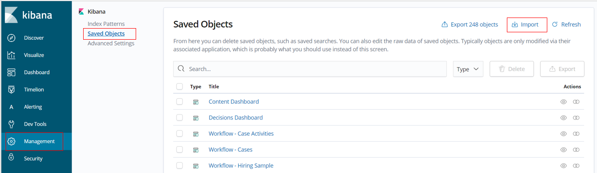

- Select the saved `Index Pattern` definition downloaded from [`dc-bai-custom-index-pattern.json`](https://github.com/ibm-cloud-architecture/denim-compute/solution/bai/dc-bai-custom-index-pattern.json) and click `Import`. (This will import a custom `Index Pattern` especially for `Denim Compute` which is configured with formatting of data fields and includes `Scripted fields`).
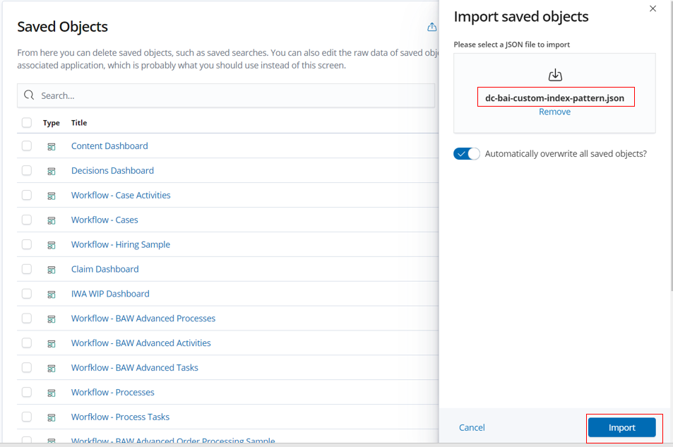

- When imported navigate to `Index Patterns` and select `process-s*` and verify that there are 3 `Scripted fields` (ignore the number against `Fields` which may be different in your environment).

- Repeat the previous steps to import the definitions downloaded from [`dc-bai-dashboards-and-related.json`](https://github.com/ibm-cloud-architecture/denim-compute/solution/bai/dc-bai-dashboards-and-related.json).
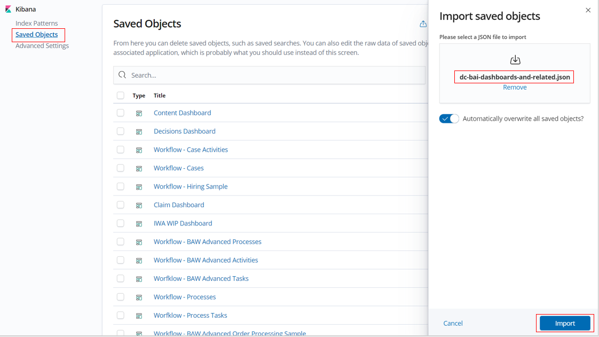

- Now when you filter against `Denim`, you should be able to see the imported objects (33 in total).
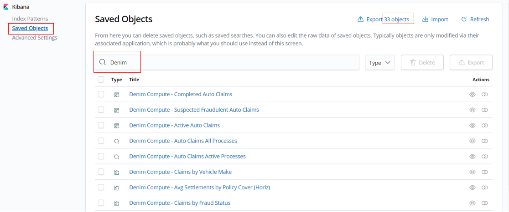

You now should have all you need to run the scenario as described earlier in this document.