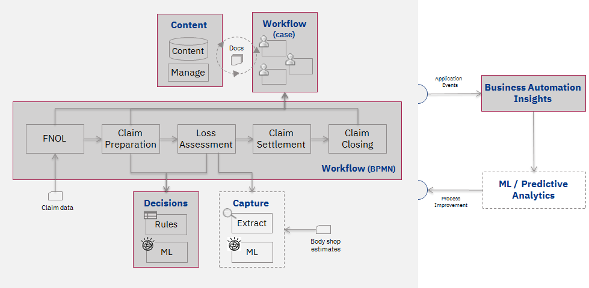
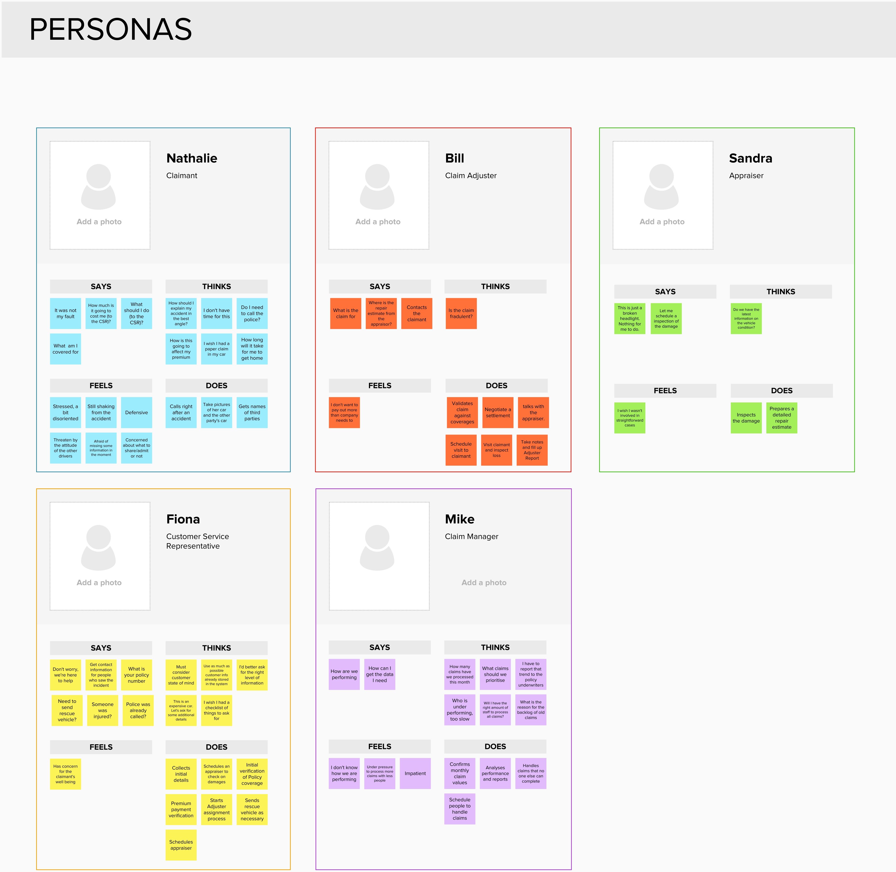
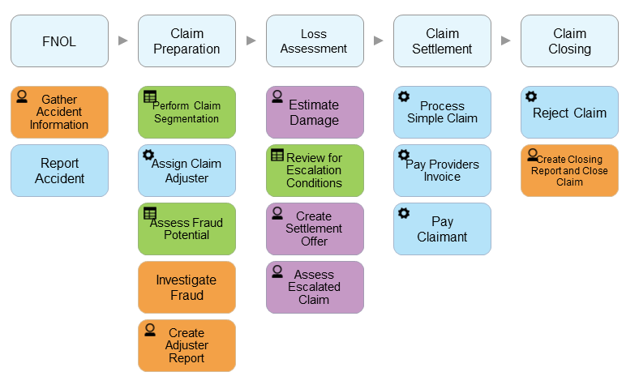

# Use case definition

Our reference implementation use case is automobile insurance claim processing.  The different components we're using in the context of the use case are shown on the figure below. The capabilities involved in the first MVP are in gray, while the dashed boxes are the ones that will be included in future MVPs.

## Identifying personas
Our standard DBA implementation methodology leverages IBM Design Thinking and in particular its focus on users and stakeholders' perspectives when designing business solutions. Here is an illustration of the use of one Design Thinking activity consisting in creating Empathy Maps, that is, looking at what a typical representative of a stakeholder role think, say, feel and do.

## Process discovery
Process discovery and modeling is another key practice in our DBA methodology. We typically conduct it in a collaborative manner by leveraging our IBM Blueworks Live process mapping software available on the cloud as Software as a Service. Here is an example of the Process Map we defined to support the elaboration of the Denim Compute use case:

The color coding is the following:

- *Orange*: an activity assumed on the Case Management side
- *Purple*: an activity requiring a BPM/ECM integration
- *Green*: a decision activity, invoking  a ruleset
- *Blue*: a regular BPM activity.

The overall process diagram for our use case is shown below. 

Since it involves ad-hoc activities, the diagram is not quite semantically correct. However, it gives a view of the intended sequence of events, along with the possible paths across the workflow.

- The first activity, `Report Accident`, represents the manual initial stimulus to start processing. It is not implemented either as a Case Activity or a BPMN Process.

- The first step under automated control is the following one, `Gather Accident Information`, which can either be initiated manually by a user starting a Claim case (say on receipt of a telephone call from the Insured to report accident) or by some document being added to the Claim folder.

The following activities are not in scope of the current MVP:

- `Assign Claim Adjuster`
- `Investigate Fraud`
- `Assess Escalated CLaim`
- `Pay Provider Invoice`
- `Process Simple Claim`
- `Reject Claim`
